# Домашнее задание к занятию "`Жизненный цикл ПО`" - `Барышников Никита`

## Подготовка к выполнению.

	

       

1. Получить бесплатную версию Jira - https://www.atlassian.com/ru/software/jira/work-management/free (скопируйте ссылку в адресную строку). Вы можете воспользоваться любым(в том числе бесплатным vpn сервисом) если сайт у вас недоступен. Кроме того вы можете скачать [docker образ](https://hub.docker.com/r/atlassian/jira-software/#) и запустить на своем хосте self-managed версию jira.
2. Настроить её для своей команды разработки.
3. Создать доски Kanban и Scrum.
4. [Дополнительные инструкции от разработчика Jira](https://support.atlassian.com/jira-cloud-administration/docs/import-and-export-issue-workflows/).

### Решение:

Создадим доски Kanban и Scrum.

Скриншот 1 - Создание досок Kanban и Scrum.
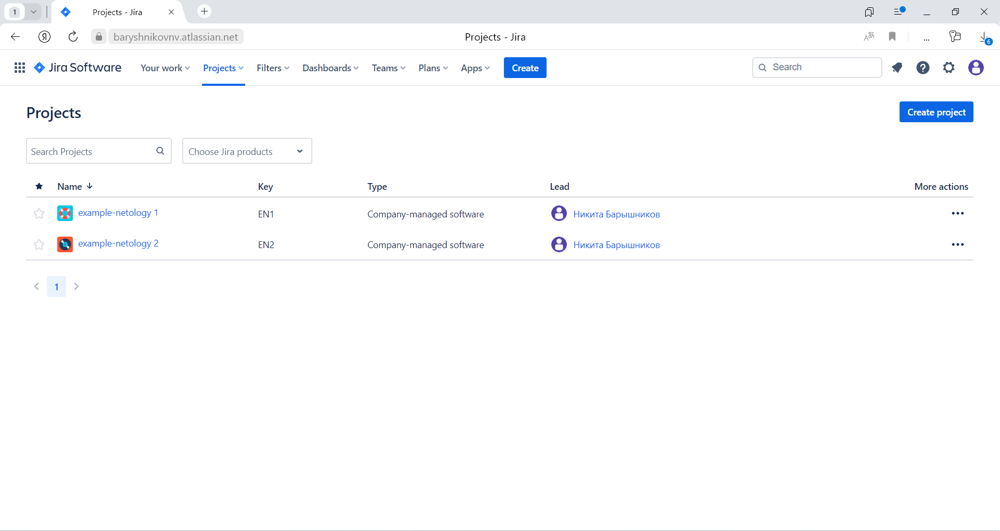

---

## Основная часть

	

       

Необходимо создать собственные workflow для двух типов задач: bug и остальные типы задач. Задачи типа bug должны проходить жизненный цикл:

1. Open -> On reproduce.
2. On reproduce -> Open, Done reproduce.
3. Done reproduce -> On fix.
4. On fix -> On reproduce, Done fix.
5. Done fix -> On test.
6. On test -> On fix, Done.
7. Done -> Closed, Open.

Остальные задачи должны проходить по упрощённому workflow:

1. Open -> On develop.
2. On develop -> Open, Done develop.
3. Done develop -> On test.
4. On test -> On develop, Done.
5. Done -> Closed, Open.

**Что нужно сделать**

1. Создайте задачу с типом bug, попытайтесь провести его по всему workflow до Done. 
1. Создайте задачу с типом epic, к ней привяжите несколько задач с типом task, проведите их по всему workflow до Done. 
1. При проведении обеих задач по статусам используйте kanban. 
1. Верните задачи в статус Open.
1. Перейдите в Scrum, запланируйте новый спринт, состоящий из задач эпика и одного бага, стартуйте спринт, проведите задачи до состояния Closed. Закройте спринт.
2. Если всё отработалось в рамках ожидания — выгрузите схемы workflow для импорта в XML. Файлы с workflow и скриншоты workflow приложите к решению задания.

### Решение:

Создадим статусы для доски Kanban.

Скриншот 2 - Создание статусов для доски Kanban.
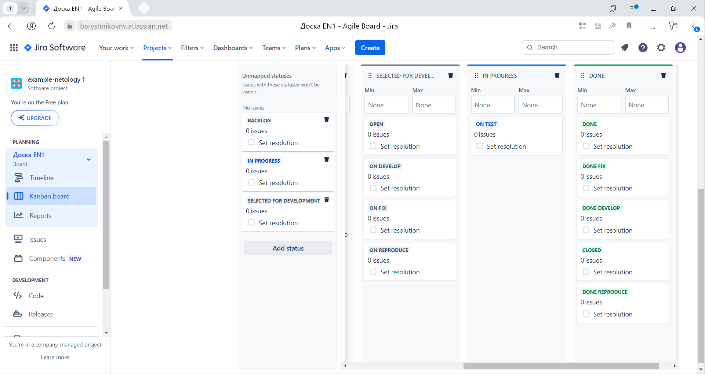

Создадим собственные workflow для двух типов задач: bug и остальные типы задач.

Скриншот 3 - Создание собственных workflow для двух типов задач.
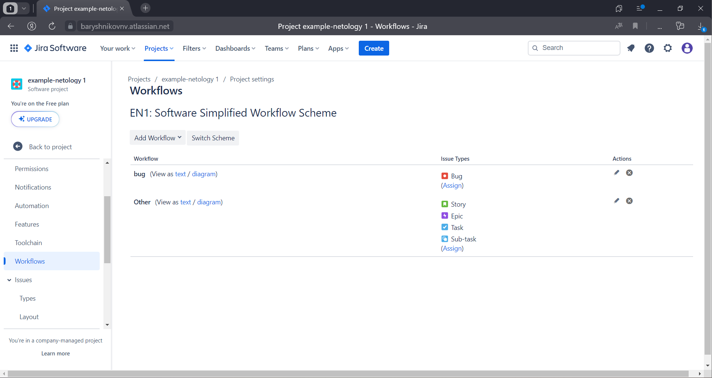

Создадим Workflow для задач типа bug.

Скриншот 4 - Workflow для задач типа bug.
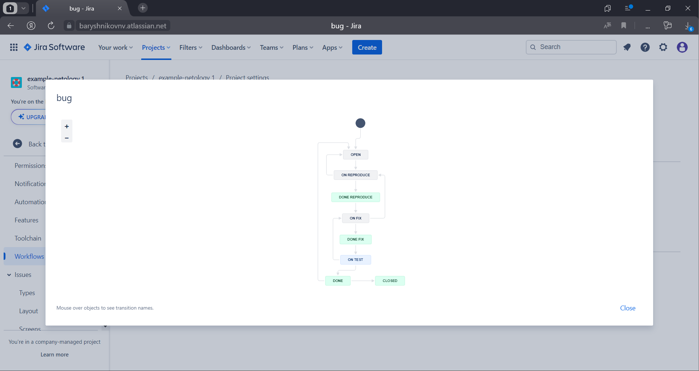

Создадим Workflow для остальных типов задач.

Скриншот 5 - Workflow для остальных типов задач.
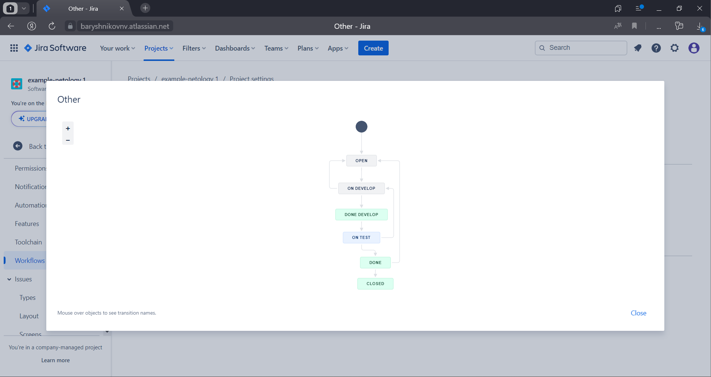

Создадим задачу с типом bug и проведем ее по всему workflow до Done.

Скриншот 6 - Создание задачи с типом bug.
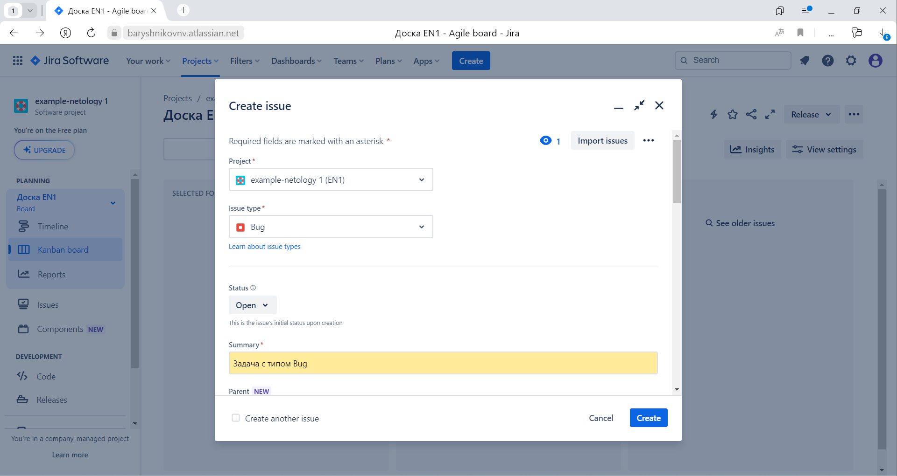

Скриншот 7 - Проведение задачи с типом bug по всему workflow до Done.
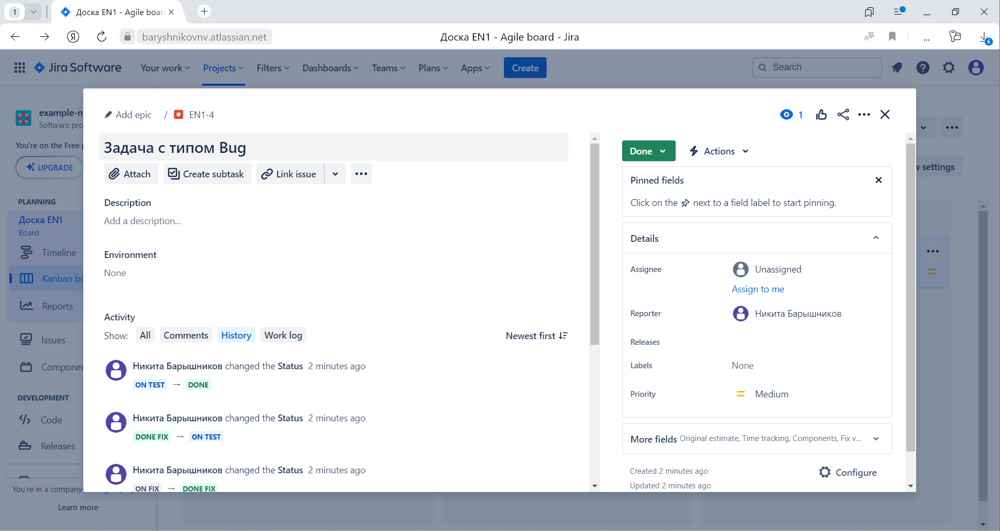

Создадим задачу с типом epic и к ней привяжем несколько задач с типом task, проведем их по всему workflow до Done.  
При проведении обеих задач по статусам используем kanban.

Скриншот 8 - Создание задачи с типом epic и задач с типом task.
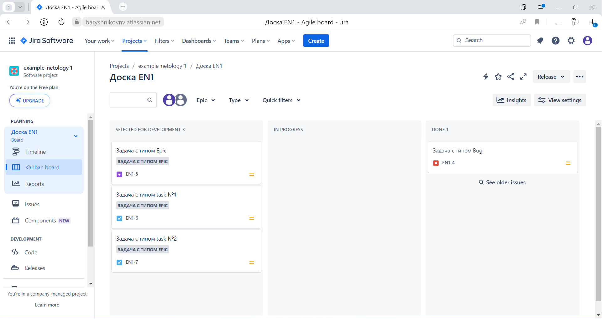

Скриншот 9 - Проведение задач с типом epic и task по всему workflow до Done.
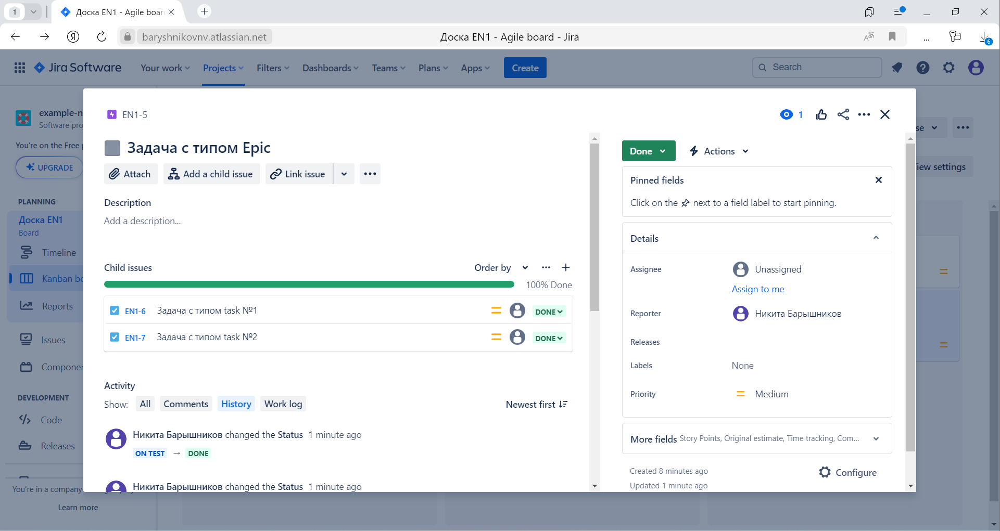

Вернем задачи в статус Open.

Скриншот 10 - Возврат задач в статус Open.
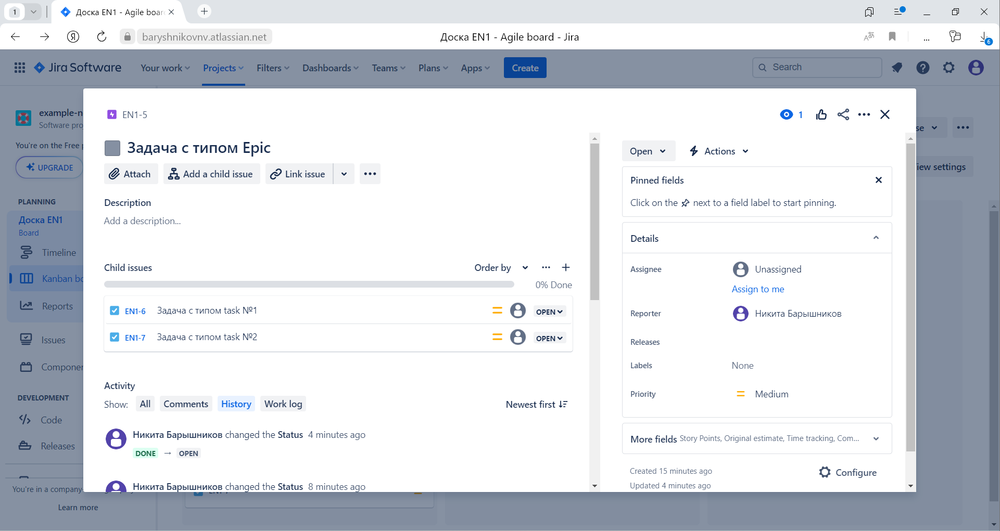

Перейдем в Scrum, запланируем новый спринт, состоящий из задач эпика и одного бага, начнем спринт, проведим задачи до состояния Closed.

Скриншот 11 - Создание задач эпика и бага.
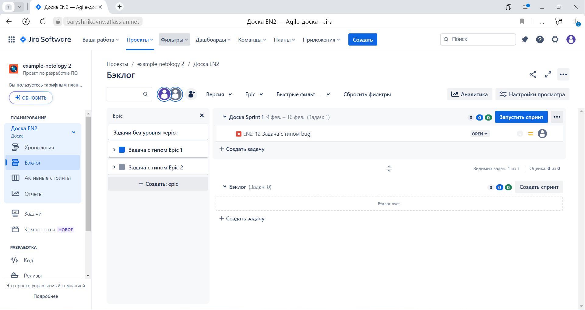

Скриншот 12 - Старт спринта.
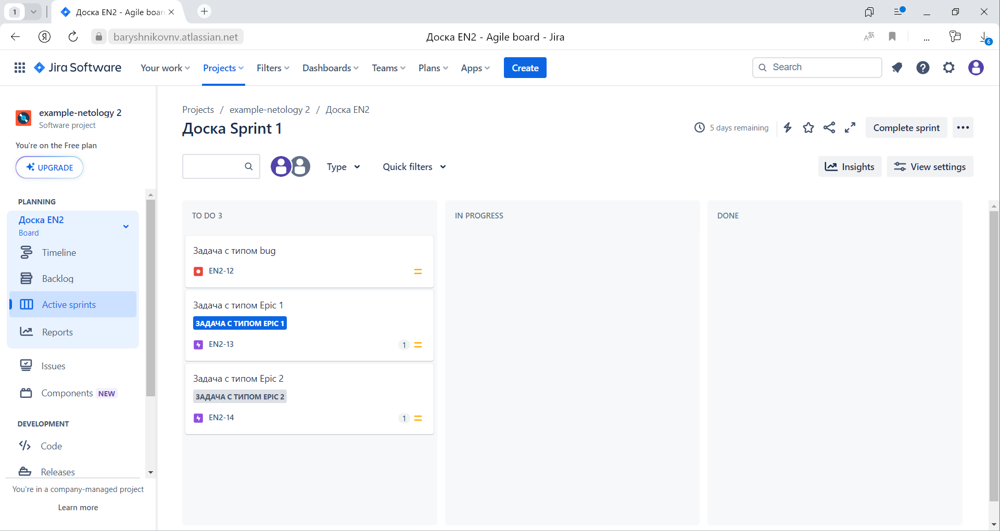

Скриншот 13 - Проведение задач до состояния Closed.
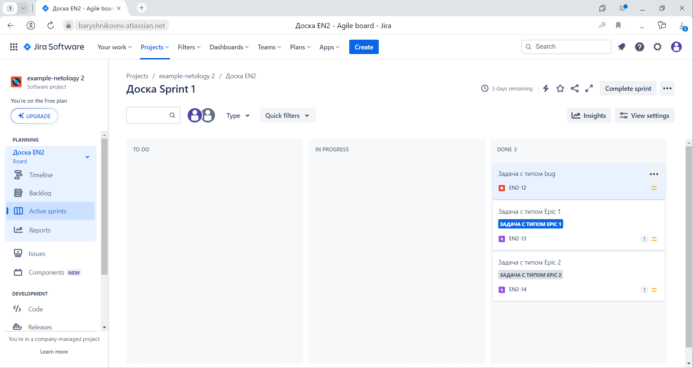

Скриншот 14 - Проведение задачи с типом bug до состояния Closed.
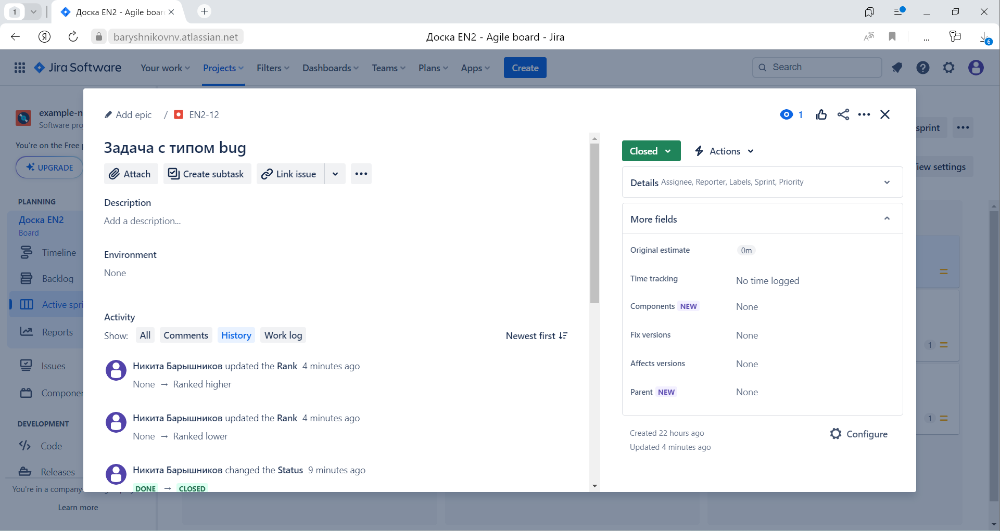

Скриншот 15 - Проведение задач с типом epic до состояния Closed.
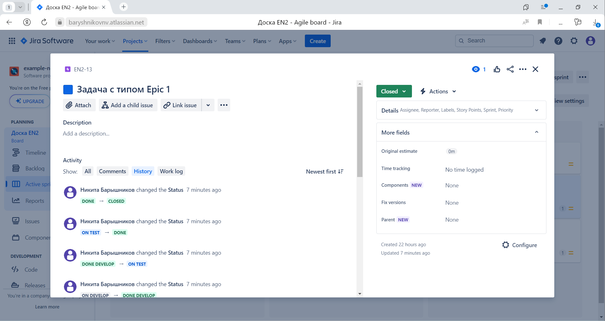

Закроем спринт.

Скриншот 16 - Закрытие спринта.
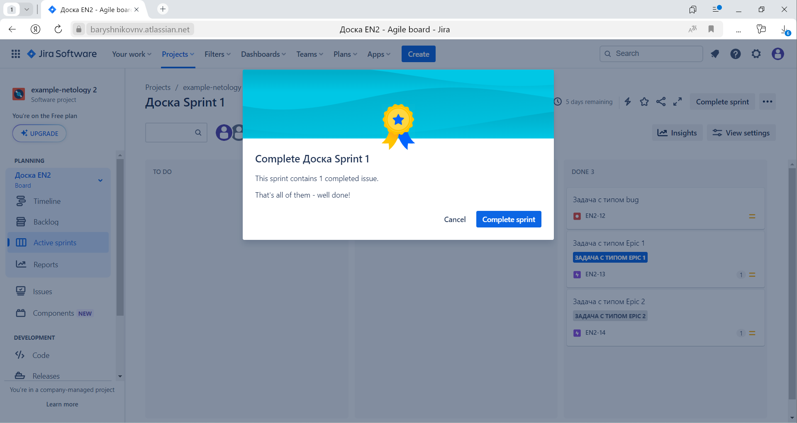

Схемы workflow для импорта в XML для задач типа [bug](./config/bug.xml) и для [остальных типов задач](./config/Other.xml).

---