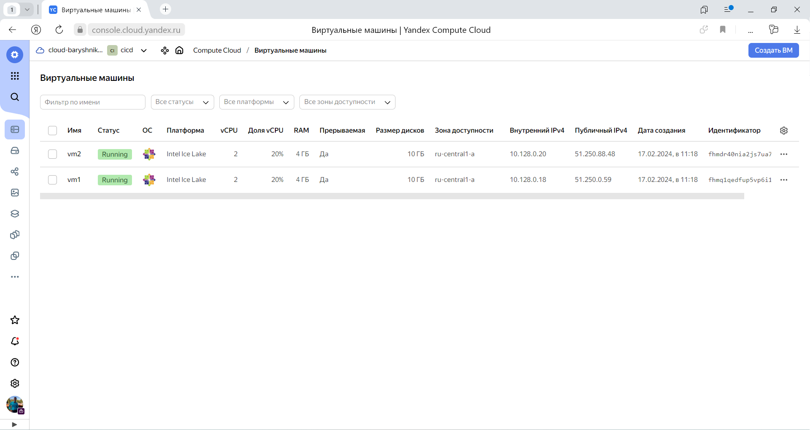
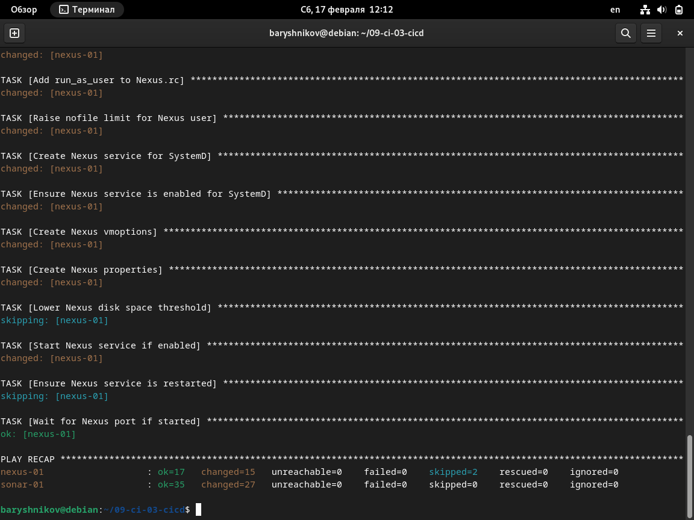
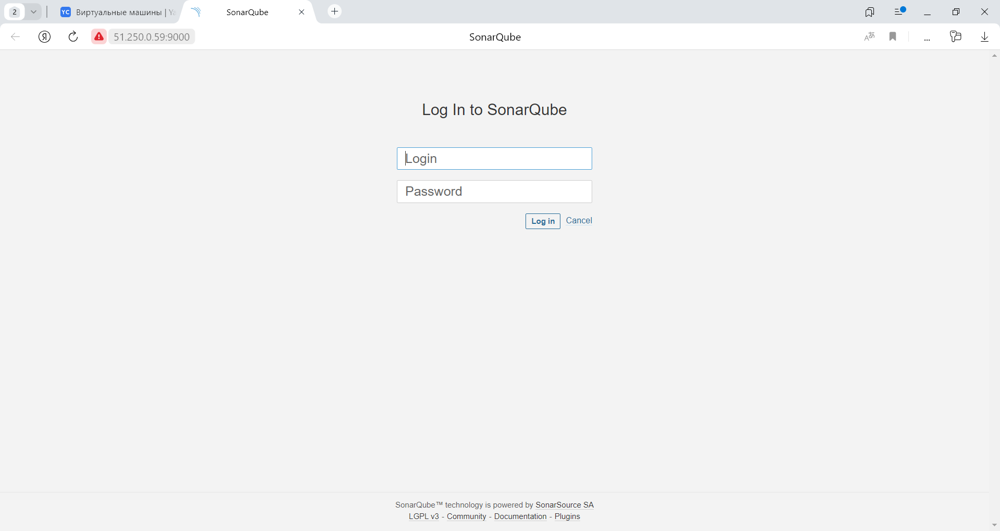
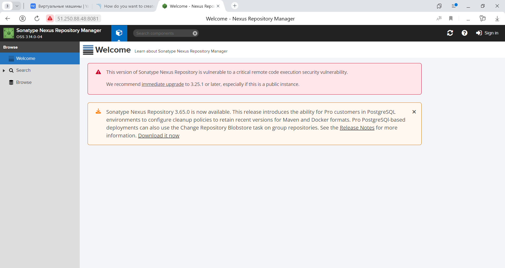
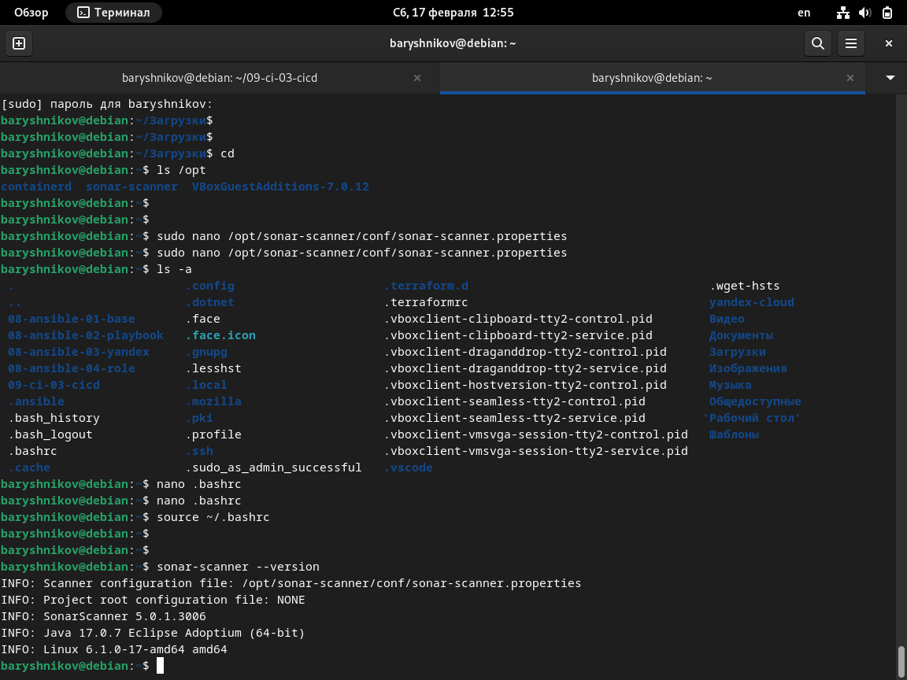
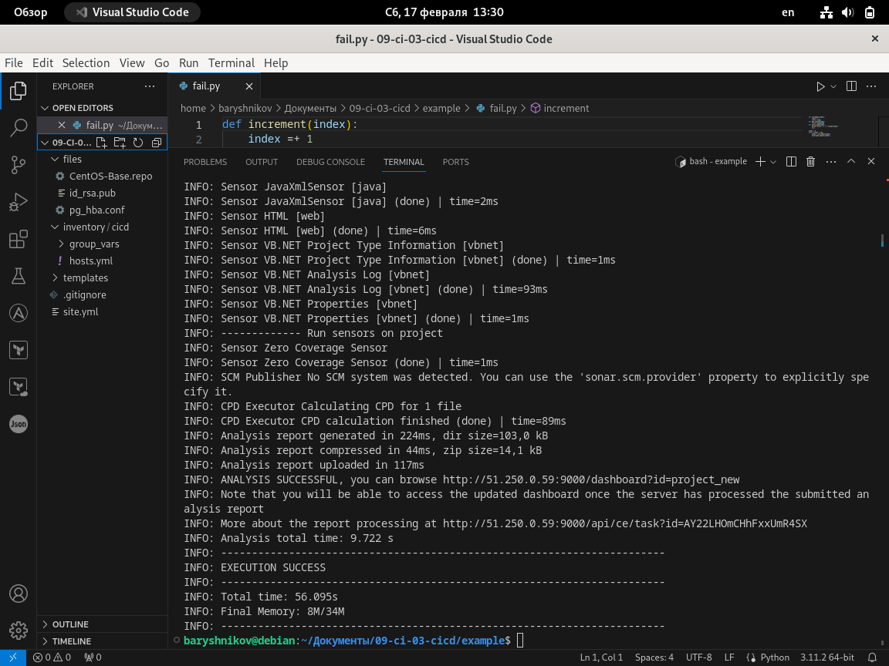
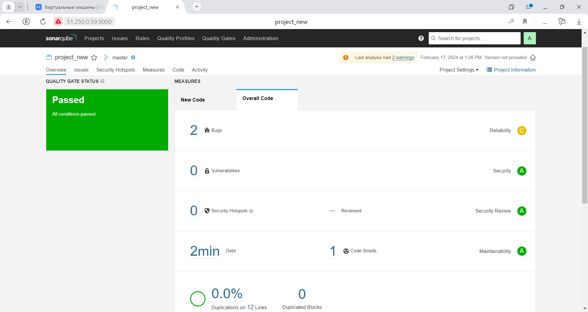
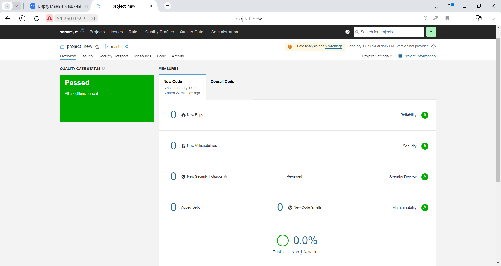
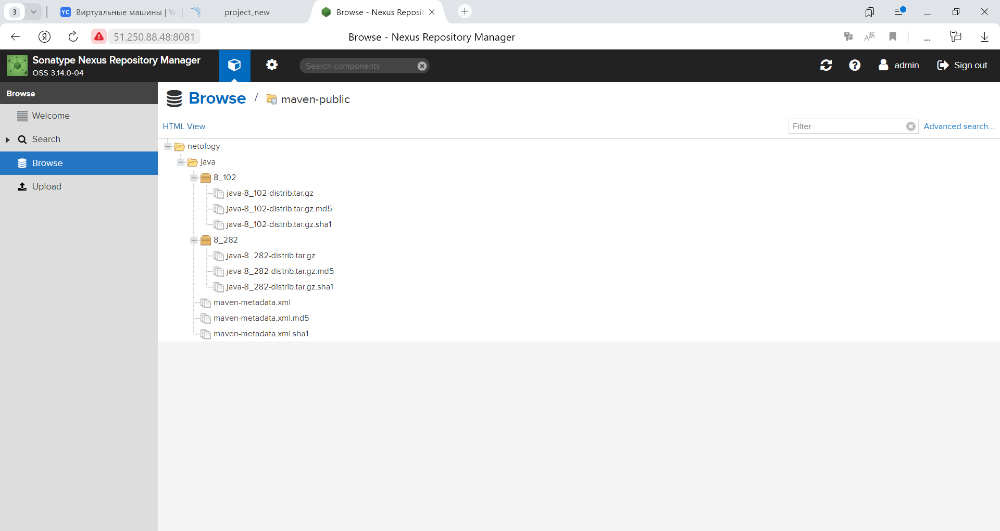
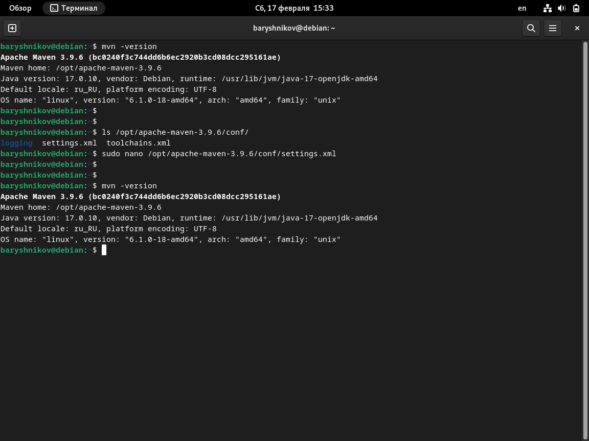

# Домашнее задание к занятию "`Процессы CI/CD`" - `Барышников Никита`


## Подготовка к выполнению
<details>
	<summary></summary>
      <br>

1. Создайте два VM в Yandex Cloud с параметрами: 2CPU 4RAM Centos7 (остальное по минимальным требованиям).
2. Пропишите в inventory playbook созданные хосты.
3. Добавьте в files файл со своим публичным ключом (id_rsa.pub). Если ключ называется иначе — найдите таску в плейбуке, которая использует id_rsa.pub имя, и исправьте на своё.
4. Запустите playbook, ожидайте успешного завершения.
5. Проверьте готовность SonarQube через браузер.
6. Зайдите под admin\admin, поменяйте пароль на свой.
7.  Проверьте готовность Nexus через бразуер.
8. Подключитесь под admin\admin123, поменяйте пароль, сохраните анонимный доступ.

</details>

#### Решение:

1. Создадим два VM в Yandex Cloud с параметрами: 2CPU 4RAM Centos7.

Скриншот 1 - Создания двух ВМ.


1. Пропишем в inventory playbook созданные хосты.  
2. Добавим в files файл со своим публичным ключом (id_rsa.pub).  
3. Запустим playbook и дождемся успешного завершения.

Скриншот 2 - Успешное завершение playbook.


5. Проверим готовность SonarQube через браузер.

Скриншот 3 - Проверка готовности SonarQube через браузер.


6. Зайдем под admin\admin, поменяем пароль на свой.  
7. Проверим готовность Nexus через бразуер.

Скриншот 4 - Проверка готовности Nexus через браузер.


8. Подключимся под admin\admin123, поменяем пароль, сохраним анонимный доступ.

---

## Знакомоство с SonarQube

### Основная часть
<details>
	<summary></summary>
      <br>

1. Создайте новый проект, название произвольное.
2. Скачайте пакет sonar-scanner, который вам предлагает скачать SonarQube.
3. Сделайте так, чтобы binary был доступен через вызов в shell (или поменяйте переменную PATH, или любой другой, удобный вам способ).
4. Проверьте `sonar-scanner --version`.
5. Запустите анализатор против кода из директории example с дополнительным ключом `-Dsonar.coverage.exclusions=fail.py`.
6. Посмотрите результат в интерфейсе.
7. Исправьте ошибки, которые он выявил, включая warnings.
8. Запустите анализатор повторно — проверьте, что QG пройдены успешно.
9. Сделайте скриншот успешного прохождения анализа, приложите к решению ДЗ.

</details>

#### Решение:

1. Создадим новый проект project_new.  
2. Скачаем пакет sonar-scanner, который предлагает скачать SonarQube.  
3. Чтобы binary был доступен через вызов в shell, добавим его в переменную PATH.  
4. Проверим `sonar-scanner --version`.  

Скриншот 5 - Проверка установки sonar-scanner.


1. Запустим анализатор против кода из директории example с дополнительным ключом `-Dsonar.coverage.exclusions=fail.py`.

Скриншот 6 - Результат запуска sonar-scanner.


6. Посмотрим результат в интерфейсе.

Скриншот 7 - Результат запуска sonar-scanner в интерфейсе.


7. Исправляем ошибки, которые он выявил, включая warnings.  
8. Запусткаем анализатор повторно — проверяем, что QG пройдены успешно.

Повторный запуск sonar-scanner после исправления ошибок:
```bash
baryshnikov@debian:~/Документы/09-ci-03-cicd/example$ sonar-scanner   -Dsonar.projectKey=project_new   -Dsonar.sources=.   -Dsonar.host.url=http://51.250.0.59:9000   -Dsonar.login=1dc5dfc3710bf0fd3308de19dfb15bf0efeeec8e -Dsonar.coverage.exclusions=fail.py
INFO: Scanner configuration file: /opt/sonar-scanner/conf/sonar-scanner.properties
INFO: Project root configuration file: NONE
INFO: SonarScanner 5.0.1.3006
INFO: Java 17.0.7 Eclipse Adoptium (64-bit)
INFO: Linux 6.1.0-18-amd64 amd64
INFO: User cache: /home/baryshnikov/.sonar/cache
INFO: Analyzing on SonarQube server 9.1.0
INFO: Default locale: "ru_RU", source code encoding: "UTF-8" (analysis is platform dependent)
INFO: Load global settings
INFO: Load global settings (done) | time=518ms
INFO: Server id: 9CFC3560-AY21uyLkCHhFxxUmRzNN
INFO: User cache: /home/baryshnikov/.sonar/cache
INFO: Load/download plugins
INFO: Load plugins index
INFO: Load plugins index (done) | time=296ms
INFO: Load/download plugins (done) | time=514ms
INFO: Process project properties
INFO: Process project properties (done) | time=42ms
INFO: Execute project builders
INFO: Execute project builders (done) | time=9ms
INFO: Project key: project_new
INFO: Base dir: /home/baryshnikov/Документы/09-ci-03-cicd/example
INFO: Working dir: /home/baryshnikov/Документы/09-ci-03-cicd/example/.scannerwork
INFO: Load project settings for component key: 'project_new'
INFO: Load project settings for component key: 'project_new' (done) | time=358ms
INFO: Load quality profiles
INFO: Load quality profiles (done) | time=200ms
INFO: Load active rules
INFO: Load active rules (done) | time=4478ms
WARN: SCM provider autodetection failed. Please use "sonar.scm.provider" to define SCM of your project, or disable the SCM Sensor in the project settings.
INFO: Indexing files...
INFO: Project configuration:
INFO:   Excluded sources for coverage: fail.py
INFO: 1 file indexed
INFO: Quality profile for py: Sonar way
INFO: ------------- Run sensors on module project_new
INFO: Load metrics repository
INFO: Load metrics repository (done) | time=148ms
INFO: Sensor Python Sensor [python]
WARN: Your code is analyzed as compatible with python 2 and 3 by default. This will prevent the detection of issues specific to python 2 or python 3. You can get a more precise analysis by setting a python version in your configuration via the parameter "sonar.python.version"
INFO: Starting global symbols computation
INFO: 1 source file to be analyzed
INFO: Load project repositories
INFO: Load project repositories (done) | time=245ms
INFO: 1/1 source file has been analyzed
INFO: Starting rules execution
INFO: 1 source file to be analyzed
INFO: 1/1 source file has been analyzed
INFO: Sensor Python Sensor [python] (done) | time=2162ms
INFO: Sensor Cobertura Sensor for Python coverage [python]
INFO: Sensor Cobertura Sensor for Python coverage [python] (done) | time=13ms
INFO: Sensor PythonXUnitSensor [python]
INFO: Sensor PythonXUnitSensor [python] (done) | time=5ms
INFO: Sensor CSS Rules [cssfamily]
INFO: No CSS, PHP, HTML or VueJS files are found in the project. CSS analysis is skipped.
INFO: Sensor CSS Rules [cssfamily] (done) | time=3ms
INFO: Sensor JaCoCo XML Report Importer [jacoco]
INFO: 'sonar.coverage.jacoco.xmlReportPaths' is not defined. Using default locations: target/site/jacoco/jacoco.xml,target/site/jacoco-it/jacoco.xml,build/reports/jacoco/test/jacocoTestReport.xml
INFO: No report imported, no coverage information will be imported by JaCoCo XML Report Importer
INFO: Sensor JaCoCo XML Report Importer [jacoco] (done) | time=50ms
INFO: Sensor C# Project Type Information [csharp]
INFO: Sensor C# Project Type Information [csharp] (done) | time=2ms
INFO: Sensor C# Analysis Log [csharp]
INFO: Sensor C# Analysis Log [csharp] (done) | time=18ms
INFO: Sensor C# Properties [csharp]
INFO: Sensor C# Properties [csharp] (done) | time=2ms
INFO: Sensor JavaXmlSensor [java]
INFO: Sensor JavaXmlSensor [java] (done) | time=1ms
INFO: Sensor HTML [web]
INFO: Sensor HTML [web] (done) | time=4ms
INFO: Sensor VB.NET Project Type Information [vbnet]
INFO: Sensor VB.NET Project Type Information [vbnet] (done) | time=1ms
INFO: Sensor VB.NET Analysis Log [vbnet]
INFO: Sensor VB.NET Analysis Log [vbnet] (done) | time=40ms
INFO: Sensor VB.NET Properties [vbnet]
INFO: Sensor VB.NET Properties [vbnet] (done) | time=1ms
INFO: ------------- Run sensors on project
INFO: Sensor Zero Coverage Sensor
INFO: Sensor Zero Coverage Sensor (done) | time=9ms
INFO: SCM Publisher No SCM system was detected. You can use the 'sonar.scm.provider' property to explicitly specify it.
INFO: CPD Executor Calculating CPD for 1 file
INFO: CPD Executor CPD calculation finished (done) | time=16ms
INFO: Analysis report generated in 517ms, dir size=103,1 kB
INFO: Analysis report compressed in 103ms, zip size=14,1 kB
INFO: Analysis report uploaded in 114ms
INFO: ANALYSIS SUCCESSFUL, you can browse http://51.250.0.59:9000/dashboard?id=project_new
INFO: Note that you will be able to access the updated dashboard once the server has processed the submitted analysis report
INFO: More about the report processing at http://51.250.0.59:9000/api/ce/task?id=AY22Ptx6CHhFxxUmR4SY
INFO: Analysis total time: 13.528 s
INFO: ------------------------------------------------------------------------
INFO: EXECUTION SUCCESS
INFO: ------------------------------------------------------------------------
INFO: Total time: 17.664s
INFO: Final Memory: 8M/30M
INFO: ------------------------------------------------------------------------
```

9. Сделаем скриншот успешного прохождения анализа.

Скриншот 8 - Результат запуска sonar-scanner в интерфейсе после исправления ошибок.


---

## Знакомоство с Nexus

### Основная часть
<details>
	<summary></summary>
      <br>

1. В репозиторий `maven-public` загрузите артефакт с GAV-параметрами:

 *    groupId: netology;
 *    artifactId: java;
 *    version: 8_282;
 *    classifier: distrib;
 *    type: tar.gz.
   
2. В него же загрузите такой же артефакт, но с version: 8_102.
3. Проверьте, что все файлы загрузились успешно.
4. В ответе пришлите файл `maven-metadata.xml` для этого артефекта.

</details>

#### Решение:

1. В репозиторий `maven-public` загружаем артефакт с GAV-параметрами:

 *    groupId: netology;
 *    artifactId: java;
 *    version: 8_282;
 *    classifier: distrib;
 *    type: tar.gz.
   
2. В него же загружаем такой же артефакт, но с version: 8_102.  
3. Проверим, что все файлы загрузились успешно.

Скриншот 9 - Проверка загрузки файлов.


4. Полученый файл [`maven-metadata.xml`](./config/maven-metadata.xml) для этого артефекта.

---

## Знакомоство с Maven

### Подготовка к выполнению
<details>
	<summary></summary>
      <br>

1. Скачайте дистрибутив с [maven](https://maven.apache.org/download.cgi).
2. Разархивируйте, сделайте так, чтобы binary был доступен через вызов в shell (или поменяйте переменную PATH, или любой другой, удобный вам способ).
3. Удалите из `apache-maven-<version>/conf/settings.xml` упоминание о правиле, отвергающем HTTP- соединение — раздел mirrors —> id: my-repository-http-unblocker.
4. Проверьте `mvn --version`.
5. Заберите директорию mvn с pom.

</details>

#### Решение:

1. Скачаем дистрибутив с [maven](https://maven.apache.org/download.cgi).  
2. Разархивируем, сделаем binary доступным через вызов в shell.  
3. Удалим из `apache-maven-<version>/conf/settings.xml` упоминание о правиле, отвергающем HTTP- соединение — раздел mirrors —> id: my-repository-http-unblocker.  
4. Проверим `mvn --version`.

Скриншот 10 - Проверка установки maven.


5. Заберем директорию mvn с pom.

---