# Домашнее задание к занятию "`Teamcity`" - `Барышников Никита`


## Подготовка к выполнению
<details>
	<summary></summary>
      <br>

1. В Yandex Cloud создайте новый инстанс (4CPU4RAM) на основе образа `jetbrains/teamcity-server`.
2. Дождитесь запуска teamcity, выполните первоначальную настройку.
3. Создайте ещё один инстанс (2CPU4RAM) на основе образа `jetbrains/teamcity-agent`. Пропишите к нему переменную окружения `SERVER_URL: "http://<teamcity_url>:8111"`.
4. Авторизуйте агент.
5. Сделайте fork [репозитория](https://github.com/aragastmatb/example-teamcity).
6. Создайте VM (2CPU4RAM) и запустите [playbook](./infrastructure).

</details>

### Решение:

1. В Yandex Cloud создадим новый инстанс (4CPU4RAM) на основе образа `jetbrains/teamcity-server`.  
2. Выполним первоначальную настройку.  
3. Создадим ещё один инстанс (2CPU4RAM) на основе образа `jetbrains/teamcity-agent`. Пропишем к нему переменную окружения `SERVER_URL: "http://<teamcity_url>:8111"`.  
4. Авторизуем агент.  
5. Сделаем fork [репозитория](https://github.com/aragastmatb/example-teamcity).  
6. Создадим VM (2CPU4RAM) и запустим [playbook](./infrastructure).

Скриншот 1 - Создание инстансов и ВМ.
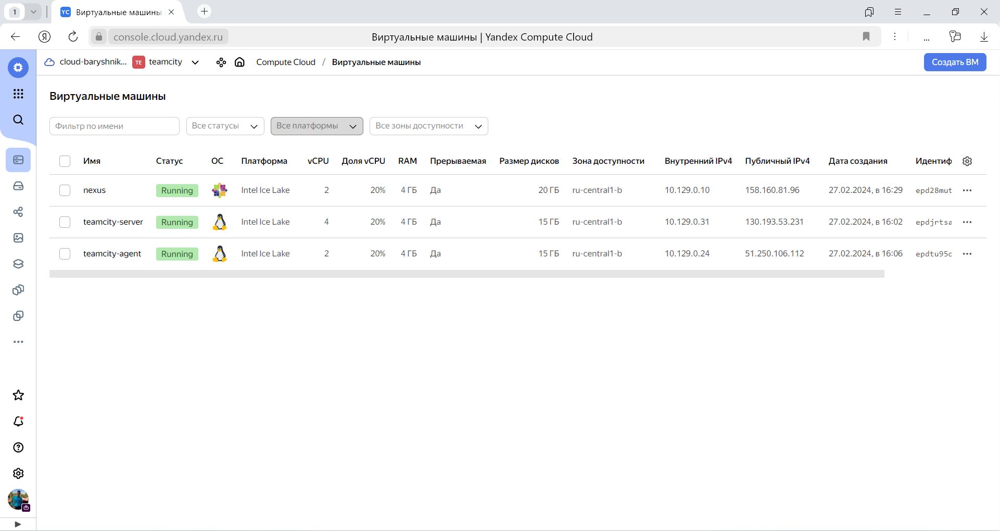

Скриншот 2 - Выполнение запуска playbook.
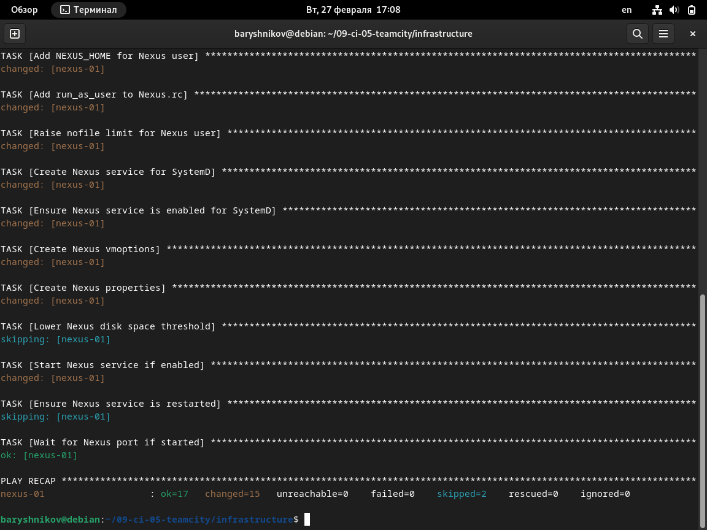

Скриншот 3 - Выполнение первоначальной настройки teamcity.
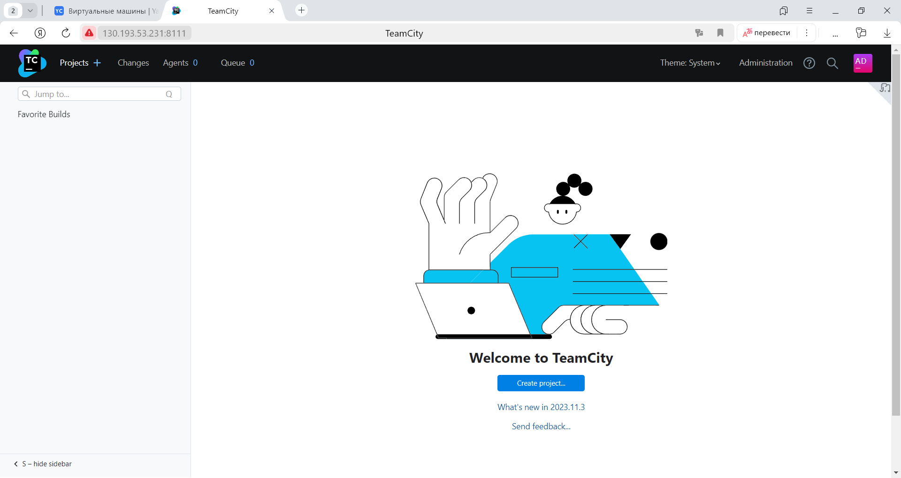

Скриншот 4 - Выполнение авторизации агента.
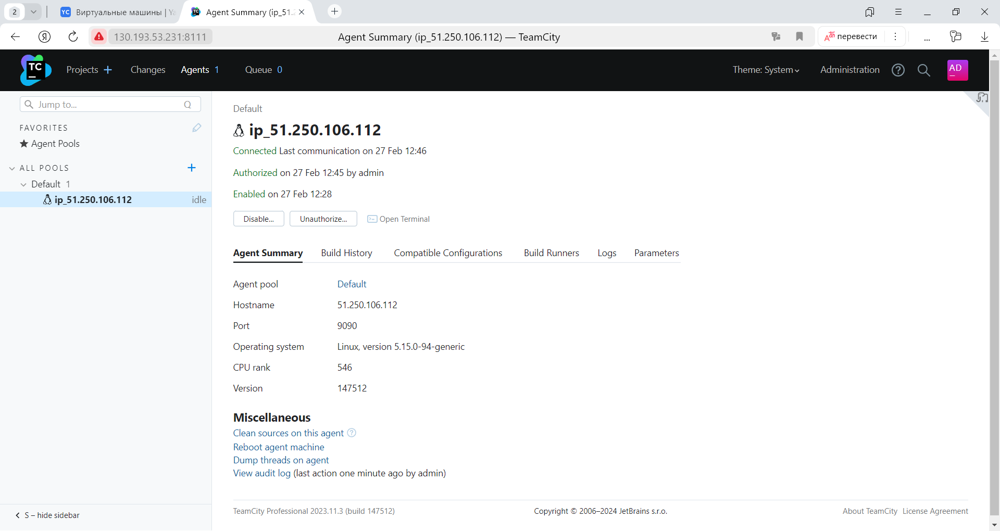

---

## Основная часть
<details>
	<summary></summary>
      <br>

1. Создайте новый проект в teamcity на основе fork.
2. Сделайте autodetect конфигурации.
3. Сохраните необходимые шаги, запустите первую сборку master.
4. Поменяйте условия сборки: если сборка по ветке `master`, то должен происходит `mvn clean deploy`, иначе `mvn clean test`.
5. Для deploy будет необходимо загрузить [settings.xml](./teamcity/settings.xml) в набор конфигураций maven у teamcity, предварительно записав туда креды для подключения к nexus.
6. В pom.xml необходимо поменять ссылки на репозиторий и nexus.
7. Запустите сборку по master, убедитесь, что всё прошло успешно и артефакт появился в nexus.
8. Мигрируйте `build configuration` в репозиторий.
9. Создайте отдельную ветку `feature/add_reply` в репозитории.
10. Напишите новый метод для класса Welcomer: метод должен возвращать произвольную реплику, содержащую слово `hunter`.
11. Дополните тест для нового метода на поиск слова `hunter` в новой реплике.
12. Сделайте push всех изменений в новую ветку репозитория.
13. Убедитесь, что сборка самостоятельно запустилась, тесты прошли успешно.
14. Внесите изменения из произвольной ветки `feature/add_reply` в `master` через `Merge`.
15. Убедитесь, что нет собранного артефакта в сборке по ветке `master`.
16. Настройте конфигурацию так, чтобы она собирала `.jar` в артефакты сборки.
17. Проведите повторную сборку мастера, убедитесь, что сбора прошла успешно и артефакты собраны.
18. Проверьте, что конфигурация в репозитории содержит все настройки конфигурации из teamcity.
19. В ответе пришлите ссылку на репозиторий.

</details>

### Решение:

1. Создадим новый проект в teamcity на основе fork.

Скриншот 5 - Cоздание нового проекта в teamcity на основе fork.
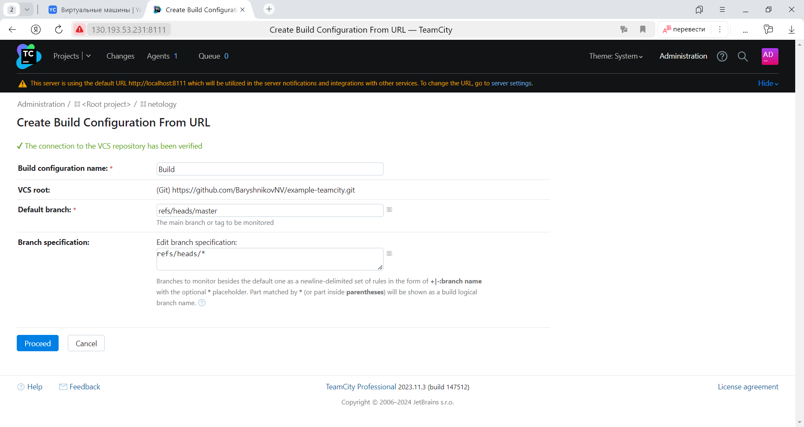

2. Сделаем autodetect конфигурации.

Скриншот 6 - Autodetect конфигурации.
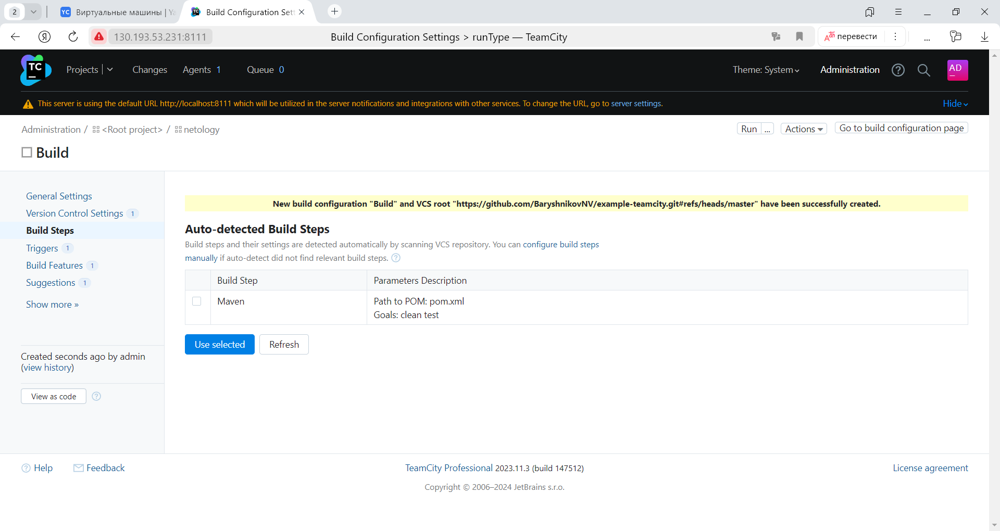

3. Запустим первую сборку master.

Скриншот 7 - Запуск первой сборки.
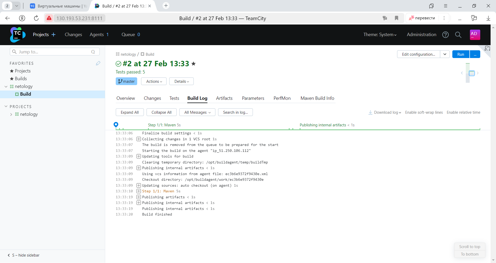

4. Поменяем условия сборки: если сборка по ветке `master`, то должен происходит `mvn clean deploy`, иначе `mvn clean test`.

Скриншот 8 - Изменение условий сборки.
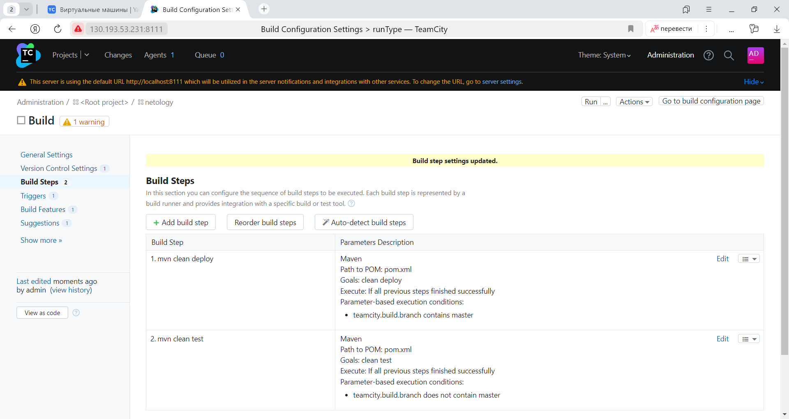

5. Для deploy загрузим [settings.xml](./config/teamcity/settings.xml) в набор конфигураций maven у teamcity.

Скриншот 9 - Изменение условий сборки.
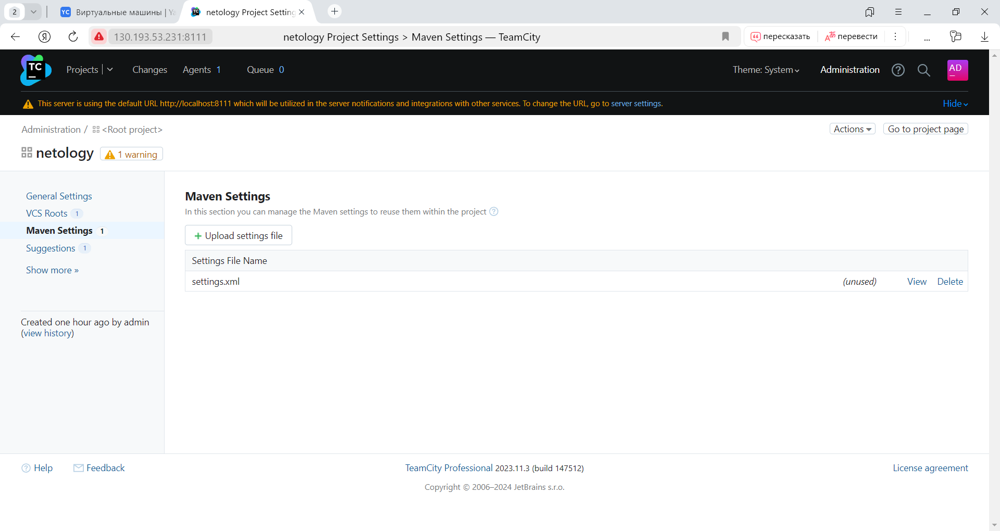

6. В pom.xml поменяем ссылки на репозиторий и nexus.  
7. Запустим сборку по master, убедимся, что всё прошло успешно и артефакт появился в nexus.

Скриншот 10 - Запуск сборки.
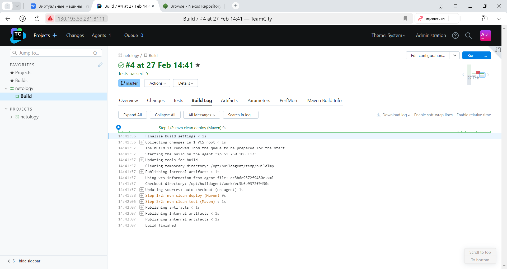

Скриншот 11 - Проверка появления артефакта в nexus.
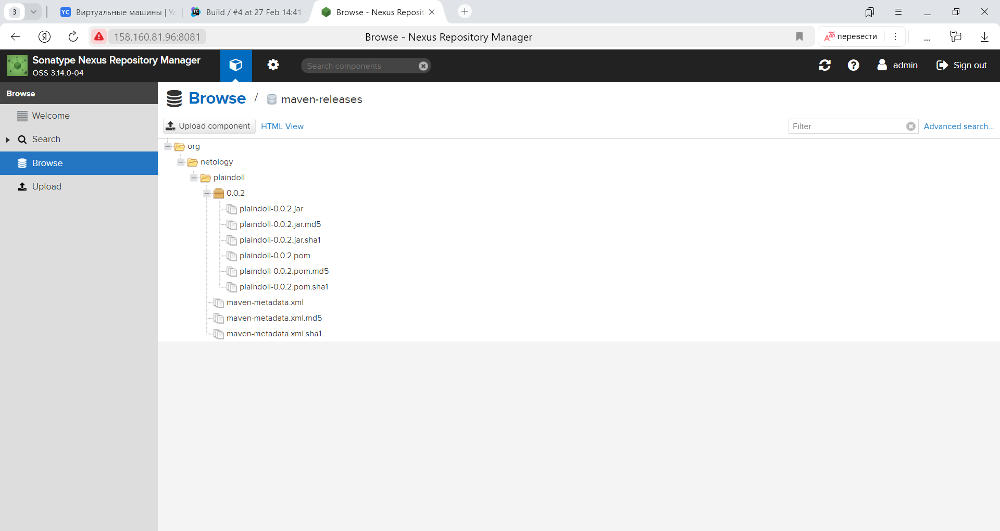

8. Мигрируем `build configuration` в репозиторий.

Скриншот 12 - Миграция `build configuration` в репозиторий.
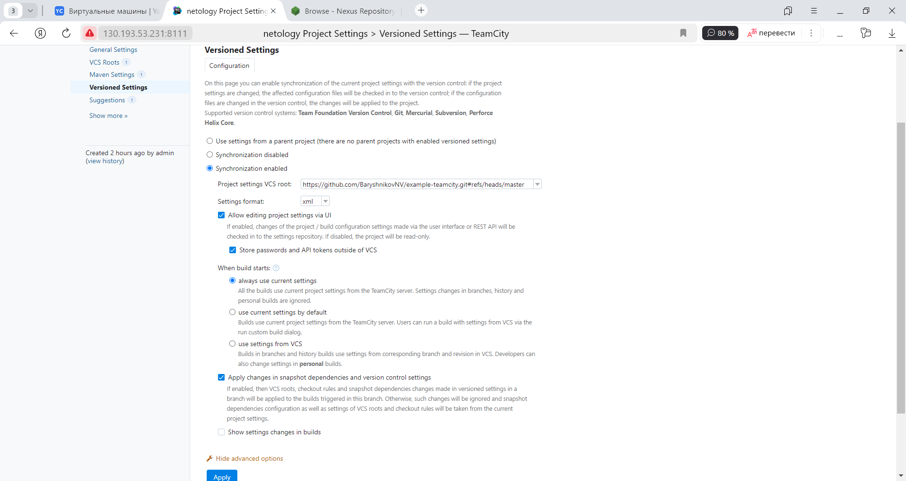

9. Создадим отдельную ветку `feature/add_reply` в репозитории.

С помощью команды ```git branch feature/add_reply``` создадим отдельную ветку в репозитории.

10. Напишем новый метод для класса Welcomer: метод должен возвращать произвольную реплику, содержащую слово `hunter`.  
11. Дополним тест для нового метода на поиск слова `hunter` в новой реплике.  
12. Сделаем push всех изменений в новую ветку репозитория. (https://github.com/BaryshnikovNV/example-teamcity/commit/5621bb145d81e30e064181e2099ad9e310c38486)  
13. Убедимся, что сборка самостоятельно запустилась, тесты прошли успешно.

Скриншот 13 - Проверка запуска сборки и прохождения тестов.
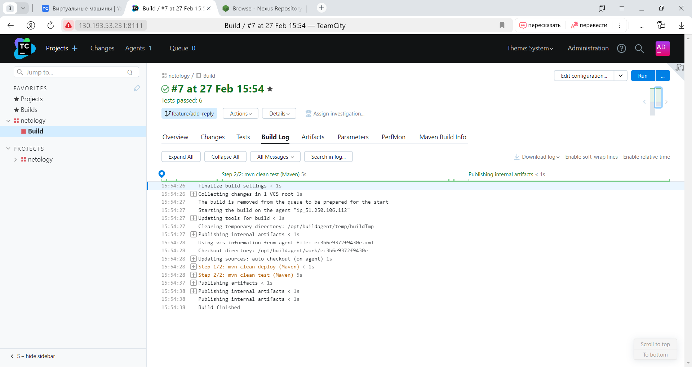

14. Внесем изменения из произвольной ветки `feature/add_reply` в `master` через `Merge`.  
15. Убедимся, что нет собранного артефакта в сборке по ветке `master`.

Скриншот 14 - Проверка отсутствия собранного артефакта по ветке `master`.
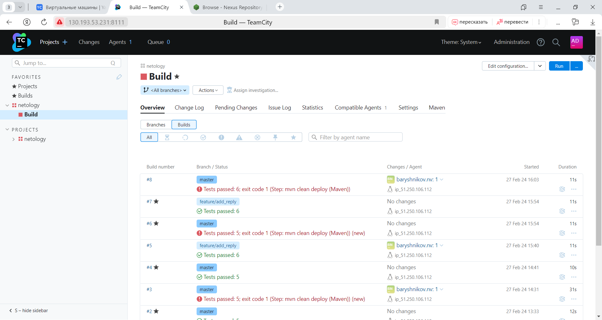

Из скриншота 14 видно, что сборка #8 не прошла. Причиной тому служит собранный уже до этого артефакт по ветке `master`. Для решения этой проблемы изменим версию артефакта в файле `pom.xml`.

Скриншот 15 - Проверка отсутствия собранного артефакта по ветке `master` после изменения версии.
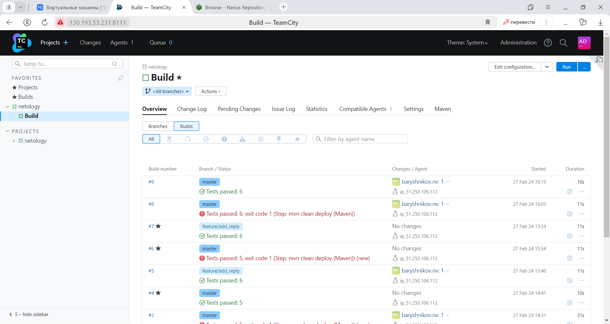

16. Настройте конфигурацию так, чтобы она собирала `.jar` в артефакты сборки.
17. Проведите повторную сборку мастера, убедитесь, что сбора прошла успешно и артефакты собраны.

Скриншот 16 - Проверка наличия артефакта в nexus.
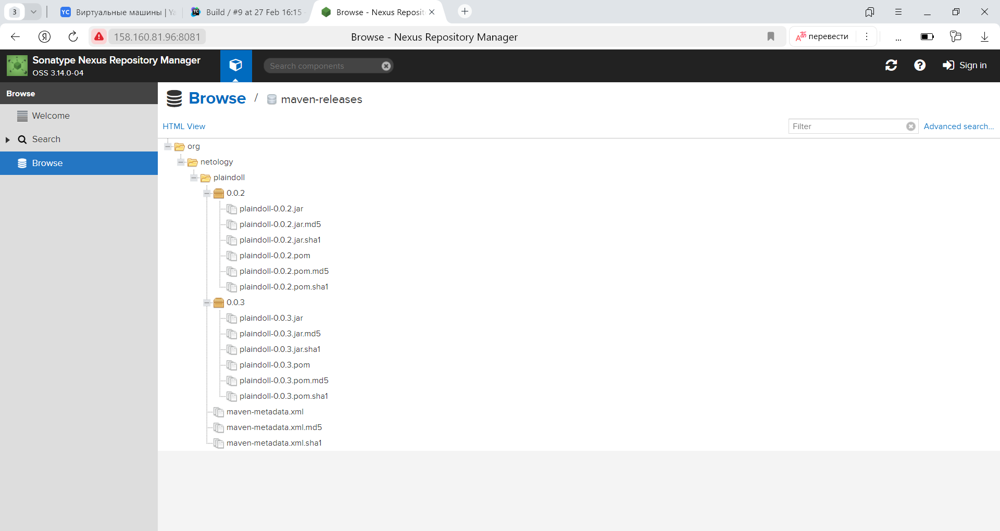

18. Проверим, что конфигурация в репозитории содержит все настройки конфигурации из teamcity.

Скриншот 17 - Проверка содержания в репозитории всех настроек конфигурации из teamcity.
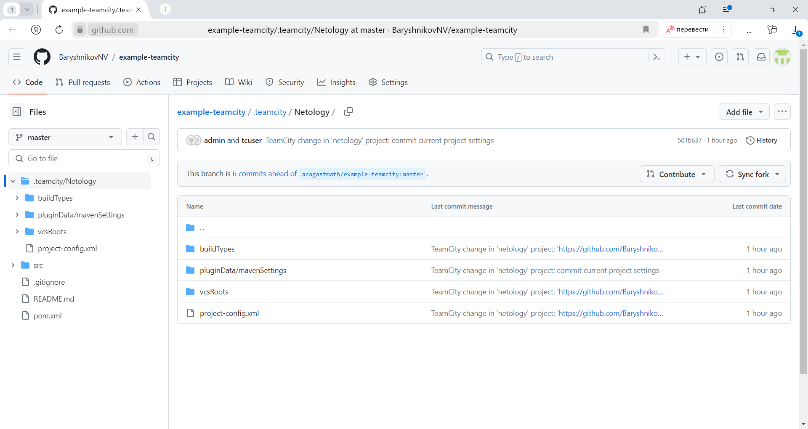

19. [Ссылка](https://github.com/BaryshnikovNV/example-teamcity.git) на репозиторий.

---