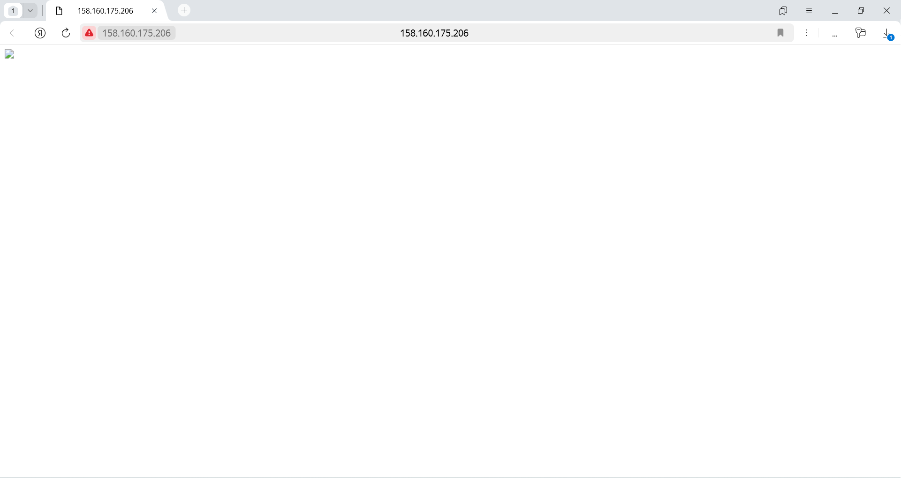

# Домашнее задание к занятию "`Безопасность в облачных провайдерах`" - `Барышников Никита`

Используя конфигурации, выполненные в рамках предыдущих домашних заданий, нужно добавить возможность шифрования бакета.

## Задание 1. Yandex Cloud
<details>
	<summary></summary>
      <br>

**Что нужно сделать**

1. С помощью ключа в KMS необходимо зашифровать содержимое бакета:

 - создать ключ в KMS;
 - с помощью ключа зашифровать содержимое бакета, созданного ранее.
2. (Выполняется не в Terraform)* Создать статический сайт в Object Storage c собственным публичным адресом и сделать доступным по HTTPS:

 - создать сертификат;
 - создать статическую страницу в Object Storage и применить сертификат HTTPS;
 - в качестве результата предоставить скриншот на страницу с сертификатом в заголовке (замочек).

Полезные документы:

- [Настройка HTTPS статичного сайта](https://cloud.yandex.ru/docs/storage/operations/hosting/certificate).
- [Object Storage bucket](https://registry.terraform.io/providers/yandex-cloud/yandex/latest/docs/resources/storage_bucket).
- [KMS key](https://registry.terraform.io/providers/yandex-cloud/yandex/latest/docs/resources/kms_symmetric_key).

</details>

### Решение:

Используя конфигурации, выполненные в рамках предыдущих домашних заданий, добавим возможность шифрования бакета.

1. С помощью ключа в KMS зашифруем содержимое бакета:

Создадим роль. Она будет иметь доступ для редактирования хранилища.
```hcl
resource "yandex_resourcemanager_folder_iam_member" "sa-editor-encrypter-decrypter" {
  folder_id = var.folder_id
  role      = "kms.keys.encrypterDecrypter"
  member    = "serviceAccount:${yandex_iam_service_account.service.id}"
}
```

Создадим симметричный ключ шифрования с алгоритмом шифрования AES_128 и временем жизни 24 часа.
```hcl
resource "yandex_kms_symmetric_key" "secret-key" {
  name              = "key-1"
  description       = "ключ для шифрования бакета"
  default_algorithm = "AES_128"
  rotation_period   = "24h"
}
```

Примененим ключ шифрования к имеющемуся бакету.
```hcl
  server_side_encryption_configuration {
    rule {
      apply_server_side_encryption_by_default {
        kms_master_key_id = yandex_kms_symmetric_key.secret-key.id
        sse_algorithm     = "aws:kms"
      }
    }
  }
```

Выполним `terraform apply`.

Выведим список симметричных ключей:
```bash
baryshnikov@debian:~$ yc kms symmetric-key list
+----------------------+-------+----------------------+-------------------+---------------------+--------+
|          ID          | NAME  |  PRIMARY VERSION ID  | DEFAULT ALGORITHM |     CREATED AT      | STATUS |
+----------------------+-------+----------------------+-------------------+---------------------+--------+
| abj1vnngglsjt5ohusnl | key-1 | abjfjs2cledctnsb9jve | AES_128           | 2024-07-13 14:11:01 | ACTIVE |
+----------------------+-------+----------------------+-------------------+---------------------+--------+

```

Выведем информацию о ключе:
```bash
baryshnikov@debian:~$ yc kms symmetric-key get --id abj1vnngglsjt5ohusnl
id: abj1vnngglsjt5ohusnl
folder_id: b1ghnkadavleanbnn9ut
created_at: "2024-07-13T14:11:01Z"
name: key-1
description: ключ для шифрования бакета
status: ACTIVE
primary_version:
  id: abjfjs2cledctnsb9jve
  key_id: abj1vnngglsjt5ohusnl
  status: ACTIVE
  algorithm: AES_128
  created_at: "2024-07-13T14:11:01Z"
  primary: true
default_algorithm: AES_128
rotation_period: 86400s

```

Определим ip-адрес балансировщика:
```bash
baryshnikov@debian:~$ yc load-balancer network-load-balancer get balancer
id: enptb33op35mjkqkoo2m
folder_id: b1ghnkadavleanbnn9ut
created_at: "2024-07-13T14:14:39Z"
name: balancer
region_id: ru-central1
status: ACTIVE
type: EXTERNAL
listeners:
  - name: my-listener
    address: 158.160.175.206
    port: "80"
    protocol: TCP
    target_port: "80"
    ip_version: IPV4
attached_target_groups:
  - target_group_id: enpqb57dov6aj8dh4qdd
    health_checks:
      - name: http
        interval: 2s
        timeout: 1s
        unhealthy_threshold: "2"
        healthy_threshold: "5"
        http_options:
          port: "80"
          path: /

```

Попробуем посмотреть картинку:


Как видно из скриншота выше, доступа к картинке в бакете нет.

---