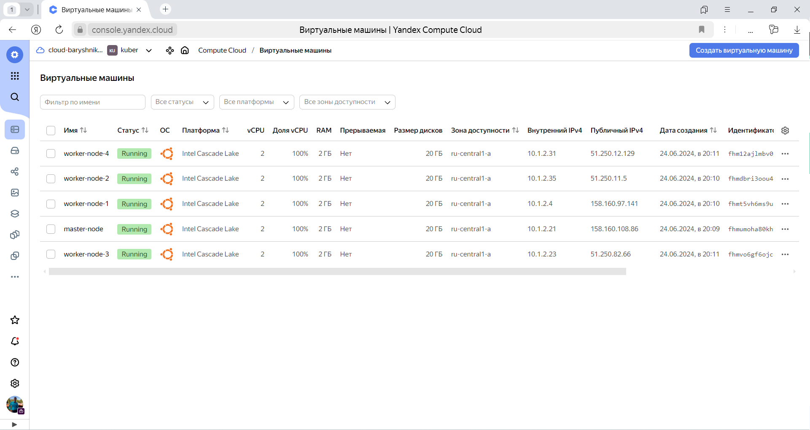

# Домашнее задание к занятию "`Установка Kubernetes`" - `Барышников Никита`


## Цель задания

Установить кластер K8s.

### Задание 1. Установить кластер k8s с 1 master node
<details>
	<summary></summary>
      <br>

1. Подготовка работы кластера из 5 нод: 1 мастер и 4 рабочие ноды.
2. В качестве CRI — containerd.
3. Запуск etcd производить на мастере.
4. Способ установки выбрать самостоятельно.

</details>

#### Решение:

Для выполнения работы воспользуемся Yandex Cloud.

Установим интерфейс командной строки (CLI) с помощью команды `curl -sSL https://storage.yandexcloud.net/yandexcloud-yc/install.sh | bash`.  
Аутентифицируемся с помощью аккаунта на Яндексе и создадим каталог `kuber`.

Создадим облачную сеть в каталоге, указанном в профиле CLI:
```bash
baryshnikov@debian:~$ yc vpc network create  --name my-yc-network --labels my-label=my-value
id: enpnc0qgnkr2d96ooquv
folder_id: b1g4551cf32boa8956a2
created_at: "2024-06-20T12:39:46Z"
name: my-yc-network
description: net yc
labels:
  my-label: my-value
default_security_group_id: enpvr2tma5176api13en

baryshnikov@debian:~$ 
baryshnikov@debian:~$ 
baryshnikov@debian:~$ yc vpc network list
+----------------------+---------------+
|          ID          |     NAME      |
+----------------------+---------------+
| enpnc0qgnkr2d96ooquv | my-yc-network |
+----------------------+---------------+
```

Создадим подсеть в облачной сети my-yc-network:
```bash
baryshnikov@debian:~$ yc vpc subnet create  --name my-yc-subnet-a --zone ru-central1-a --range 10.1.2.0/24 --network-name my-yc-network
id: e9bp2j7a005ju5fmhend
folder_id: b1g4551cf32boa8956a2
created_at: "2024-06-20T12:47:51Z"
name: my-yc-subnet-a
network_id: enpnc0qgnkr2d96ooquv
zone_id: ru-central1-a
v4_cidr_blocks:
  - 10.1.2.0/24

baryshnikov@debian:~$ 
baryshnikov@debian:~$ 
baryshnikov@debian:~$ yc vpc subnet list
+----------------------+----------------+----------------------+----------------+---------------+---------------+
|          ID          |      NAME      |      NETWORK ID      | ROUTE TABLE ID |     ZONE      |     RANGE     |
+----------------------+----------------+----------------------+----------------+---------------+---------------+
| e9bp2j7a005ju5fmhend | my-yc-subnet-a | enpnc0qgnkr2d96ooquv |                | ru-central1-a | [10.1.2.0/24] |
+----------------------+----------------+----------------------+----------------+---------------+---------------+
```

Далее, запустим скрипт создания ВМ в Yandex Cloud с помощью комадны `bash create-vm.bash`.

Скриншот 1 - Cозданные ВМ в Yandex Cloud.


С помощью команды `ssh yc-user@158.160.108.86` зайдем на мастер ноду.

Подготовим ВМ для установки `python3.11`
<details>
	<summary></summary>
      <br>

```bash
yc-user@master-node:~$ sudo apt-get update -y
Hit:1 http://mirror.yandex.ru/ubuntu jammy InRelease
Hit:2 http://mirror.yandex.ru/ubuntu jammy-updates InRelease
Hit:3 http://mirror.yandex.ru/ubuntu jammy-backports InRelease
Hit:4 http://security.ubuntu.com/ubuntu jammy-security InRelease
Reading package lists... Done                        
yc-user@master-node:~$ 
yc-user@master-node:~$ 
yc-user@master-node:~$ sudo apt install software-properties-common
Reading package lists... Done
Building dependency tree... Done
Reading state information... Done
software-properties-common is already the newest version (0.99.22.9).
software-properties-common set to manually installed.
0 upgraded, 0 newly installed, 0 to remove and 2 not upgraded.
yc-user@master-node:~$ 
yc-user@master-node:~$ 
yc-user@master-node:~$ sudo add-apt-repository ppa:deadsnakes/ppa
Repository: 'deb https://ppa.launchpadcontent.net/deadsnakes/ppa/ubuntu/ jammy main'
Description:
This PPA contains more recent Python versions packaged for Ubuntu.

Disclaimer: there's no guarantee of timely updates in case of security problems or other issues. If you want to use them in a security-or-otherwise-critical environment (say, on a production server), you do so at your own risk.

Update Note
===========
Please use this repository instead of ppa:fkrull/deadsnakes.

Reporting Issues
================

Issues can be reported in the master issue tracker at:
https://github.com/deadsnakes/issues/issues

Supported Ubuntu and Python Versions
====================================

- Ubuntu 20.04 (focal) Python3.5 - Python3.7, Python3.9 - Python3.13
- Ubuntu 22.04 (jammy) Python3.7 - Python3.9, Python3.11 - Python3.13
- Ubuntu 24.04 (noble) Python3.7 - Python3.11, Python3.13
- Note: Python2.7 (focal, jammy), Python 3.8 (focal), Python 3.10 (jammy), Python3.12 (noble) are not provided by deadsnakes as upstream ubuntu provides those packages.

Why some packages aren't built:
- Note: for focal, older python versions require libssl<1.1 so they are not currently built
- Note: for jammy and noble, older python versions requre libssl<3 so they are not currently built
- If you need these, reach out to asottile to set up a private ppa

The packages may also work on other versions of Ubuntu or Debian, but that is not tested or supported.

Packages
========

The packages provided here are loosely based on the debian upstream packages with some modifications to make them more usable as non-default pythons and on ubuntu.  As such, the packages follow debian's patterns and often do not include a full python distribution with just `apt install python#.#`.  Here is a list of packages that may be useful along with the default install:

- `python#.#-dev`: includes development headers for building C extensions
- `python#.#-venv`: provides the standard library `venv` module
- `python#.#-distutils`: provides the standard library `distutils` module
- `python#.#-lib2to3`: provides the `2to3-#.#` utility as well as the standard library `lib2to3` module
- `python#.#-gdbm`: provides the standard library `dbm.gnu` module
- `python#.#-tk`: provides the standard library `tkinter` module

Third-Party Python Modules
==========================

Python modules in the official Ubuntu repositories are packaged to work with the Python interpreters from the official repositories. Accordingly, they generally won't work with the Python interpreters from this PPA. As an exception, pure-Python modules for Python 3 will work, but any compiled extension modules won't.

To install 3rd-party Python modules, you should use the common Python packaging tools.  For an introduction into the Python packaging ecosystem and its tools, refer to the Python Packaging User Guide:
https://packaging.python.org/installing/

Sources
=======
The package sources are available at:
https://github.com/deadsnakes/

Nightly Builds
==============

For nightly builds, see ppa:deadsnakes/nightly https://launchpad.net/~deadsnakes/+archive/ubuntu/nightly
More info: https://launchpad.net/~deadsnakes/+archive/ubuntu/ppa
Adding repository.
Press [ENTER] to continue or Ctrl-c to cancel.
Adding deb entry to /etc/apt/sources.list.d/deadsnakes-ubuntu-ppa-jammy.list
Adding disabled deb-src entry to /etc/apt/sources.list.d/deadsnakes-ubuntu-ppa-jammy.list
Adding key to /etc/apt/trusted.gpg.d/deadsnakes-ubuntu-ppa.gpg with fingerprint F23C5A6CF475977595C89F51BA6932366A755776
Hit:1 http://mirror.yandex.ru/ubuntu jammy InRelease
Hit:2 http://mirror.yandex.ru/ubuntu jammy-updates InRelease                                    
Hit:3 http://mirror.yandex.ru/ubuntu jammy-backports InRelease                                  
Hit:4 http://security.ubuntu.com/ubuntu jammy-security InRelease                                                 
Get:5 https://ppa.launchpadcontent.net/deadsnakes/ppa/ubuntu jammy InRelease [18.1 kB]                           
Get:6 https://ppa.launchpadcontent.net/deadsnakes/ppa/ubuntu jammy/main amd64 Packages [23.6 kB]
Get:7 https://ppa.launchpadcontent.net/deadsnakes/ppa/ubuntu jammy/main Translation-en [4,800 B]
Fetched 46.4 kB in 1s (50.9 kB/s)           
Reading package lists... Done
yc-user@master-node:~$ 
yc-user@master-node:~$ 
yc-user@master-node:~$ sudo apt-get update -y
Hit:1 http://mirror.yandex.ru/ubuntu jammy InRelease
Hit:2 http://mirror.yandex.ru/ubuntu jammy-updates InRelease                                                   
Hit:3 http://mirror.yandex.ru/ubuntu jammy-backports InRelease                                                 
Hit:4 http://security.ubuntu.com/ubuntu jammy-security InRelease                                               
Hit:5 https://ppa.launchpadcontent.net/deadsnakes/ppa/ubuntu jammy InRelease                                   
Reading package lists... Done
yc-user@master-node:~$ 
yc-user@master-node:~$ 
yc-user@master-node:~$ sudo apt-get install git pip python3.11 -y
Reading package lists... Done
Building dependency tree... Done
Reading state information... Done
Note, selecting 'python3-pip' instead of 'pip'
git is already the newest version (1:2.34.1-1ubuntu1.11).
git set to manually installed.
The following additional packages will be installed:
  build-essential bzip2 cpp cpp-11 dpkg-dev fakeroot fontconfig-config fonts-dejavu-core g++ g++-11 gcc gcc-11 gcc-11-base
  javascript-common libalgorithm-diff-perl libalgorithm-diff-xs-perl libalgorithm-merge-perl libasan6 libatomic1
  libc-dev-bin libc-devtools libc6-dev libcc1-0 libcrypt-dev libdeflate0 libdpkg-perl libexpat1-dev libfakeroot
  libfile-fcntllock-perl libfontconfig1 libgcc-11-dev libgd3 libgomp1 libisl23 libitm1 libjbig0 libjpeg-turbo8 libjpeg8
  libjs-jquery libjs-sphinxdoc libjs-underscore liblsan0 libmpc3 libnsl-dev libpython3-dev libpython3.10-dev
  libpython3.11-minimal libpython3.11-stdlib libquadmath0 libstdc++-11-dev libtiff5 libtirpc-dev libtsan0 libubsan1 libwebp7
  libxpm4 linux-libc-dev lto-disabled-list mailcap make manpages-dev mime-support python3-dev python3-wheel python3.10-dev
  python3.11-minimal rpcsvc-proto zlib1g-dev
Suggested packages:
  bzip2-doc cpp-doc gcc-11-locales debian-keyring g++-multilib g++-11-multilib gcc-11-doc gcc-multilib autoconf automake
  libtool flex bison gdb gcc-doc gcc-11-multilib apache2 | lighttpd | httpd glibc-doc bzr libgd-tools libstdc++-11-doc
  make-doc python3.11-venv binfmt-support
The following NEW packages will be installed:
  build-essential bzip2 cpp cpp-11 dpkg-dev fakeroot fontconfig-config fonts-dejavu-core g++ g++-11 gcc gcc-11 gcc-11-base
  javascript-common libalgorithm-diff-perl libalgorithm-diff-xs-perl libalgorithm-merge-perl libasan6 libatomic1
  libc-dev-bin libc-devtools libc6-dev libcc1-0 libcrypt-dev libdeflate0 libdpkg-perl libexpat1-dev libfakeroot
  libfile-fcntllock-perl libfontconfig1 libgcc-11-dev libgd3 libgomp1 libisl23 libitm1 libjbig0 libjpeg-turbo8 libjpeg8
  libjs-jquery libjs-sphinxdoc libjs-underscore liblsan0 libmpc3 libnsl-dev libpython3-dev libpython3.10-dev
  libpython3.11-minimal libpython3.11-stdlib libquadmath0 libstdc++-11-dev libtiff5 libtirpc-dev libtsan0 libubsan1 libwebp7
  libxpm4 linux-libc-dev lto-disabled-list mailcap make manpages-dev mime-support python3-dev python3-pip python3-wheel
  python3.10-dev python3.11 python3.11-minimal rpcsvc-proto zlib1g-dev
0 upgraded, 70 newly installed, 0 to remove and 2 not upgraded.
Need to get 77.2 MB of archives.
After this operation, 261 MB of additional disk space will be used.
Get:1 http://mirror.yandex.ru/ubuntu jammy-updates/main amd64 libc-dev-bin amd64 2.35-0ubuntu3.8 [20.3 kB]
Get:2 http://mirror.yandex.ru/ubuntu jammy-updates/main amd64 linux-libc-dev amd64 5.15.0-112.122 [1,342 kB]
Get:3 http://mirror.yandex.ru/ubuntu jammy/main amd64 libcrypt-dev amd64 1:4.4.27-1 [112 kB]
Get:4 http://mirror.yandex.ru/ubuntu jammy/main amd64 rpcsvc-proto amd64 1.4.2-0ubuntu6 [68.5 kB]
Get:5 http://mirror.yandex.ru/ubuntu jammy-updates/main amd64 libtirpc-dev amd64 1.3.2-2ubuntu0.1 [192 kB]
Get:6 http://mirror.yandex.ru/ubuntu jammy/main amd64 libnsl-dev amd64 1.3.0-2build2 [71.3 kB] 
Get:7 http://mirror.yandex.ru/ubuntu jammy-updates/main amd64 libc6-dev amd64 2.35-0ubuntu3.8 [2,100 kB]
Get:8 http://mirror.yandex.ru/ubuntu jammy-updates/main amd64 gcc-11-base amd64 11.4.0-1ubuntu1~22.04 [20.2 kB]
Get:9 http://mirror.yandex.ru/ubuntu jammy/main amd64 libisl23 amd64 0.24-2build1 [727 kB]
Get:10 http://mirror.yandex.ru/ubuntu jammy/main amd64 libmpc3 amd64 1.2.1-2build1 [46.9 kB]
Get:11 http://mirror.yandex.ru/ubuntu jammy-updates/main amd64 cpp-11 amd64 11.4.0-1ubuntu1~22.04 [10.0 MB]
Get:12 http://mirror.yandex.ru/ubuntu jammy/main amd64 cpp amd64 4:11.2.0-1ubuntu1 [27.7 kB]
Get:13 http://mirror.yandex.ru/ubuntu jammy-updates/main amd64 libcc1-0 amd64 12.3.0-1ubuntu1~22.04 [48.3 kB]
Get:14 http://mirror.yandex.ru/ubuntu jammy-updates/main amd64 libgomp1 amd64 12.3.0-1ubuntu1~22.04 [126 kB]
Get:15 https://ppa.launchpadcontent.net/deadsnakes/ppa/ubuntu jammy/main amd64 libpython3.11-minimal amd64 3.11.9-1+jammy1 [884 kB]
Get:16 http://mirror.yandex.ru/ubuntu jammy-updates/main amd64 libitm1 amd64 12.3.0-1ubuntu1~22.04 [30.2 kB]
Get:17 http://mirror.yandex.ru/ubuntu jammy-updates/main amd64 libatomic1 amd64 12.3.0-1ubuntu1~22.04 [10.4 kB]
Get:18 http://mirror.yandex.ru/ubuntu jammy-updates/main amd64 libasan6 amd64 11.4.0-1ubuntu1~22.04 [2,282 kB]
Get:19 http://mirror.yandex.ru/ubuntu jammy-updates/main amd64 liblsan0 amd64 12.3.0-1ubuntu1~22.04 [1,069 kB]
Get:20 http://mirror.yandex.ru/ubuntu jammy-updates/main amd64 libtsan0 amd64 11.4.0-1ubuntu1~22.04 [2,260 kB]
Get:21 http://mirror.yandex.ru/ubuntu jammy-updates/main amd64 libubsan1 amd64 12.3.0-1ubuntu1~22.04 [976 kB]
Get:22 http://mirror.yandex.ru/ubuntu jammy-updates/main amd64 libquadmath0 amd64 12.3.0-1ubuntu1~22.04 [154 kB]
Get:23 http://mirror.yandex.ru/ubuntu jammy-updates/main amd64 libgcc-11-dev amd64 11.4.0-1ubuntu1~22.04 [2,517 kB]
Get:24 http://mirror.yandex.ru/ubuntu jammy-updates/main amd64 gcc-11 amd64 11.4.0-1ubuntu1~22.04 [20.1 MB]
Get:25 https://ppa.launchpadcontent.net/deadsnakes/ppa/ubuntu jammy/main amd64 python3.11-minimal amd64 3.11.9-1+jammy1 [2,355 kB]
Get:26 http://mirror.yandex.ru/ubuntu jammy/main amd64 gcc amd64 4:11.2.0-1ubuntu1 [5,112 B]
Get:27 http://mirror.yandex.ru/ubuntu jammy-updates/main amd64 libstdc++-11-dev amd64 11.4.0-1ubuntu1~22.04 [2,101 kB]
Get:28 http://mirror.yandex.ru/ubuntu jammy-updates/main amd64 g++-11 amd64 11.4.0-1ubuntu1~22.04 [11.4 MB]
Get:29 http://mirror.yandex.ru/ubuntu jammy/main amd64 g++ amd64 4:11.2.0-1ubuntu1 [1,412 B]
Get:30 http://mirror.yandex.ru/ubuntu jammy/main amd64 make amd64 4.3-4.1build1 [180 kB]
Get:31 http://mirror.yandex.ru/ubuntu jammy-updates/main amd64 libdpkg-perl all 1.21.1ubuntu2.3 [237 kB]
Get:32 http://mirror.yandex.ru/ubuntu jammy/main amd64 bzip2 amd64 1.0.8-5build1 [34.8 kB]
Get:33 http://mirror.yandex.ru/ubuntu jammy/main amd64 lto-disabled-list all 24 [12.5 kB]
Get:34 http://mirror.yandex.ru/ubuntu jammy-updates/main amd64 dpkg-dev all 1.21.1ubuntu2.3 [922 kB]
Get:35 http://mirror.yandex.ru/ubuntu jammy/main amd64 build-essential amd64 12.9ubuntu3 [4,744 B]
Get:36 http://mirror.yandex.ru/ubuntu jammy/main amd64 libfakeroot amd64 1.28-1ubuntu1 [31.5 kB]
Get:37 http://mirror.yandex.ru/ubuntu jammy/main amd64 fakeroot amd64 1.28-1ubuntu1 [60.4 kB]
Get:38 http://mirror.yandex.ru/ubuntu jammy/main amd64 fonts-dejavu-core all 2.37-2build1 [1,041 kB]
Get:39 http://mirror.yandex.ru/ubuntu jammy/main amd64 fontconfig-config all 2.13.1-4.2ubuntu5 [29.1 kB]
Get:40 http://mirror.yandex.ru/ubuntu jammy/main amd64 javascript-common all 11+nmu1 [5,936 B]
Get:41 http://mirror.yandex.ru/ubuntu jammy/main amd64 libalgorithm-diff-perl all 1.201-1 [41.8 kB]
Get:42 http://mirror.yandex.ru/ubuntu jammy/main amd64 libalgorithm-diff-xs-perl amd64 0.04-6build3 [11.9 kB]
Get:43 http://mirror.yandex.ru/ubuntu jammy/main amd64 libalgorithm-merge-perl all 0.08-3 [12.0 kB]  
Get:44 http://mirror.yandex.ru/ubuntu jammy/main amd64 libfontconfig1 amd64 2.13.1-4.2ubuntu5 [131 kB]
Get:45 http://mirror.yandex.ru/ubuntu jammy/main amd64 libjpeg-turbo8 amd64 2.1.2-0ubuntu1 [134 kB]
Get:46 http://mirror.yandex.ru/ubuntu jammy/main amd64 libjpeg8 amd64 8c-2ubuntu10 [2,264 B]
Get:47 http://mirror.yandex.ru/ubuntu jammy/main amd64 libdeflate0 amd64 1.10-2 [70.9 kB]
Get:48 http://mirror.yandex.ru/ubuntu jammy-updates/main amd64 libjbig0 amd64 2.1-3.1ubuntu0.22.04.1 [29.2 kB]
Get:49 http://mirror.yandex.ru/ubuntu jammy-updates/main amd64 libwebp7 amd64 1.2.2-2ubuntu0.22.04.2 [206 kB]
Get:50 http://mirror.yandex.ru/ubuntu jammy-updates/main amd64 libtiff5 amd64 4.3.0-6ubuntu0.9 [185 kB]
Get:51 http://mirror.yandex.ru/ubuntu jammy-updates/main amd64 libxpm4 amd64 1:3.5.12-1ubuntu0.22.04.2 [36.7 kB]
Get:52 http://mirror.yandex.ru/ubuntu jammy/main amd64 libgd3 amd64 2.3.0-2ubuntu2 [129 kB]
Get:53 http://mirror.yandex.ru/ubuntu jammy-updates/main amd64 libc-devtools amd64 2.35-0ubuntu3.8 [28.9 kB]
Get:54 http://mirror.yandex.ru/ubuntu jammy-updates/main amd64 libexpat1-dev amd64 2.4.7-1ubuntu0.3 [147 kB]
Get:55 http://mirror.yandex.ru/ubuntu jammy/main amd64 libfile-fcntllock-perl amd64 0.22-3build7 [33.9 kB]
Get:56 http://mirror.yandex.ru/ubuntu jammy/main amd64 libjs-jquery all 3.6.0+dfsg+~3.5.13-1 [321 kB]
Get:57 http://mirror.yandex.ru/ubuntu jammy/main amd64 libjs-underscore all 1.13.2~dfsg-2 [118 kB]
Get:58 http://mirror.yandex.ru/ubuntu jammy/main amd64 libjs-sphinxdoc all 4.3.2-1 [139 kB]
Get:59 http://mirror.yandex.ru/ubuntu jammy-updates/main amd64 zlib1g-dev amd64 1:1.2.11.dfsg-2ubuntu9.2 [164 kB]
Get:60 http://mirror.yandex.ru/ubuntu jammy-updates/main amd64 libpython3.10-dev amd64 3.10.12-1~22.04.3 [4,762 kB]
Get:61 https://ppa.launchpadcontent.net/deadsnakes/ppa/ubuntu jammy/main amd64 libpython3.11-stdlib amd64 3.11.9-1+jammy1 [1,925 kB]
Get:62 http://mirror.yandex.ru/ubuntu jammy-updates/main amd64 libpython3-dev amd64 3.10.6-1~22.04 [7,166 B]
Get:63 http://mirror.yandex.ru/ubuntu jammy/main amd64 mailcap all 3.70+nmu1ubuntu1 [23.8 kB]
Get:64 http://mirror.yandex.ru/ubuntu jammy/main amd64 mime-support all 3.66 [3,696 B]
Get:65 http://mirror.yandex.ru/ubuntu jammy/main amd64 manpages-dev all 5.10-1ubuntu1 [2,309 kB]
Get:66 http://mirror.yandex.ru/ubuntu jammy-updates/main amd64 python3.10-dev amd64 3.10.12-1~22.04.3 [507 kB]
Get:67 http://mirror.yandex.ru/ubuntu jammy-updates/main amd64 python3-dev amd64 3.10.6-1~22.04 [26.0 kB]
Get:68 http://mirror.yandex.ru/ubuntu jammy-updates/universe amd64 python3-wheel all 0.37.1-2ubuntu0.22.04.1 [32.0 kB]
Get:69 http://mirror.yandex.ru/ubuntu jammy-updates/universe amd64 python3-pip all 22.0.2+dfsg-1ubuntu0.4 [1,305 kB]
Get:70 https://ppa.launchpadcontent.net/deadsnakes/ppa/ubuntu jammy/main amd64 python3.11 amd64 3.11.9-1+jammy1 [640 kB]
Fetched 77.2 MB in 6s (12.4 MB/s)                                                                                            
Extracting templates from packages: 100%
Selecting previously unselected package libpython3.11-minimal:amd64.
(Reading database ... 110126 files and directories currently installed.)
Preparing to unpack .../00-libpython3.11-minimal_3.11.9-1+jammy1_amd64.deb ...
Unpacking libpython3.11-minimal:amd64 (3.11.9-1+jammy1) ...
Selecting previously unselected package python3.11-minimal.
Preparing to unpack .../01-python3.11-minimal_3.11.9-1+jammy1_amd64.deb ...
Unpacking python3.11-minimal (3.11.9-1+jammy1) ...
Selecting previously unselected package libc-dev-bin.
Preparing to unpack .../02-libc-dev-bin_2.35-0ubuntu3.8_amd64.deb ...
Unpacking libc-dev-bin (2.35-0ubuntu3.8) ...
Selecting previously unselected package linux-libc-dev:amd64.
Preparing to unpack .../03-linux-libc-dev_5.15.0-112.122_amd64.deb ...
Unpacking linux-libc-dev:amd64 (5.15.0-112.122) ...
Selecting previously unselected package libcrypt-dev:amd64.
Preparing to unpack .../04-libcrypt-dev_1%3a4.4.27-1_amd64.deb ...
Unpacking libcrypt-dev:amd64 (1:4.4.27-1) ...
Selecting previously unselected package rpcsvc-proto.
Preparing to unpack .../05-rpcsvc-proto_1.4.2-0ubuntu6_amd64.deb ...
Unpacking rpcsvc-proto (1.4.2-0ubuntu6) ...
Selecting previously unselected package libtirpc-dev:amd64.
Preparing to unpack .../06-libtirpc-dev_1.3.2-2ubuntu0.1_amd64.deb ...
Unpacking libtirpc-dev:amd64 (1.3.2-2ubuntu0.1) ...
Selecting previously unselected package libnsl-dev:amd64.
Preparing to unpack .../07-libnsl-dev_1.3.0-2build2_amd64.deb ...
Unpacking libnsl-dev:amd64 (1.3.0-2build2) ...
Selecting previously unselected package libc6-dev:amd64.
Preparing to unpack .../08-libc6-dev_2.35-0ubuntu3.8_amd64.deb ...
Unpacking libc6-dev:amd64 (2.35-0ubuntu3.8) ...
Selecting previously unselected package gcc-11-base:amd64.
Preparing to unpack .../09-gcc-11-base_11.4.0-1ubuntu1~22.04_amd64.deb ...
Unpacking gcc-11-base:amd64 (11.4.0-1ubuntu1~22.04) ...
Selecting previously unselected package libisl23:amd64.
Preparing to unpack .../10-libisl23_0.24-2build1_amd64.deb ...
Unpacking libisl23:amd64 (0.24-2build1) ...
Selecting previously unselected package libmpc3:amd64.
Preparing to unpack .../11-libmpc3_1.2.1-2build1_amd64.deb ...
Unpacking libmpc3:amd64 (1.2.1-2build1) ...
Selecting previously unselected package cpp-11.
Preparing to unpack .../12-cpp-11_11.4.0-1ubuntu1~22.04_amd64.deb ...
Unpacking cpp-11 (11.4.0-1ubuntu1~22.04) ...
Selecting previously unselected package cpp.
Preparing to unpack .../13-cpp_4%3a11.2.0-1ubuntu1_amd64.deb ...
Unpacking cpp (4:11.2.0-1ubuntu1) ...
Selecting previously unselected package libcc1-0:amd64.
Preparing to unpack .../14-libcc1-0_12.3.0-1ubuntu1~22.04_amd64.deb ...
Unpacking libcc1-0:amd64 (12.3.0-1ubuntu1~22.04) ...
Selecting previously unselected package libgomp1:amd64.
Preparing to unpack .../15-libgomp1_12.3.0-1ubuntu1~22.04_amd64.deb ...
Unpacking libgomp1:amd64 (12.3.0-1ubuntu1~22.04) ...
Selecting previously unselected package libitm1:amd64.
Preparing to unpack .../16-libitm1_12.3.0-1ubuntu1~22.04_amd64.deb ...
Unpacking libitm1:amd64 (12.3.0-1ubuntu1~22.04) ...
Selecting previously unselected package libatomic1:amd64.
Preparing to unpack .../17-libatomic1_12.3.0-1ubuntu1~22.04_amd64.deb ...
Unpacking libatomic1:amd64 (12.3.0-1ubuntu1~22.04) ...
Selecting previously unselected package libasan6:amd64.
Preparing to unpack .../18-libasan6_11.4.0-1ubuntu1~22.04_amd64.deb ...
Unpacking libasan6:amd64 (11.4.0-1ubuntu1~22.04) ...
Selecting previously unselected package liblsan0:amd64.
Preparing to unpack .../19-liblsan0_12.3.0-1ubuntu1~22.04_amd64.deb ...
Unpacking liblsan0:amd64 (12.3.0-1ubuntu1~22.04) ...
Selecting previously unselected package libtsan0:amd64.
Preparing to unpack .../20-libtsan0_11.4.0-1ubuntu1~22.04_amd64.deb ...
Unpacking libtsan0:amd64 (11.4.0-1ubuntu1~22.04) ...
Selecting previously unselected package libubsan1:amd64.
Preparing to unpack .../21-libubsan1_12.3.0-1ubuntu1~22.04_amd64.deb ...
Unpacking libubsan1:amd64 (12.3.0-1ubuntu1~22.04) ...
Selecting previously unselected package libquadmath0:amd64.
Preparing to unpack .../22-libquadmath0_12.3.0-1ubuntu1~22.04_amd64.deb ...
Unpacking libquadmath0:amd64 (12.3.0-1ubuntu1~22.04) ...
Selecting previously unselected package libgcc-11-dev:amd64.
Preparing to unpack .../23-libgcc-11-dev_11.4.0-1ubuntu1~22.04_amd64.deb ...
Unpacking libgcc-11-dev:amd64 (11.4.0-1ubuntu1~22.04) ...
Selecting previously unselected package gcc-11.
Preparing to unpack .../24-gcc-11_11.4.0-1ubuntu1~22.04_amd64.deb ...
Unpacking gcc-11 (11.4.0-1ubuntu1~22.04) ...
Selecting previously unselected package gcc.
Preparing to unpack .../25-gcc_4%3a11.2.0-1ubuntu1_amd64.deb ...
Unpacking gcc (4:11.2.0-1ubuntu1) ...
Selecting previously unselected package libstdc++-11-dev:amd64.
Preparing to unpack .../26-libstdc++-11-dev_11.4.0-1ubuntu1~22.04_amd64.deb ...
Unpacking libstdc++-11-dev:amd64 (11.4.0-1ubuntu1~22.04) ...
Selecting previously unselected package g++-11.
Preparing to unpack .../27-g++-11_11.4.0-1ubuntu1~22.04_amd64.deb ...
Unpacking g++-11 (11.4.0-1ubuntu1~22.04) ...
Selecting previously unselected package g++.
Preparing to unpack .../28-g++_4%3a11.2.0-1ubuntu1_amd64.deb ...
Unpacking g++ (4:11.2.0-1ubuntu1) ...
Selecting previously unselected package make.
Preparing to unpack .../29-make_4.3-4.1build1_amd64.deb ...
Unpacking make (4.3-4.1build1) ...
Selecting previously unselected package libdpkg-perl.
Preparing to unpack .../30-libdpkg-perl_1.21.1ubuntu2.3_all.deb ...
Unpacking libdpkg-perl (1.21.1ubuntu2.3) ...
Selecting previously unselected package bzip2.
Preparing to unpack .../31-bzip2_1.0.8-5build1_amd64.deb ...
Unpacking bzip2 (1.0.8-5build1) ...
Selecting previously unselected package lto-disabled-list.
Preparing to unpack .../32-lto-disabled-list_24_all.deb ...
Unpacking lto-disabled-list (24) ...
Selecting previously unselected package dpkg-dev.
Preparing to unpack .../33-dpkg-dev_1.21.1ubuntu2.3_all.deb ...
Unpacking dpkg-dev (1.21.1ubuntu2.3) ...
Selecting previously unselected package build-essential.
Preparing to unpack .../34-build-essential_12.9ubuntu3_amd64.deb ...
Unpacking build-essential (12.9ubuntu3) ...
Selecting previously unselected package libfakeroot:amd64.
Preparing to unpack .../35-libfakeroot_1.28-1ubuntu1_amd64.deb ...
Unpacking libfakeroot:amd64 (1.28-1ubuntu1) ...
Selecting previously unselected package fakeroot.
Preparing to unpack .../36-fakeroot_1.28-1ubuntu1_amd64.deb ...
Unpacking fakeroot (1.28-1ubuntu1) ...
Selecting previously unselected package fonts-dejavu-core.
Preparing to unpack .../37-fonts-dejavu-core_2.37-2build1_all.deb ...
Unpacking fonts-dejavu-core (2.37-2build1) ...
Selecting previously unselected package fontconfig-config.
Preparing to unpack .../38-fontconfig-config_2.13.1-4.2ubuntu5_all.deb ...
Unpacking fontconfig-config (2.13.1-4.2ubuntu5) ...
Selecting previously unselected package javascript-common.
Preparing to unpack .../39-javascript-common_11+nmu1_all.deb ...
Unpacking javascript-common (11+nmu1) ...
Selecting previously unselected package libalgorithm-diff-perl.
Preparing to unpack .../40-libalgorithm-diff-perl_1.201-1_all.deb ...
Unpacking libalgorithm-diff-perl (1.201-1) ...
Selecting previously unselected package libalgorithm-diff-xs-perl.
Preparing to unpack .../41-libalgorithm-diff-xs-perl_0.04-6build3_amd64.deb ...
Unpacking libalgorithm-diff-xs-perl (0.04-6build3) ...
Selecting previously unselected package libalgorithm-merge-perl.
Preparing to unpack .../42-libalgorithm-merge-perl_0.08-3_all.deb ...
Unpacking libalgorithm-merge-perl (0.08-3) ...
Selecting previously unselected package libfontconfig1:amd64.
Preparing to unpack .../43-libfontconfig1_2.13.1-4.2ubuntu5_amd64.deb ...
Unpacking libfontconfig1:amd64 (2.13.1-4.2ubuntu5) ...
Selecting previously unselected package libjpeg-turbo8:amd64.
Preparing to unpack .../44-libjpeg-turbo8_2.1.2-0ubuntu1_amd64.deb ...
Unpacking libjpeg-turbo8:amd64 (2.1.2-0ubuntu1) ...
Selecting previously unselected package libjpeg8:amd64.
Preparing to unpack .../45-libjpeg8_8c-2ubuntu10_amd64.deb ...
Unpacking libjpeg8:amd64 (8c-2ubuntu10) ...
Selecting previously unselected package libdeflate0:amd64.
Preparing to unpack .../46-libdeflate0_1.10-2_amd64.deb ...
Unpacking libdeflate0:amd64 (1.10-2) ...
Selecting previously unselected package libjbig0:amd64.
Preparing to unpack .../47-libjbig0_2.1-3.1ubuntu0.22.04.1_amd64.deb ...
Unpacking libjbig0:amd64 (2.1-3.1ubuntu0.22.04.1) ...
Selecting previously unselected package libwebp7:amd64.
Preparing to unpack .../48-libwebp7_1.2.2-2ubuntu0.22.04.2_amd64.deb ...
Unpacking libwebp7:amd64 (1.2.2-2ubuntu0.22.04.2) ...
Selecting previously unselected package libtiff5:amd64.
Preparing to unpack .../49-libtiff5_4.3.0-6ubuntu0.9_amd64.deb ...
Unpacking libtiff5:amd64 (4.3.0-6ubuntu0.9) ...
Selecting previously unselected package libxpm4:amd64.
Preparing to unpack .../50-libxpm4_1%3a3.5.12-1ubuntu0.22.04.2_amd64.deb ...
Unpacking libxpm4:amd64 (1:3.5.12-1ubuntu0.22.04.2) ...
Selecting previously unselected package libgd3:amd64.
Preparing to unpack .../51-libgd3_2.3.0-2ubuntu2_amd64.deb ...
Unpacking libgd3:amd64 (2.3.0-2ubuntu2) ...
Selecting previously unselected package libc-devtools.
Preparing to unpack .../52-libc-devtools_2.35-0ubuntu3.8_amd64.deb ...
Unpacking libc-devtools (2.35-0ubuntu3.8) ...
Selecting previously unselected package libexpat1-dev:amd64.
Preparing to unpack .../53-libexpat1-dev_2.4.7-1ubuntu0.3_amd64.deb ...
Unpacking libexpat1-dev:amd64 (2.4.7-1ubuntu0.3) ...
Selecting previously unselected package libfile-fcntllock-perl.
Preparing to unpack .../54-libfile-fcntllock-perl_0.22-3build7_amd64.deb ...
Unpacking libfile-fcntllock-perl (0.22-3build7) ...
Selecting previously unselected package libjs-jquery.
Preparing to unpack .../55-libjs-jquery_3.6.0+dfsg+~3.5.13-1_all.deb ...
Unpacking libjs-jquery (3.6.0+dfsg+~3.5.13-1) ...
Selecting previously unselected package libjs-underscore.
Preparing to unpack .../56-libjs-underscore_1.13.2~dfsg-2_all.deb ...
Unpacking libjs-underscore (1.13.2~dfsg-2) ...
Selecting previously unselected package libjs-sphinxdoc.
Preparing to unpack .../57-libjs-sphinxdoc_4.3.2-1_all.deb ...
Unpacking libjs-sphinxdoc (4.3.2-1) ...
Selecting previously unselected package zlib1g-dev:amd64.
Preparing to unpack .../58-zlib1g-dev_1%3a1.2.11.dfsg-2ubuntu9.2_amd64.deb ...
Unpacking zlib1g-dev:amd64 (1:1.2.11.dfsg-2ubuntu9.2) ...
Selecting previously unselected package libpython3.10-dev:amd64.
Preparing to unpack .../59-libpython3.10-dev_3.10.12-1~22.04.3_amd64.deb ...
Unpacking libpython3.10-dev:amd64 (3.10.12-1~22.04.3) ...
Selecting previously unselected package libpython3-dev:amd64.
Preparing to unpack .../60-libpython3-dev_3.10.6-1~22.04_amd64.deb ...
Unpacking libpython3-dev:amd64 (3.10.6-1~22.04) ...
Selecting previously unselected package mailcap.
Preparing to unpack .../61-mailcap_3.70+nmu1ubuntu1_all.deb ...
Unpacking mailcap (3.70+nmu1ubuntu1) ...
Selecting previously unselected package mime-support.
Preparing to unpack .../62-mime-support_3.66_all.deb ...
Unpacking mime-support (3.66) ...
Selecting previously unselected package libpython3.11-stdlib:amd64.
Preparing to unpack .../63-libpython3.11-stdlib_3.11.9-1+jammy1_amd64.deb ...
Unpacking libpython3.11-stdlib:amd64 (3.11.9-1+jammy1) ...
Selecting previously unselected package manpages-dev.
Preparing to unpack .../64-manpages-dev_5.10-1ubuntu1_all.deb ...
Unpacking manpages-dev (5.10-1ubuntu1) ...
Selecting previously unselected package python3.10-dev.
Preparing to unpack .../65-python3.10-dev_3.10.12-1~22.04.3_amd64.deb ...
Unpacking python3.10-dev (3.10.12-1~22.04.3) ...
Selecting previously unselected package python3-dev.
Preparing to unpack .../66-python3-dev_3.10.6-1~22.04_amd64.deb ...
Unpacking python3-dev (3.10.6-1~22.04) ...
Selecting previously unselected package python3-wheel.
Preparing to unpack .../67-python3-wheel_0.37.1-2ubuntu0.22.04.1_all.deb ...
Unpacking python3-wheel (0.37.1-2ubuntu0.22.04.1) ...
Selecting previously unselected package python3-pip.
Preparing to unpack .../68-python3-pip_22.0.2+dfsg-1ubuntu0.4_all.deb ...
Unpacking python3-pip (22.0.2+dfsg-1ubuntu0.4) ...
Selecting previously unselected package python3.11.
Preparing to unpack .../69-python3.11_3.11.9-1+jammy1_amd64.deb ...
Unpacking python3.11 (3.11.9-1+jammy1) ...
Setting up javascript-common (11+nmu1) ...
Setting up gcc-11-base:amd64 (11.4.0-1ubuntu1~22.04) ...
Setting up manpages-dev (5.10-1ubuntu1) ...
Setting up lto-disabled-list (24) ...
Setting up libxpm4:amd64 (1:3.5.12-1ubuntu0.22.04.2) ...
Setting up libfile-fcntllock-perl (0.22-3build7) ...
Setting up libalgorithm-diff-perl (1.201-1) ...
Setting up libdeflate0:amd64 (1.10-2) ...
Setting up linux-libc-dev:amd64 (5.15.0-112.122) ...
Setting up libgomp1:amd64 (12.3.0-1ubuntu1~22.04) ...
Setting up bzip2 (1.0.8-5build1) ...
Setting up python3-wheel (0.37.1-2ubuntu0.22.04.1) ...
Setting up libjbig0:amd64 (2.1-3.1ubuntu0.22.04.1) ...
Setting up libfakeroot:amd64 (1.28-1ubuntu1) ...
Setting up libasan6:amd64 (11.4.0-1ubuntu1~22.04) ...
Setting up fakeroot (1.28-1ubuntu1) ...
update-alternatives: using /usr/bin/fakeroot-sysv to provide /usr/bin/fakeroot (fakeroot) in auto mode
Setting up libtirpc-dev:amd64 (1.3.2-2ubuntu0.1) ...
Setting up rpcsvc-proto (1.4.2-0ubuntu6) ...
Setting up make (4.3-4.1build1) ...
Setting up libquadmath0:amd64 (12.3.0-1ubuntu1~22.04) ...
Setting up libmpc3:amd64 (1.2.1-2build1) ...
Setting up libatomic1:amd64 (12.3.0-1ubuntu1~22.04) ...
Setting up fonts-dejavu-core (2.37-2build1) ...
Setting up python3-pip (22.0.2+dfsg-1ubuntu0.4) ...
Setting up libjpeg-turbo8:amd64 (2.1.2-0ubuntu1) ...
Setting up libdpkg-perl (1.21.1ubuntu2.3) ...
Setting up libwebp7:amd64 (1.2.2-2ubuntu0.22.04.2) ...
Setting up libubsan1:amd64 (12.3.0-1ubuntu1~22.04) ...
Setting up libnsl-dev:amd64 (1.3.0-2build2) ...
Setting up libcrypt-dev:amd64 (1:4.4.27-1) ...
Setting up libpython3.11-minimal:amd64 (3.11.9-1+jammy1) ...
Setting up libjs-jquery (3.6.0+dfsg+~3.5.13-1) ...
Setting up libisl23:amd64 (0.24-2build1) ...
Setting up libc-dev-bin (2.35-0ubuntu3.8) ...
Setting up mailcap (3.70+nmu1ubuntu1) ...
Setting up libalgorithm-diff-xs-perl (0.04-6build3) ...
Setting up libcc1-0:amd64 (12.3.0-1ubuntu1~22.04) ...
Setting up liblsan0:amd64 (12.3.0-1ubuntu1~22.04) ...
Setting up libitm1:amd64 (12.3.0-1ubuntu1~22.04) ...
Setting up libjs-underscore (1.13.2~dfsg-2) ...
Setting up libalgorithm-merge-perl (0.08-3) ...
Setting up libtsan0:amd64 (11.4.0-1ubuntu1~22.04) ...
Setting up libjpeg8:amd64 (8c-2ubuntu10) ...
Setting up python3.11-minimal (3.11.9-1+jammy1) ...
Setting up cpp-11 (11.4.0-1ubuntu1~22.04) ...
Setting up mime-support (3.66) ...
Setting up fontconfig-config (2.13.1-4.2ubuntu5) ...
Setting up libpython3.11-stdlib:amd64 (3.11.9-1+jammy1) ...
Setting up dpkg-dev (1.21.1ubuntu2.3) ...
Setting up libjs-sphinxdoc (4.3.2-1) ...
Setting up libgcc-11-dev:amd64 (11.4.0-1ubuntu1~22.04) ...
Setting up gcc-11 (11.4.0-1ubuntu1~22.04) ...
Setting up cpp (4:11.2.0-1ubuntu1) ...
Setting up libc6-dev:amd64 (2.35-0ubuntu3.8) ...
Setting up libtiff5:amd64 (4.3.0-6ubuntu0.9) ...
Setting up libfontconfig1:amd64 (2.13.1-4.2ubuntu5) ...
Setting up python3.11 (3.11.9-1+jammy1) ...
Setting up gcc (4:11.2.0-1ubuntu1) ...
Setting up libexpat1-dev:amd64 (2.4.7-1ubuntu0.3) ...
Setting up libgd3:amd64 (2.3.0-2ubuntu2) ...
Setting up libstdc++-11-dev:amd64 (11.4.0-1ubuntu1~22.04) ...
Setting up zlib1g-dev:amd64 (1:1.2.11.dfsg-2ubuntu9.2) ...
Setting up libc-devtools (2.35-0ubuntu3.8) ...
Setting up g++-11 (11.4.0-1ubuntu1~22.04) ...
Setting up libpython3.10-dev:amd64 (3.10.12-1~22.04.3) ...
Setting up python3.10-dev (3.10.12-1~22.04.3) ...
Setting up g++ (4:11.2.0-1ubuntu1) ...
update-alternatives: using /usr/bin/g++ to provide /usr/bin/c++ (c++) in auto mode
Setting up build-essential (12.9ubuntu3) ...
Setting up libpython3-dev:amd64 (3.10.6-1~22.04) ...
Setting up python3-dev (3.10.6-1~22.04) ...
Processing triggers for man-db (2.10.2-1) ...
Processing triggers for libc-bin (2.35-0ubuntu3.8) ...
Scanning processes...                                                                                                         
Scanning linux images...                                                                                                      

Running kernel seems to be up-to-date.

No services need to be restarted.

No containers need to be restarted.

No user sessions are running outdated binaries.

No VM guests are running outdated hypervisor (qemu) binaries on this host.
```

</details>

Установим `get-pip.py`
```bash
yc-user@master-node:~$ sudo -i
root@master-node:~# 
root@master-node:~# 
root@master-node:~# curl https://bootstrap.pypa.io/get-pip.py -o get-pip.py
  % Total    % Received % Xferd  Average Speed   Time    Time     Time  Current
                                 Dload  Upload   Total   Spent    Left  Speed
100 2222k  100 2222k    0     0  6705k      0 --:--:-- --:--:-- --:--:-- 6715k
root@master-node:~# 
root@master-node:~# 
root@master-node:~# python3.11 get-pip.py
Collecting pip
  Downloading pip-24.1-py3-none-any.whl.metadata (3.6 kB)
Downloading pip-24.1-py3-none-any.whl (1.8 MB)
   ━━━━━━━━━━━━━━━━━━━━━━━━━━━━━━━━━━━━━━━━ 1.8/1.8 MB 6.8 MB/s eta 0:00:00
Installing collected packages: pip
  Attempting uninstall: pip
    Found existing installation: pip 22.0.2
    Uninstalling pip-22.0.2:
      Successfully uninstalled pip-22.0.2
Successfully installed pip-24.1
WARNING: Running pip as the 'root' user can result in broken permissions and conflicting behaviour with the system package manager, possibly rendering your system unusable.It is recommended to use a virtual environment instead: https://pip.pypa.io/warnings/venv. Use the --root-user-action option if you know what you are doing and want to suppress this warning.
root@master-node:~# 
root@master-node:~# 
root@master-node:~# logout
```

Клонируем kubespray из репозитория:
```bash
yc-user@master-node:~$ git clone https://github.com/kubernetes-sigs/kubespray.git
Cloning into 'kubespray'...
remote: Enumerating objects: 74874, done.
remote: Counting objects: 100% (652/652), done.
remote: Compressing objects: 100% (418/418), done.
remote: Total 74874 (delta 316), reused 450 (delta 212), pack-reused 74222
Receiving objects: 100% (74874/74874), 23.66 MiB | 14.47 MiB/s, done.
Resolving deltas: 100% (42188/42188), done.
yc-user@master-node:~$ 
yc-user@master-node:~$ 
yc-user@master-node:~$ cd kubespray/
yc-user@master-node:~/kubespray$ 
yc-user@master-node:~/kubespray$ 
yc-user@master-node:~/kubespray$ ls
ansible.cfg         CONTRIBUTING.md  library         pipeline.Dockerfile        requirements.txt   setup.cfg
CHANGELOG.md        Dockerfile       LICENSE         playbooks                  reset.yml          setup.py
cluster.yml         docs             logo            plugins                    roles              test-infra
CNAME               extra_playbooks  Makefile        README.md                  run.rc             tests
code-of-conduct.md  galaxy.yml       meta            recover-control-plane.yml  scale.yml          upgrade-cluster.yml
_config.yml         index.html       OWNERS          RELEASE.md                 scripts            Vagrantfile
contrib             inventory        OWNERS_ALIASES  remove-node.yml            SECURITY_CONTACTS
yc-user@master-node:~/kubespray$ 
yc-user@master-node:~/kubespray$ 
yc-user@master-node:~/kubespray$ cat requirements.txt 
ansible==9.6.0
# Needed for jinja2 json_query templating
jmespath==1.0.1
# Needed for ansible.utils.validate module
jsonschema==4.22.0
# Needed for ansible.utils.ipaddr
netaddr==1.2.1
```

Установим зависимости из `requirements.txt`
<details>
	<summary></summary>
      <br>

```bash
yc-user@master-node:~/kubespray$ pip3.11 install -r requirements.txt
Defaulting to user installation because normal site-packages is not writeable
Collecting ansible==9.6.0 (from -r requirements.txt (line 1))
  Downloading ansible-9.6.0-py3-none-any.whl.metadata (8.2 kB)
Collecting jmespath==1.0.1 (from -r requirements.txt (line 3))
  Downloading jmespath-1.0.1-py3-none-any.whl.metadata (7.6 kB)
Collecting jsonschema==4.22.0 (from -r requirements.txt (line 5))
  Downloading jsonschema-4.22.0-py3-none-any.whl.metadata (8.2 kB)
Collecting netaddr==1.2.1 (from -r requirements.txt (line 7))
  Downloading netaddr-1.2.1-py3-none-any.whl.metadata (5.0 kB)
Collecting ansible-core~=2.16.7 (from ansible==9.6.0->-r requirements.txt (line 1))
  Downloading ansible_core-2.16.8-py3-none-any.whl.metadata (6.9 kB)
Collecting attrs>=22.2.0 (from jsonschema==4.22.0->-r requirements.txt (line 5))
  Downloading attrs-23.2.0-py3-none-any.whl.metadata (9.5 kB)
Collecting jsonschema-specifications>=2023.03.6 (from jsonschema==4.22.0->-r requirements.txt (line 5))
  Downloading jsonschema_specifications-2023.12.1-py3-none-any.whl.metadata (3.0 kB)
Collecting referencing>=0.28.4 (from jsonschema==4.22.0->-r requirements.txt (line 5))
  Downloading referencing-0.35.1-py3-none-any.whl.metadata (2.8 kB)
Collecting rpds-py>=0.7.1 (from jsonschema==4.22.0->-r requirements.txt (line 5))
  Downloading rpds_py-0.18.1-cp311-cp311-manylinux_2_17_x86_64.manylinux2014_x86_64.whl.metadata (4.1 kB)
Requirement already satisfied: jinja2>=3.0.0 in /usr/lib/python3/dist-packages (from ansible-core~=2.16.7->ansible==9.6.0->-r requirements.txt (line 1)) (3.0.3)
Requirement already satisfied: PyYAML>=5.1 in /usr/lib/python3/dist-packages (from ansible-core~=2.16.7->ansible==9.6.0->-r requirements.txt (line 1)) (5.4.1)
Requirement already satisfied: cryptography in /usr/lib/python3/dist-packages (from ansible-core~=2.16.7->ansible==9.6.0->-r requirements.txt (line 1)) (3.4.8)
Collecting packaging (from ansible-core~=2.16.7->ansible==9.6.0->-r requirements.txt (line 1))
  Downloading packaging-24.1-py3-none-any.whl.metadata (3.2 kB)
Collecting resolvelib<1.1.0,>=0.5.3 (from ansible-core~=2.16.7->ansible==9.6.0->-r requirements.txt (line 1))
  Downloading resolvelib-1.0.1-py2.py3-none-any.whl.metadata (4.0 kB)
WARNING: The candidate selected for download or install is a yanked version: 'ansible' candidate (version 9.6.0 at https://files.pythonhosted.org/packages/8c/04/e3f5bc1c6784fe30c9fcfe4f89cc24a9695211224405573cb189f51629f5/ansible-9.6.0-py3-none-any.whl (from https://pypi.org/simple/ansible/) (requires-python:>=3.10))
Reason for being yanked: contains extra files which shouldn't be included 
Downloading ansible-9.6.0-py3-none-any.whl (54.2 MB)
   ━━━━━━━━━━━━━━━━━━━━━━━━━━━━━━━━━━━━━━━━ 54.2/54.2 MB 3.9 MB/s eta 0:00:00
Downloading jmespath-1.0.1-py3-none-any.whl (20 kB)
Downloading jsonschema-4.22.0-py3-none-any.whl (88 kB)
   ━━━━━━━━━━━━━━━━━━━━━━━━━━━━━━━━━━━━━━━━ 88.3/88.3 kB 5.0 MB/s eta 0:00:00
Downloading netaddr-1.2.1-py3-none-any.whl (2.3 MB)
   ━━━━━━━━━━━━━━━━━━━━━━━━━━━━━━━━━━━━━━━━ 2.3/2.3 MB 27.4 MB/s eta 0:00:00
Downloading ansible_core-2.16.8-py3-none-any.whl (2.3 MB)
   ━━━━━━━━━━━━━━━━━━━━━━━━━━━━━━━━━━━━━━━━ 2.3/2.3 MB 13.9 MB/s eta 0:00:00
Downloading attrs-23.2.0-py3-none-any.whl (60 kB)
   ━━━━━━━━━━━━━━━━━━━━━━━━━━━━━━━━━━━━━━━━ 60.8/60.8 kB 628.9 kB/s eta 0:00:00
Downloading jsonschema_specifications-2023.12.1-py3-none-any.whl (18 kB)
Downloading referencing-0.35.1-py3-none-any.whl (26 kB)
Downloading rpds_py-0.18.1-cp311-cp311-manylinux_2_17_x86_64.manylinux2014_x86_64.whl (1.1 MB)
   ━━━━━━━━━━━━━━━━━━━━━━━━━━━━━━━━━━━━━━━━ 1.1/1.1 MB 38.1 MB/s eta 0:00:00
Downloading resolvelib-1.0.1-py2.py3-none-any.whl (17 kB)
Downloading packaging-24.1-py3-none-any.whl (53 kB)
   ━━━━━━━━━━━━━━━━━━━━━━━━━━━━━━━━━━━━━━━━ 54.0/54.0 kB 2.3 MB/s eta 0:00:00
Installing collected packages: resolvelib, rpds-py, packaging, netaddr, jmespath, attrs, referencing, ansible-core, jsonschema-specifications, ansible, jsonschema
  WARNING: The script netaddr is installed in '/home/yc-user/.local/bin' which is not on PATH.
  Consider adding this directory to PATH or, if you prefer to suppress this warning, use --no-warn-script-location.
  WARNING: The scripts ansible, ansible-config, ansible-connection, ansible-console, ansible-doc, ansible-galaxy, ansible-inventory, ansible-playbook, ansible-pull and ansible-vault are installed in '/home/yc-user/.local/bin' which is not on PATH.
  Consider adding this directory to PATH or, if you prefer to suppress this warning, use --no-warn-script-location.
  WARNING: The script ansible-community is installed in '/home/yc-user/.local/bin' which is not on PATH.
  Consider adding this directory to PATH or, if you prefer to suppress this warning, use --no-warn-script-location.
  WARNING: The script jsonschema is installed in '/home/yc-user/.local/bin' which is not on PATH.
  Consider adding this directory to PATH or, if you prefer to suppress this warning, use --no-warn-script-location.
Successfully installed ansible-9.6.0 ansible-core-2.16.8 attrs-23.2.0 jmespath-1.0.1 jsonschema-4.22.0 jsonschema-specifications-2023.12.1 netaddr-1.2.1 packaging-24.1 referencing-0.35.1 resolvelib-1.0.1 rpds-py-0.18.1
```

</details>

Скопируем содержание папки inventory/sample в папку inventory/mycluster с помощью команды `cp -rpf inventory/sample inventory/mycluster`.

Объявим список ip всех нод в переменную IPS
```bash
baryshnikov@debian:~$ yc compute instance list
+----------------------+---------------+---------------+---------+----------------+-------------+
|          ID          |     NAME      |    ZONE ID    | STATUS  |  EXTERNAL IP   | INTERNAL IP |
+----------------------+---------------+---------------+---------+----------------+-------------+
| fhm12ajlmbv0ghdumt76 | worker-node-4 | ru-central1-a | RUNNING | 51.250.12.129  | 10.1.2.31   |
| fhmdbri3oou4fn858hi0 | worker-node-2 | ru-central1-a | RUNNING | 51.250.11.5    | 10.1.2.35   |
| fhmt5vh6ms9u2t40aqks | worker-node-1 | ru-central1-a | RUNNING | 158.160.97.141 | 10.1.2.4    |
| fhmumoha80kh9gjsieku | master-node   | ru-central1-a | RUNNING | 158.160.108.86 | 10.1.2.21   |
| fhmvo6gf6ojcd4t0ue1g | worker-node-3 | ru-central1-a | RUNNING | 51.250.82.66   | 10.1.2.23   |
+----------------------+---------------+---------------+---------+----------------+-------------+

baryshnikov@debian:~$ 
baryshnikov@debian:~$ 
baryshnikov@debian:~$ ssh yc-user@158.160.108.86
Welcome to Ubuntu 22.04.4 LTS (GNU/Linux 5.15.0-112-generic x86_64)

 * Documentation:  https://help.ubuntu.com
 * Management:     https://landscape.canonical.com
 * Support:        https://ubuntu.com/pro

 System information as of Mon Jun 24 03:39:05 PM UTC 2024

  System load:  0.06               Processes:             133
  Usage of /:   25.1% of 19.59GB   Users logged in:       0
  Memory usage: 17%                IPv4 address for eth0: 10.1.2.21
  Swap usage:   0%


Expanded Security Maintenance for Applications is not enabled.

0 updates can be applied immediately.

Enable ESM Apps to receive additional future security updates.
See https://ubuntu.com/esm or run: sudo pro status


Last login: Mon Jun 24 15:17:18 2024 from 212.193.22.103
yc-user@master-node:~$ 
yc-user@master-node:~$ 
yc-user@master-node:~$ cd kubespray/
yc-user@master-node:~/kubespray$ 
yc-user@master-node:~/kubespray$ 
yc-user@master-node:~/kubespray$ declare -a IPS=(10.1.2.21 10.1.2.4 10.1.2.35 10.1.2.23 10.1.2.31)
```

Сгенерируем динаммический инвентарь
```bash
yc-user@master-node:~/kubespray$ CONFIG_FILE=inventory/mycluster/hosts.yaml python3.11 contrib/inventory_builder/inventory.py ${IPS[@]}
DEBUG: Adding group all
DEBUG: Adding group kube_control_plane
DEBUG: Adding group kube_node
DEBUG: Adding group etcd
DEBUG: Adding group k8s_cluster
DEBUG: Adding group calico_rr
DEBUG: adding host node1 to group all
DEBUG: adding host node2 to group all
DEBUG: adding host node3 to group all
DEBUG: adding host node4 to group all
DEBUG: adding host node5 to group all
DEBUG: adding host node1 to group etcd
DEBUG: adding host node2 to group etcd
DEBUG: adding host node3 to group etcd
DEBUG: adding host node1 to group kube_control_plane
DEBUG: adding host node2 to group kube_control_plane
DEBUG: adding host node1 to group kube_node
DEBUG: adding host node2 to group kube_node
DEBUG: adding host node3 to group kube_node
DEBUG: adding host node4 to group kube_node
DEBUG: adding host node5 to group kube_node
```

Скопируем на мастер приватный ключ
```bash
baryshnikov@debian:~$ scp ~/.ssh/id_rsa yc-user@158.160.108.86:.ssh
id_rsa                                                                                      100% 2655    75.8KB/s   00:00    
```

Меняем права на ключ с помощью команды `sudo chmod 600 ~/.ssh/id_rsa`.

Отредактируем файл hosts.ymal, уберем лишние ноды
```yaml
all:
  hosts:
    master-node:
      ansible_host: 10.1.2.21
      ip: 10.1.2.21
      access_ip: 10.1.2.21
      ansible_user: yc-user
    worker-node-1:
      ansible_host: 10.1.2.4
      ip: 10.1.2.4
      access_ip: 10.1.2.4
      ansible_user: yc-user
    worker-node-2:
      ansible_host: 10.1.2.35
      ip: 10.1.2.35
      access_ip: 10.1.2.35
      ansible_user: yc-user
    worker-node-3:
      ansible_host: 10.1.2.23
      ip: 10.1.2.23
      access_ip: 10.1.2.23
      ansible_user: yc-user
    worker-node-4:
      ansible_host: 10.1.2.31
      ip: 10.1.2.31
      access_ip: 10.1.2.31
      ansible_user: yc-user
  children:
    kube_control_plane:
      hosts:
        master-node:
    kube_node:
      hosts:
        worker-node-1:
        worker-node-2:
        worker-node-3:
        worker-node-4:
    etcd:
      hosts:
        master-node:
    k8s_cluster:
      children:
        kube_control_plane:
        kube_node:
    calico_rr:
      hosts: {}
```

Запустим playbook:
```bash
ansible-playbook -i inventory/mycluster/hosts.yaml cluster.yml -b -v
```

Скриншот 2 - Результат выполнения ansible-playbook.


Проверим версию kubectl.
```bash
yc-user@master-node:~/kubespray$ sudo kubectl version
Client Version: v1.29.5
Kustomize Version: v5.0.4-0.20230601165947-6ce0bf390ce3
Server Version: v1.29.5
```

Проверим статус нод
```bash
yc-user@master-node:~/kubespray$ kubectl get nodes
NAME            STATUS   ROLES           AGE   VERSION
master-node     Ready    control-plane   11m   v1.29.5
worker-node-1   Ready    <none>          11m   v1.29.5
worker-node-2   Ready    <none>          11m   v1.29.5
worker-node-3   Ready    <none>          11m   v1.29.5
worker-node-4   Ready    <none>          11m   v1.29.5
```

Проверим pods
```bash
yc-user@master-node:~/kubespray$ kubectl get po -A
NAMESPACE     NAME                                       READY   STATUS    RESTARTS        AGE
kube-system   calico-kube-controllers-68485cbf9c-gxxfj   1/1     Running   0               10m
kube-system   calico-node-4fmgw                          1/1     Running   0               11m
kube-system   calico-node-8fj7w                          1/1     Running   0               10m
kube-system   calico-node-drwp9                          1/1     Running   0               11m
kube-system   calico-node-ffq2k                          1/1     Running   0               11m
kube-system   calico-node-tj5x9                          1/1     Running   0               10m
kube-system   coredns-69db55dd76-kkskx                   1/1     Running   0               9m36s
kube-system   coredns-69db55dd76-zqqtk                   1/1     Running   0               9m50s
kube-system   dns-autoscaler-6f4b597d8c-92m82            1/1     Running   0               9m46s
kube-system   kube-apiserver-master-node                 1/1     Running   1               12m
kube-system   kube-controller-manager-master-node        1/1     Running   3 (8m46s ago)   12m
kube-system   kube-proxy-94wxr                           1/1     Running   0               11m
kube-system   kube-proxy-9hp5d                           1/1     Running   0               11m
kube-system   kube-proxy-hpv9g                           1/1     Running   0               11m
kube-system   kube-proxy-p5njc                           1/1     Running   0               11m
kube-system   kube-proxy-xgssw                           1/1     Running   0               11m
kube-system   kube-scheduler-master-node                 1/1     Running   1               12m
kube-system   nginx-proxy-worker-node-1                  1/1     Running   0               11m
kube-system   nginx-proxy-worker-node-2                  1/1     Running   0               11m
kube-system   nginx-proxy-worker-node-3                  1/1     Running   0               11m
kube-system   nginx-proxy-worker-node-4                  1/1     Running   0               11m
kube-system   nodelocaldns-2gh79                         1/1     Running   0               9m45s
kube-system   nodelocaldns-2nsfw                         1/1     Running   0               9m45s
kube-system   nodelocaldns-4ct4k                         1/1     Running   0               9m45s
kube-system   nodelocaldns-5zmh5                         1/1     Running   0               9m45s
kube-system   nodelocaldns-vz8rq                         1/1     Running   0               9m45s
```

---