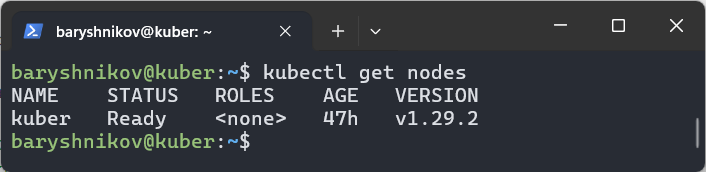
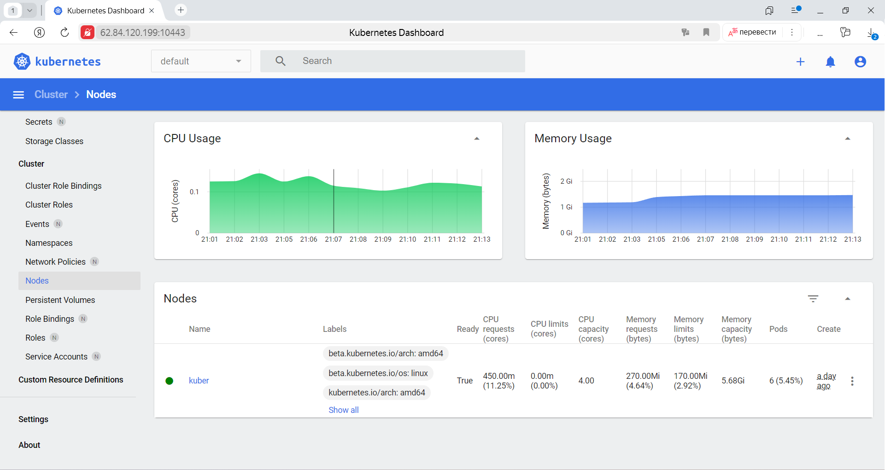

# Домашнее задание к занятию "`Kubernetes. Причины появления. Команда kubectl`" - `Барышников Никита`


## Цель задания

Для экспериментов и валидации ваших решений вам нужно подготовить тестовую среду для работы с Kubernetes. Оптимальное решение — развернуть на рабочей машине или на отдельной виртуальной машине MicroK8S.

## Задание 1. Установка MicroK8S
<details>
	<summary></summary>
      <br>

1. Установить MicroK8S на локальную машину или на удалённую виртуальную машину.
2. Установить dashboard.
3. Сгенерировать сертификат для подключения к внешнему ip-адресу.

</details>

### Решение:

1. Установим MicroK8S на удаленную виртуальную машину с помощью команды `sudo snap install microk8s --classic`:
```bash
baryshnikov@kuber:~$ sudo snap install microk8s --classic
microk8s (1.29/stable) v1.29.2 from Canonical✓ installed
```

MicroK8s создает группу, чтобы обеспечить беспрепятственное использование команд, требующих прав администратора. Чтобы добавить текущего пользователя в группу и получить доступ к каталогу кэширования .kube, выполним следующие команды:
```bash
baryshnikov@kuber:~$ sudo usermod -a -G microk8s baryshnikov
baryshnikov@kuber:~$ mkdir -p ~/.kube
baryshnikov@kuber:~$ sudo chown -R baryshnikov ~/.kube
```

Проверим статус MicroK8S:
```bash
baryshnikov@kuber:~$ microk8s status --wait-ready
microk8s is running
high-availability: no
  datastore master nodes: 127.0.0.1:19001
  datastore standby nodes: none
addons:
  enabled:
    dns                  # (core) CoreDNS
    ha-cluster           # (core) Configure high availability on the current node
    helm                 # (core) Helm - the package manager for Kubernetes
    helm3                # (core) Helm 3 - the package manager for Kubernetes
  disabled:
    cert-manager         # (core) Cloud native certificate management
    cis-hardening        # (core) Apply CIS K8s hardening
    community            # (core) The community addons repository
    dashboard            # (core) The Kubernetes dashboard
    gpu                  # (core) Alias to nvidia add-on
    host-access          # (core) Allow Pods connecting to Host services smoothly
    hostpath-storage     # (core) Storage class; allocates storage from host directory
    ingress              # (core) Ingress controller for external access
    kube-ovn             # (core) An advanced network fabric for Kubernetes
    mayastor             # (core) OpenEBS MayaStor
    metallb              # (core) Loadbalancer for your Kubernetes cluster
    metrics-server       # (core) K8s Metrics Server for API access to service metrics
    minio                # (core) MinIO object storage
    nvidia               # (core) NVIDIA hardware (GPU and network) support
    observability        # (core) A lightweight observability stack for logs, traces and metrics
    prometheus           # (core) Prometheus operator for monitoring and logging
    rbac                 # (core) Role-Based Access Control for authorisation
    registry             # (core) Private image registry exposed on localhost:32000
    rook-ceph            # (core) Distributed Ceph storage using Rook
    storage              # (core) Alias to hostpath-storage add-on, deprecated
```

2. С помощью команды `microk8s enable dashboard` установим dashboard.
```bash
baryshnikov@kuber:~$ microk8s enable dashboard
Infer repository core for addon dashboard
Enabling Kubernetes Dashboard
Infer repository core for addon metrics-server
Enabling Metrics-Server
serviceaccount/metrics-server created
clusterrole.rbac.authorization.k8s.io/system:aggregated-metrics-reader created
clusterrole.rbac.authorization.k8s.io/system:metrics-server created
rolebinding.rbac.authorization.k8s.io/metrics-server-auth-reader created
clusterrolebinding.rbac.authorization.k8s.io/metrics-server:system:auth-delegator created
clusterrolebinding.rbac.authorization.k8s.io/system:metrics-server created
service/metrics-server created
deployment.apps/metrics-server created
apiservice.apiregistration.k8s.io/v1beta1.metrics.k8s.io created
clusterrolebinding.rbac.authorization.k8s.io/microk8s-admin created
Metrics-Server is enabled
Applying manifest
serviceaccount/kubernetes-dashboard created
service/kubernetes-dashboard created
secret/kubernetes-dashboard-certs created
secret/kubernetes-dashboard-csrf created
secret/kubernetes-dashboard-key-holder created
configmap/kubernetes-dashboard-settings created
role.rbac.authorization.k8s.io/kubernetes-dashboard created
clusterrole.rbac.authorization.k8s.io/kubernetes-dashboard created
rolebinding.rbac.authorization.k8s.io/kubernetes-dashboard created
clusterrolebinding.rbac.authorization.k8s.io/kubernetes-dashboard created
deployment.apps/kubernetes-dashboard created
service/dashboard-metrics-scraper created
deployment.apps/dashboard-metrics-scraper created
secret/microk8s-dashboard-token created

If RBAC is not enabled access the dashboard using the token retrieved with:

microk8s kubectl describe secret -n kube-system microk8s-dashboard-token

Use this token in the https login UI of the kubernetes-dashboard service.

In an RBAC enabled setup (microk8s enable RBAC) you need to create a user with restricted
permissions as shown in:
https://github.com/kubernetes/dashboard/blob/master/docs/user/access-control/creating-sample-user.md
```

3. Настройка внешнего подключения:

Отредактируем файл `/var/snap/microk8s/current/certs/csr.conf.template` добавив туда строку `IP.3 = 62.84.120.199` и обновим сертификат `sudo microk8s refresh-certs --cert front-proxy-client.crt`.

```bash
baryshnikov@kuber:~$ sudo microk8s refresh-certs --cert front-proxy-client.crt
Taking a backup of the current certificates under /var/snap/microk8s/6641/certs-backup/
Creating new certificates
Signature ok
subject=CN = front-proxy-client
Getting CA Private Key
Restarting service kubelite.
```

---

## Задание 2. Установка и настройка локального kubectl
<details>
	<summary></summary>
      <br>

1. Установить на локальную машину kubectl.
2. Настроить локально подключение к кластеру.
3. Подключиться к дашборду с помощью port-forward.

</details>

### Решение:

1. Установим на локальную машину kubectl.
```bash
baryshnikov@kuber:~$ curl -LO https://storage.googleapis.com/kubernetes-release/release/`curl -s https://storage.googleapis.com/kubernetes-release/release/stable.txt`/bin/linux/amd64/kubectl
  % Total    % Received % Xferd  Average Speed   Time    Time     Time  Current
                                 Dload  Upload   Total   Spent    Left  Speed
100 49.0M  100 49.0M    0     0  20.3M      0  0:00:02  0:00:02 --:--:-- 20.3M
baryshnikov@kuber:~$
baryshnikov@kuber:~$ chmod +x ./kubectl
baryshnikov@kuber:~$ sudo mv ./kubectl /usr/local/bin/kubectl
baryshnikov@kuber:~$ bash source <(kubectl completion bash)
bash: source: No such file or directory
baryshnikov@kuber:~$ source <(kubectl completion bash)
baryshnikov@kuber:~$ echo "source <(kubectl completion bash)" >> ~/.bashrc
```

2. Настроим локально подключение к кластеру.

Внесем параметры cluster, user и context на локальной машине:
```bash
baryshnikov@kuber:~$ microk8s config > ~/.kube/config
baryshnikov@kuber:~$ kubectl config get-contexts
CURRENT   NAME       CLUSTER            AUTHINFO   NAMESPACE
*         microk8s   microk8s-cluster   admin
```

Скриншот 1 - Вывод команд kubectl get nodes.


3. Подключимся к дашборду с помощью port-forward.

```bash
baryshnikov@kuber:~$ kubectl port-forward -n kube-system service/kubernetes-dashboard 10443:443 --address='0.0.0.0'
Forwarding from 0.0.0.0:10443 -> 8443
Handling connection for 10443
```

С помощью команды `microk8s kubectl create token default` извлечем токен для входа в dashboard.  
Перейдем в панель управления по адресу https://62.84.120.199:10443.

Скриншот 2 - Dashboard.


---