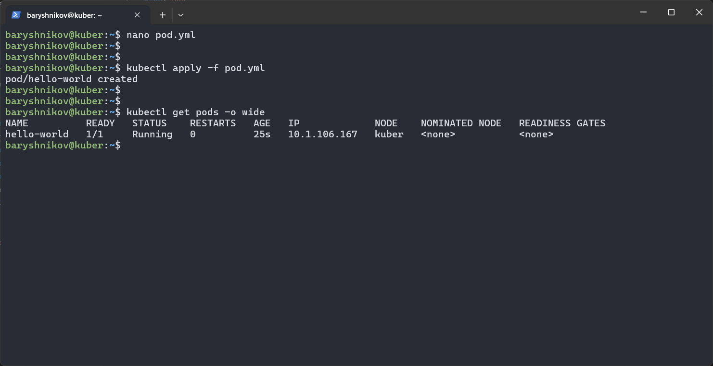
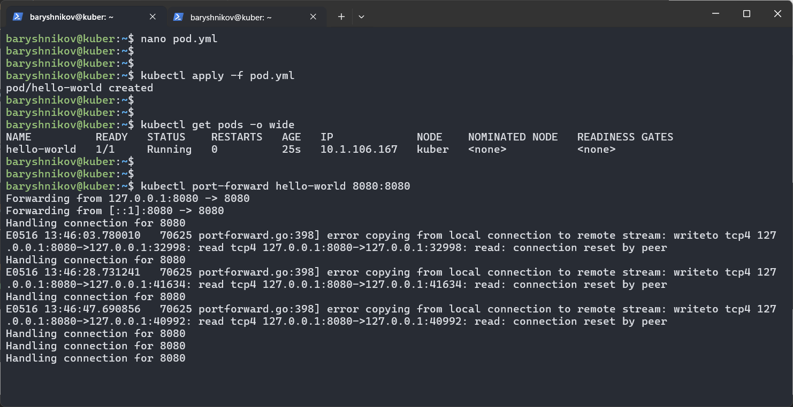
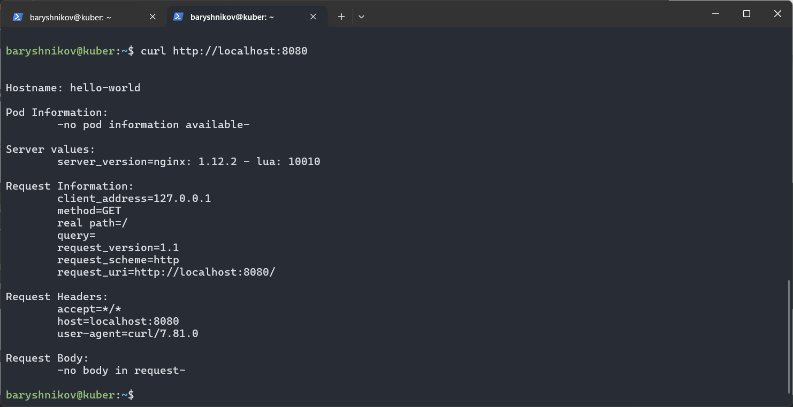

# Домашнее задание к занятию "`Базовые объекты K8S`" - `Барышников Никита`


## Задание 1. Создать Pod с именем hello-world
<details>
	<summary></summary>
      <br>

1. Создать манифест (yaml-конфигурацию) Pod.
2. Использовать image - gcr.io/kubernetes-e2e-test-images/echoserver:2.2.
3. Подключиться локально к Pod с помощью `kubectl port-forward` и вывести значение (curl или в браузере).

</details>

### Решение:

Создадим манифест (yaml-конфигурацию) Pod используя образ gcr.io/kubernetes-e2e-test-images/echoserver:2.2.

Файл pod.yml:
```yml
apiVersion: v1
kind: Pod
metadata:
  name: hello-world
spec:
  containers:
  - image: gcr.io/kubernetes-e2e-test-images/echoserver:2.2
    name: hello-world
    ports:
    - containerPort: 8080
```

С помощью команды `kubectl apply -f pod.yml` отправим манифест в кластер.  
Далее, с помощью команды `kubectl get pods -o wide` выведем все поды в текущем пространстве имен с подробностями.

Скриншот 1 - Вывод команды `kubectl get pods -o wide`.


Для подключения к поду с помощью команды `kubectl port-forward hello-world 8080:8080` перебросим порт пода на порт ВМ:

Скриншот 2 - Проброс порта пода.


Выведем значение ответа на запрос с помощью команды `curl http://localhost:8080`:

Скриншот 3 - Просмотр ответа от пода на запрос c помощью curl.


---