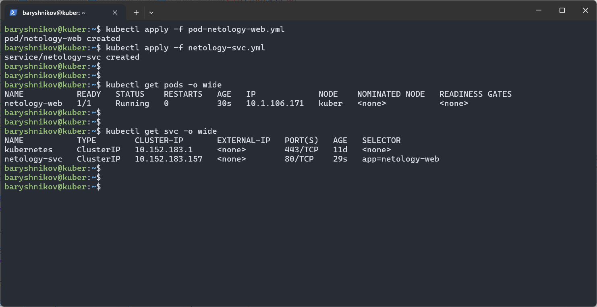
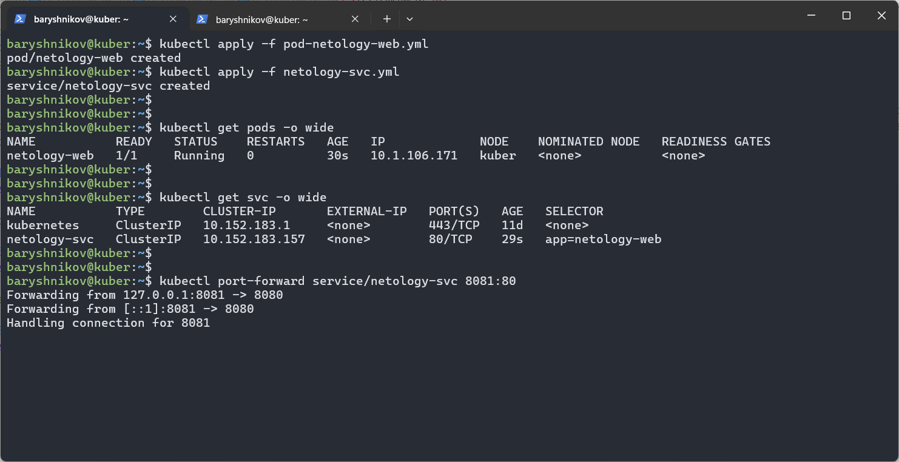
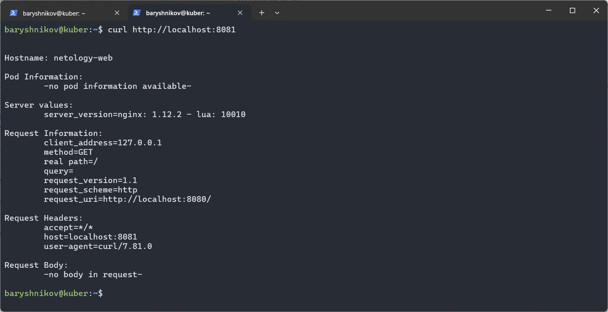

# Домашнее задание к занятию "`Базовые объекты K8S`" - `Барышников Никита`


## Задание 1. Создать Pod с именем hello-world
<details>
	<summary></summary>
      <br>

1. Создать манифест (yaml-конфигурацию) Pod.
2. Использовать image - gcr.io/kubernetes-e2e-test-images/echoserver:2.2.
3. Подключиться локально к Pod с помощью `kubectl port-forward` и вывести значение (curl или в браузере).

</details>

### Решение:

Создадим манифест (yaml-конфигурацию) Pod используя образ gcr.io/kubernetes-e2e-test-images/echoserver:2.2.

Файл pod.yml:
```yml
apiVersion: v1
kind: Pod
metadata:
  name: hello-world
spec:
  containers:
  - image: gcr.io/kubernetes-e2e-test-images/echoserver:2.2
    name: hello-world
    ports:
    - containerPort: 8080
```

С помощью команды `kubectl apply -f pod.yml` отправим манифест в кластер.  
Далее, с помощью команды `kubectl get pods -o wide` выведем все поды в текущем пространстве имен с подробностями.

Скриншот 1 - Вывод команды `kubectl get pods -o wide`.


Для подключения к поду с помощью команды `kubectl port-forward hello-world 8080:8080` перебросим порт пода на порт ВМ:

Скриншот 2 - Проброс порта пода.


Выведем значение ответа на запрос с помощью команды `curl http://localhost:8080`:

Скриншот 3 - Просмотр ответа от пода на запрос c помощью curl.


---

## Задание 2. Создать Service и подключить его к Pod
<details>
	<summary></summary>
      <br>

1. Создать Pod с именем netology-web.
2. Использовать image — gcr.io/kubernetes-e2e-test-images/echoserver:2.2.
3. Создать Service с именем netology-svc и подключить к netology-web.
4. Подключиться локально к Service с помощью `kubectl port-forward` и вывести значение (curl или в браузере).

</details>

### Решение:

Создадим Pod с именем netology-web.

Файл pod-netology-web.yml:
```yml
apiVersion: v1
kind: Pod
metadata:
  name: netology-web
  labels:
    app: netology-web
spec:
  containers:
  - image: gcr.io/kubernetes-e2e-test-images/echoserver:2.2
    name: web
    ports:
    - containerPort: 8080
```

Создадим Service с именем netology-svc.

Файл netology-svc.yml:
```yml
apiVersion: v1
kind: Service
metadata:
  name: netology-svc
spec:
  selector:
    app: netology-web
  ports:
    - protocol: TCP
      port: 80
      targetPort: 8080
```

С помощью команды `kubectl apply -f pod-netology-web.yml` и `kubectl apply -f netology-svc.yml` отправим манифесты в кластер.  
Далее, с помощью команд `kubectl get pods -o wide` и `kubectl get svc -o wide` выведем все поды и сервисы в текущем пространстве имен с подробностями.

Скриншот 4 - Создание Service и подключение к netology-web.


Для подключения локально к Service с помощью команды `kubectl port-forward service/netology-svc 8081:80` перебросим порт.

Скриншот 5 - Проброс порта сервиса.


Выведем значение ответа на запрос с помощью команды `curl http://localhost:8081`:

Скриншот 6 - Просмотр ответа от сервиса на запрос c помощью curl.


---