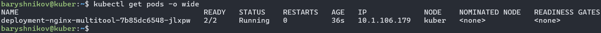
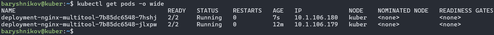
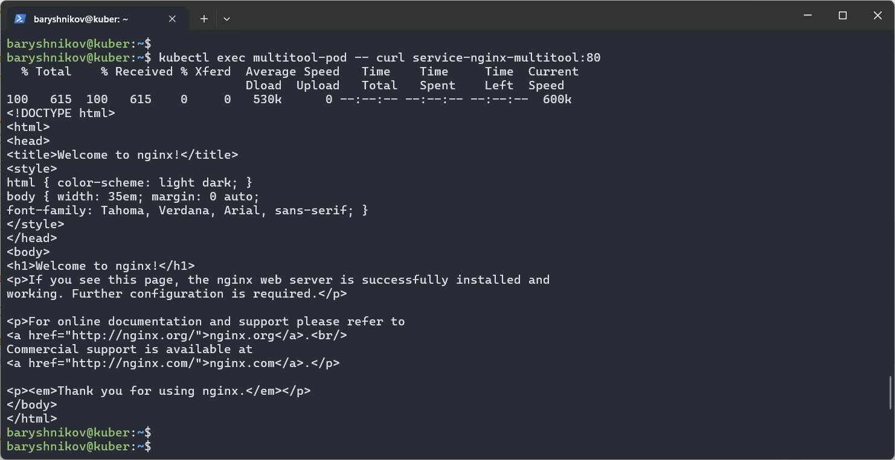
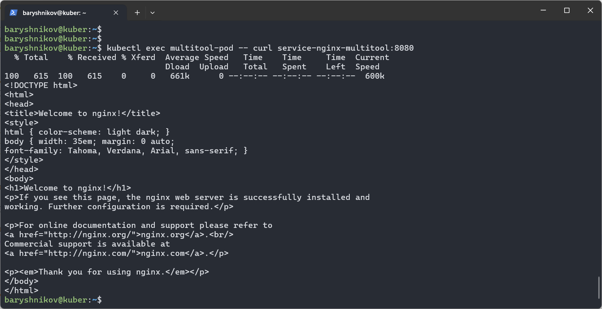
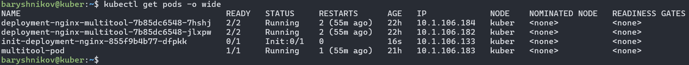
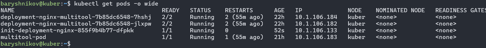

# Домашнее задание к занятию "`Запуск приложений в K8S`" - `Барышников Никита`

## Цель задания

В тестовой среде для работы с Kubernetes, установленной в предыдущем ДЗ, необходимо развернуть Deployment с приложением, состоящим из нескольких контейнеров, и масштабировать его.

## Задание 1. Создать Deployment и обеспечить доступ к репликам приложения из другого Pod
<details>
	<summary></summary>
      <br>

1. Создать Deployment приложения, состоящего из двух контейнеров — nginx и multitool. Решить возникшую ошибку.
2. После запуска увеличить количество реплик работающего приложения до 2.
3. Продемонстрировать количество подов до и после масштабирования.
4. Создать Service, который обеспечит доступ до реплик приложений из п.1.
5. Создать отдельный Pod с приложением multitool и убедиться с помощью `curl`, что из пода есть доступ до приложений из п.1.

</details>

### Решение:

1. Создадим Deployment приложения, состоящего из двух контейнеров — nginx и multitool:

Файл deployment.yml.
```yml
apiVersion: apps/v1
kind: Deployment
metadata:
  name: deployment-nginx-multitool
spec:
  replicas: 1
  selector:
    matchLabels:
      app: deployment
  template:
    metadata:
      labels:
        app: deployment
    spec:
      containers:
      - name: nginx
        image: nginx:1.26
      - name: multitool
        image: wbitt/network-multitool
```

С помощью команды `kubectl apply -f deployment.yml` отправим манифест в кластер.
```bash
baryshnikov@kuber:~$ kubectl apply -f deployment.yml
deployment.apps/deployment-nginx-multitool created
```

C помощью команды `kubectl get pods -o wide` выведем все поды в текущем пространстве имен с подробностями.
```bash
baryshnikov@kuber:~$ kubectl get pods -o wide
NAME                                          READY   STATUS             RESTARTS      AGE    IP             NODE    NOMINATED NODE   READINESS GATES
deployment-nginx-multitool-768fcf6f96-85qzx   1/2     CrashLoopBackOff   3 (29s ago)   102s   10.1.106.178   kuber   <none>           <none>
```

Для выяснения ошибки попробуем проверить логи с помощью команды `kubectl logs deployment-nginx-multitool-768fcf6f96-85qzx`.
```bash
baryshnikov@kuber:~$ kubectl logs deployment-nginx-multitool-768fcf6f96-85qzx nginx
/docker-entrypoint.sh: /docker-entrypoint.d/ is not empty, will attempt to perform configuration
/docker-entrypoint.sh: Looking for shell scripts in /docker-entrypoint.d/
/docker-entrypoint.sh: Launching /docker-entrypoint.d/10-listen-on-ipv6-by-default.sh
10-listen-on-ipv6-by-default.sh: info: Getting the checksum of /etc/nginx/conf.d/default.conf
10-listen-on-ipv6-by-default.sh: info: Enabled listen on IPv6 in /etc/nginx/conf.d/default.conf
/docker-entrypoint.sh: Sourcing /docker-entrypoint.d/15-local-resolvers.envsh
/docker-entrypoint.sh: Launching /docker-entrypoint.d/20-envsubst-on-templates.sh
/docker-entrypoint.sh: Launching /docker-entrypoint.d/30-tune-worker-processes.sh
/docker-entrypoint.sh: Configuration complete; ready for start up
2024/05/22 15:39:17 [notice] 1#1: using the "epoll" event method
2024/05/22 15:39:17 [notice] 1#1: nginx/1.26.0
2024/05/22 15:39:17 [notice] 1#1: built by gcc 12.2.0 (Debian 12.2.0-14)
2024/05/22 15:39:17 [notice] 1#1: OS: Linux 5.15.0-105-generic
2024/05/22 15:39:17 [notice] 1#1: getrlimit(RLIMIT_NOFILE): 65536:65536
2024/05/22 15:39:17 [notice] 1#1: start worker processes
2024/05/22 15:39:17 [notice] 1#1: start worker process 29
2024/05/22 15:39:17 [notice] 1#1: start worker process 30
2024/05/22 15:39:17 [notice] 1#1: start worker process 31
2024/05/22 15:39:17 [notice] 1#1: start worker process 32
baryshnikov@kuber:~$
baryshnikov@kuber:~$
baryshnikov@kuber:~$ kubectl logs deployment-nginx-multitool-768fcf6f96-85qzx multitool
The directory /usr/share/nginx/html is not mounted.
Therefore, over-writing the default index.html file with some useful information:
WBITT Network MultiTool (with NGINX) - deployment-nginx-multitool-768fcf6f96-85qzx - 10.1.106.178 - HTTP: 80 , HTTPS: 443 . (Formerly praqma/network-multitool)
2024/05/22 15:45:31 [emerg] 1#1: bind() to 0.0.0.0:80 failed (98: Address in use)
nginx: [emerg] bind() to 0.0.0.0:80 failed (98: Address in use)
2024/05/22 15:45:31 [emerg] 1#1: bind() to 0.0.0.0:80 failed (98: Address in use)
nginx: [emerg] bind() to 0.0.0.0:80 failed (98: Address in use)
2024/05/22 15:45:31 [emerg] 1#1: bind() to 0.0.0.0:80 failed (98: Address in use)
nginx: [emerg] bind() to 0.0.0.0:80 failed (98: Address in use)
2024/05/22 15:45:31 [emerg] 1#1: bind() to 0.0.0.0:80 failed (98: Address in use)
nginx: [emerg] bind() to 0.0.0.0:80 failed (98: Address in use)
2024/05/22 15:45:31 [emerg] 1#1: bind() to 0.0.0.0:80 failed (98: Address in use)
nginx: [emerg] bind() to 0.0.0.0:80 failed (98: Address in use)
2024/05/22 15:45:31 [emerg] 1#1: still could not bind()
nginx: [emerg] still could not bind()
```

Исходя из логов, можно сделать вывод, что контейнеры nginx и multitool пытаются использовать один и тот же порт 80.  
Для решения проблемы с помощью параметра `HTTP_PORT` контейнера multitool изменим порт 80 на 8080.

Файл deployment.yml.
```yml
apiVersion: apps/v1
kind: Deployment
metadata:
  name: deployment-nginx-multitool
spec:
  replicas: 1
  selector:
    matchLabels:
      app: deployment
  template:
    metadata:
      labels:
        app: deployment
    spec:
      containers:
      - name: nginx
        image: nginx:1.26
      - name: multitool
        image: wbitt/network-multitool
        env:
          - name: HTTP_PORT
            value: "8080"
```

С помощью команды `kubectl apply -f deployment.yml` отправим манифест в кластер.
```bash
baryshnikov@kuber:~$ kubectl apply -f deployment.yml
deployment.apps/deployment-nginx-multitool configured
```

C помощью команды `kubectl get pods -o wide` выведем все поды в текущем пространстве имен с подробностями.
```bash
baryshnikov@kuber:~$ kubectl get pods -o wide
NAME                                          READY   STATUS    RESTARTS   AGE   IP             NODE    NOMINATED NODE   READINESS GATES
deployment-nginx-multitool-7b85dc6548-jlxpw   2/2     Running   0          36s   10.1.106.179   kuber   <none>           <none>
```

2. После запуска увеличим количество реплик работающего приложения до 2.

Файл deployment.yml.
```yml
apiVersion: apps/v1
kind: Deployment
metadata:
  name: deployment-nginx-multitool
spec:
  replicas: 2
  selector:
    matchLabels:
      app: deployment
  template:
    metadata:
      labels:
        app: deployment
    spec:
      containers:
      - name: nginx
        image: nginx:1.26
      - name: multitool
        image: wbitt/network-multitool
```

С помощью команды `kubectl apply -f deployment.yml` отправим манифест в кластер.  
C помощью команды `kubectl get pods -o wide` выведем все поды в текущем пространстве имен с подробностями.
```bash
baryshnikov@kuber:~$ kubectl get pods -o wide
NAME                                          READY   STATUS    RESTARTS   AGE   IP             NODE    NOMINATED NODE   READINESS GATES
deployment-nginx-multitool-7b85dc6548-7hshj   2/2     Running   0          7s    10.1.106.180   kuber   <none>           <none>
deployment-nginx-multitool-7b85dc6548-jlxpw   2/2     Running   0          12m   10.1.106.179   kuber   <none>           <none>
```

3. Продемонстрируем количество подов до и после масштабирования.

Скриншот 1 - Количество подов до масштабирования.


Скриншот 2 - Количество подов после масштабирования.


4. Создадим Service, который обеспечит доступ до реплик приложений из п.1.

Файл service.yml.
```yml
apiVersion: v1
kind: Service
metadata:
  name: service-nginx-multitool
spec:
  ports:
    - name: nginx
      port: 80
      protocol: TCP
      targetPort: 80
    - name: multitool
      port: 8080
      protocol: TCP
      targetPort: 80
  selector:
    app: deployment
```

С помощью команды `kubectl apply -f service.yml` отправим манифест в кластер.

```bash
baryshnikov@kuber:~$ kubectl apply -f service.yml
service/service-nginx-multitool created
```

C помощью команды `kubectl get svc -o wide` выведем все сервисы в текущем пространстве имен с подробностями.

```bash
baryshnikov@kuber:~$ kubectl get svc -o wide
NAME                      TYPE        CLUSTER-IP       EXTERNAL-IP   PORT(S)           AGE   SELECTOR
kubernetes                ClusterIP   10.152.183.1     <none>        443/TCP           95m   <none>
service-nginx-multitool   ClusterIP   10.152.183.197   <none>        80/TCP,8080/TCP   14s   app=deployment
```

5. Создадим отдельный Pod с приложением multitool.

Файл multitool-pod.yml.
```yml
apiVersion: v1
kind: Pod
metadata:
  name: multitool-pod
spec:
  containers:
  - image: wbitt/network-multitool
    name: multitool
```

С помощью команды `kubectl apply -f multitool-pod.yml` отправим манифест в кластер.  
Проверим, что под запущен:
```bash
baryshnikov@kuber:~$ kubectl get pods -o wide
NAME                                          READY   STATUS    RESTARTS   AGE   IP             NODE    NOMINATED NODE   READINESS GATES
deployment-nginx-multitool-7b85dc6548-7hshj   2/2     Running   0          56m   10.1.106.180   kuber   <none>           <none>
deployment-nginx-multitool-7b85dc6548-jlxpw   2/2     Running   0          69m   10.1.106.179   kuber   <none>           <none>
multitool-pod                                 1/1     Running   0          17s   10.1.106.181   kuber   <none>           <none>
```

Убедимся с помощью `curl`, что из пода `multitool-pod` есть доступ до приложений из п.1.

Проверим доступ к nginx на порту 80 с помощью команды `kubectl exec multitool-pod -- curl service-nginx-multitool:80`.

Скриншот 3 - Доступ к nginx на порту 80.


Проверим доступ к multitool на порту 8080 с помощью команды `kubectl exec multitool-pod -- curl service-nginx-multitool:8080`.

Скриншот 4 - Доступ к multitool на порту 8080.


---

## Задание 2. Создать Deployment и обеспечить старт основного контейнера при выполнении условий
<details>
	<summary></summary>
      <br>

1. Создать Deployment приложения nginx и обеспечить старт контейнера только после того, как будет запущен сервис этого приложения.
2. Убедиться, что nginx не стартует. В качестве Init-контейнера взять busybox.
3. Создать и запустить Service. Убедиться, что Init запустился.
4. Продемонстрировать состояние пода до и после запуска сервиса.

</details>

### Решение:

1. Создадим Deployment приложения nginx, в котором обеспечим старт контейнера только после того, как будет запущен сервис этого приложения.

Файл init-deployment.yml.
```yml
apiVersion: apps/v1
kind: Deployment
metadata:
  name: init-deployment-nginx
spec:
  replicas: 1
  selector:
    matchLabels:
      app: init-deployment
  template:
    metadata:
      labels:
        app: init-deployment
    spec:
      containers:
      - name: nginx
        image: nginx:1.26
      initContainers:
      - name: init-busybox
        image: busybox:1.36.1
        command: ['sleep', '30']
```

С помощью команды `kubectl apply -f init-deployment.yml` отправим манифест в кластер.

2. Убедимся, что nginx не стартует.

C помощью команды `kubectl get pods -o wide` выведем все поды в текущем пространстве имен с подробностями.
```bash
baryshnikov@kuber:~$ kubectl get pods -o wide
NAME                                          READY   STATUS     RESTARTS      AGE   IP             NODE    NOMINATED NODE   READINESS GATES
deployment-nginx-multitool-7b85dc6548-7hshj   2/2     Running    2 (55m ago)   22h   10.1.106.184   kuber   <none>           <none>
deployment-nginx-multitool-7b85dc6548-jlxpw   2/2     Running    2 (55m ago)   22h   10.1.106.182   kuber   <none>           <none>
init-deployment-nginx-855f9b4b77-dfpkk        0/1     Init:0/1   0             16s   10.1.106.133   kuber   <none>           <none>
multitool-pod                                 1/1     Running    1 (55m ago)   21h   10.1.106.183   kuber   <none>           <none>
```

3. Создадим и запустим Service.

Файл init-deployment-service.yml.
```yml
apiVersion: v1
kind: Service
metadata:
  name: init-deployment-service
spec:
  ports:
    - name: init-nginx
      port: 80
      protocol: TCP
  selector:
    app: init-deployment
```

С помощью команды `kubectl apply -f init-deployment-service.yml` отправим манифест в кластер.  
C помощью команды `kubectl get svc -o wide` выведем все сервисы в текущем пространстве имен с подробностями.

```bash
baryshnikov@kuber:~$ kubectl get svc -o wide
NAME                      TYPE        CLUSTER-IP       EXTERNAL-IP   PORT(S)           AGE   SELECTOR
init-deployment-service   ClusterIP   10.152.183.194   <none>        80/TCP            8s    app=init-deployment
kubernetes                ClusterIP   10.152.183.1     <none>        443/TCP           22h   <none>
service-nginx-multitool   ClusterIP   10.152.183.197   <none>        80/TCP,8080/TCP   21h   app=deployment
```

Проверим, что под запущен:
```bash
baryshnikov@kuber:~$ kubectl get pods -o wide
NAME                                          READY   STATUS    RESTARTS      AGE   IP             NODE    NOMINATED NODE   READINESS GATES
deployment-nginx-multitool-7b85dc6548-7hshj   2/2     Running   2 (55m ago)   22h   10.1.106.184   kuber   <none>           <none>
deployment-nginx-multitool-7b85dc6548-jlxpw   2/2     Running   2 (55m ago)   22h   10.1.106.182   kuber   <none>           <none>
init-deployment-nginx-855f9b4b77-dfpkk        1/1     Running   0             52s   10.1.106.133   kuber   <none>           <none>
multitool-pod                                 1/1     Running   1 (55m ago)   21h   10.1.106.183   kuber   <none>           <none>
```

4. Состояние пода до и после запуска сервиса.

Скриншот 5 - Состояние пода `init-deployment-nginx-855f9b4b77-dfpkk` до запуска сервиса.


Скриншот 6 - Состояние пода `init-deployment-nginx-855f9b4b77-dfpkk` после запуска сервиса.


---