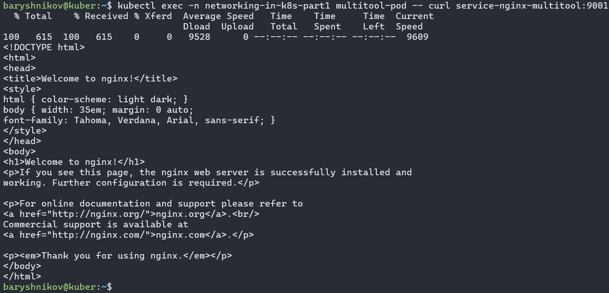
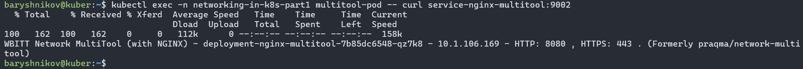

# Домашнее задание к занятию "`Сетевое взаимодействие в K8S. Часть 1`" - `Барышников Никита`


## Цель задания

В тестовой среде Kubernetes необходимо обеспечить доступ к приложению, установленному в предыдущем ДЗ и состоящему из двух контейнеров, по разным портам в разные контейнеры как внутри кластера, так и снаружи.

## Задание 1. Создать Deployment и обеспечить доступ к контейнерам приложения по разным портам из другого Pod внутри кластера
<details>
	<summary></summary>
      <br>

1. Создать Deployment приложения, состоящего из двух контейнеров (nginx и multitool), с количеством реплик 3 шт.
2. Создать Service, который обеспечит доступ внутри кластера до контейнеров приложения из п.1 по порту 9001 — nginx 80, по 9002 — multitool 8080.
3. Создать отдельный Pod с приложением multitool и убедиться с помощью `curl`, что из пода есть доступ до приложения из п.1 по разным портам в разные контейнеры.
4. Продемонстрировать доступ с помощью `curl` по доменному имени сервиса.
5. Предоставить манифесты Deployment и Service в решении, а также скриншоты или вывод команды п.4.

</details>

### Решение:

Создадим пространство имен `networking-in-k8s-part1` для ДЗ.
```bash
baryshnikov@kuber:~$ kubectl create namespace networking-in-k8s-part1
namespace/networking-in-k8s-part1 created
baryshnikov@kuber:~$
baryshnikov@kuber:~$
baryshnikov@kuber:~$ kubectl get ns
NAME                      STATUS   AGE
default                   Active   20d
kube-node-lease           Active   20d
kube-public               Active   20d
kube-system               Active   20d
networking-in-k8s-part1   Active   22s
```

1. Создадим Deployment приложения, состоящего из двух контейнеров (nginx и multitool), с количеством реплик 3 шт.

Файл deployment-nginx-multitool.yml.
```yml
apiVersion: apps/v1
kind: Deployment
metadata:
  name: deployment-nginx-multitool
  namespace: networking-in-k8s-part1
spec:
  replicas: 3
  selector:
    matchLabels:
      app: deployment
  template:
    metadata:
      labels:
        app: deployment
    spec:
      containers:
      - name: nginx
        image: nginx:1.26
      - name: multitool
        image: wbitt/network-multitool
        env:
          - name: HTTP_PORT
            value: "8080"
```

С помощью команды `kubectl apply -f deployment-nginx-multitool.yml` отправим манифест в кластер.  
C помощью команды `kubectl get pods -n networking-in-k8s-part1` выведем все поды в пространстве `networking-in-k8s-part1` с подробностями.
```bash
baryshnikov@kuber:~$ kubectl get pods -n networking-in-k8s-part1
NAME                                          READY   STATUS    RESTARTS   AGE
deployment-nginx-multitool-7b85dc6548-qz7k8   2/2     Running   0          10s
deployment-nginx-multitool-7b85dc6548-stdph   2/2     Running   0          5s
deployment-nginx-multitool-7b85dc6548-tnl89   2/2     Running   0          8s
```

2. Создадим Service, который обеспечит доступ внутри кластера до контейнеров приложения из п.1 по порту 9001 — nginx 80, по 9002 — multitool 8080.

Файл service.yml.
```yml
apiVersion: v1
kind: Service
metadata:
  name: service-nginx-multitool
  namespace: networking-in-k8s-part1
spec:
  ports:
    - name: nginx
      port: 9001
      protocol: TCP
      targetPort: 80
    - name: multitool
      port: 9002
      protocol: TCP
      targetPort: 8080
  selector:
    app: deployment
```

С помощью команды `kubectl apply -f service.yml` отправим манифест в кластер.  
C помощью команды `kubectl get svc -n networking-in-k8s-part1` выведем все сервисы в пространстве `networking-in-k8s-part1` с подробностями.
```bash
baryshnikov@kuber:~$ kubectl get svc -n networking-in-k8s-part1
NAME                      TYPE        CLUSTER-IP       EXTERNAL-IP   PORT(S)             AGE
service-nginx-multitool   ClusterIP   10.152.183.228   <none>        9001/TCP,9002/TCP   52s
```

3. Создадим отдельный Pod с приложением multitool.

Файл pod-multitool.yml.
```yml
apiVersion: v1
kind: Pod
metadata:
  name: multitool-pod
  namespace: networking-in-k8s-part1
spec:
  containers:
  - name: multitool
    image: wbitt/network-multitool
```

С помощью команды `kubectl apply -f pod-multitool.yml` отправим манифест в кластер.  
Проверим, что под запущен:
```bash
baryshnikov@kuber:~$ kubectl get pods -n networking-in-k8s-part1
NAME                                          READY   STATUS    RESTARTS   AGE
deployment-nginx-multitool-7b85dc6548-qz7k8   2/2     Running   0          23m
deployment-nginx-multitool-7b85dc6548-stdph   2/2     Running   0          22m
deployment-nginx-multitool-7b85dc6548-tnl89   2/2     Running   0          22m
multitool-pod                                 1/1     Running   0          28s
```

4. Проверим доступ с помощью `curl` по доменному имени сервиса.

Проверим доступ к nginx на порту 9001 с помощью команды `kubectl exec -n networking-in-k8s-part1 multitool-pod -- curl service-nginx-multitool:9001`.

Скриншот 1 - Доступ к nginx на порту 9001.


Проверим доступ к multitool на порту 9002 с помощью команды `kubectl exec -n networking-in-k8s-part1 multitool-pod -- curl service-nginx-multitool:9002`.

Скриншот 2 - Доступ к multitool на порту 9002.


---