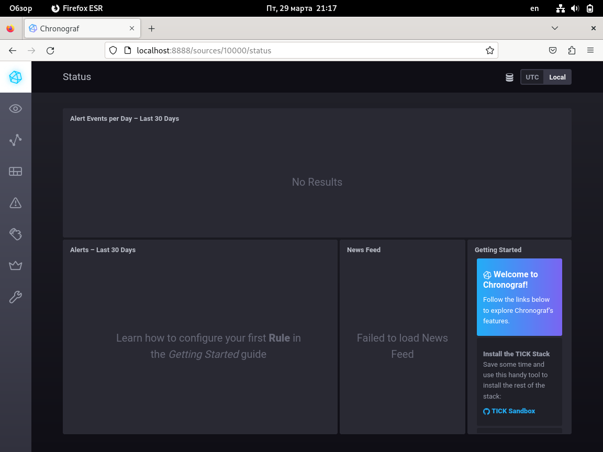
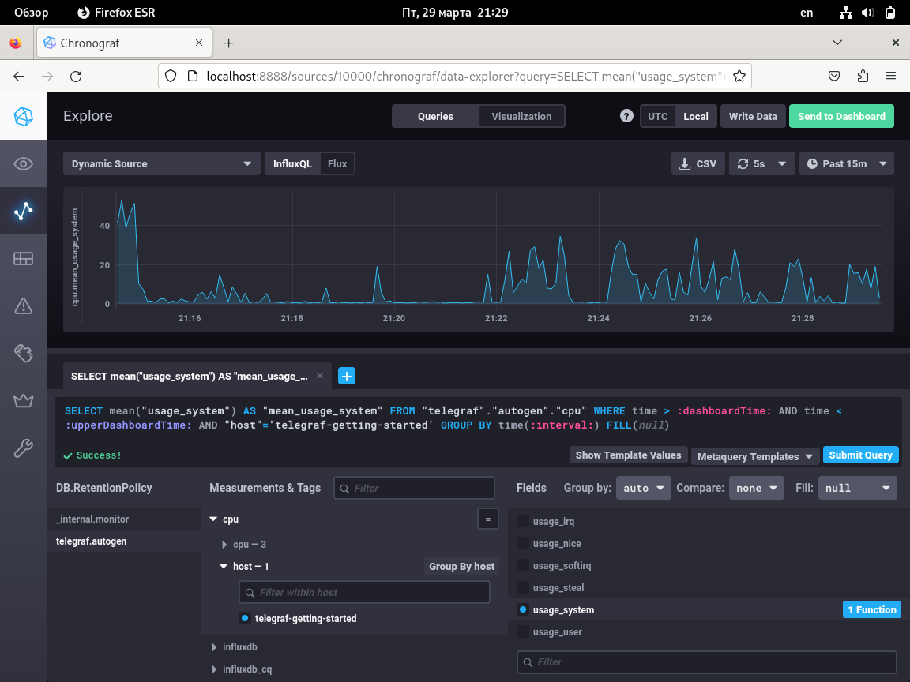
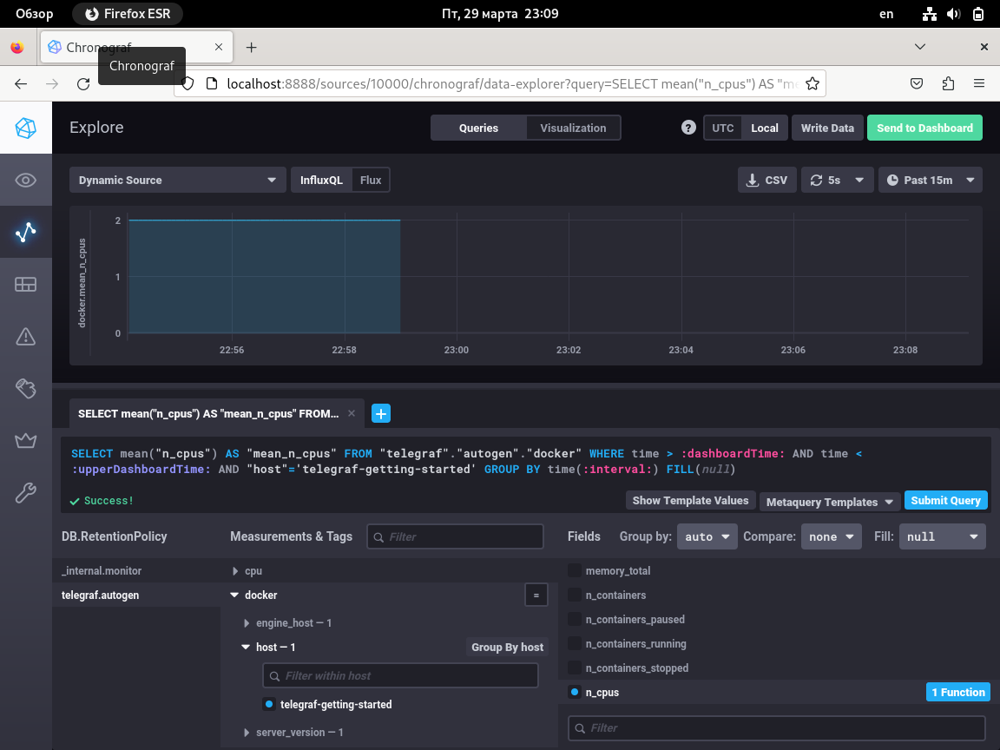

# Домашнее задание к занятию "`Системы мониторинга`" - `Барышников Никита`


## Задание 1.
<details>
	<summary></summary>
      <br>

Вас пригласили настроить мониторинг на проект. На онбординге вам рассказали, что проект представляет из себя платформу для вычислений с выдачей текстовых отчетов, которые сохраняются на диск. Взаимодействие с платформой осуществляется по протоколу http. Также вам отметили, что вычисления загружают ЦПУ. Какой минимальный набор метрик вы выведите в мониторинг и почему?

</details>

### Решение:

Я бы выбрал следующий минимальный набор метрик:

**мониторинг диска**
 - IOPS (показывает число операций с диском в секунду);
 - inodes (переполнение индексных дескрипторов);
 - FS (позволяет слидить за свободным местом на диске).
 
**мониторинг трафика**
 - NetTraffic (пропускная способность сетевого трафика).
 
**мониторинг ЦПУ**
 - CPU LA (информацию о нагрузке на центральный процессор).

---

## Задание 2.
<details>
	<summary></summary>
      <br>

Менеджер продукта посмотрев на ваши метрики сказал, что ему непонятно что такое RAM/inodes/CPUla. Также он сказал, что хочет понимать, насколько мы выполняем свои обязанности перед клиентами и какое качество обслуживания. Что вы можете ему предложить?

</details>

### Решение:

Расшифровка RAM/inodes/CPUla:

**RAM** - энергозависимая часть системы компьютерной памяти, в которой во время работы компьютера хранится выполняемый машинный код (программы), а также входные, выходные и промежуточные данные, обрабатываемые процессором.  
**Inode** - это структура данных, в которой хранятся метаданные файла и перечислены блоки с данными файла.  
**CPU LA** - средняя нагрузка на центральный процессор.

Чтобы понимать насколько мы выполняем свои обязанности перед клиентами и какое качество обслуживания, необходимо заключить SLA (соглашение об уровне обслуживания) в котором будет описан SLO (целевой уровень качества обслуживания). В свою очередь, качество обслуживания можно будет оценивать по SLI (индикатор качества обслуживания). Если значение SLI выше, чем SLO, продукт в норме.

---

## Задание 3.
<details>
	<summary></summary>
      <br>

Вашей DevOps команде в этом году не выделили финансирование на построение системы сбора логов. Разработчики в свою очередь хотят видеть все ошибки, которые выдают их приложения. Какое решение вы можете предпринять в этой ситуации, чтобы разработчики получали ошибки приложения?

</details>

### Решение:

- разработать скрипты для получения ошибок из приложений;
- использовать локальные журналы или логи на уровне приложений.

---

## Задание 4.
<details>
	<summary></summary>
      <br>

Вы, как опытный SRE, сделали мониторинг, куда вывели отображения выполнения SLA=99% по http кодам ответов. Вычисляете этот параметр по следующей формуле: summ_2xx_requests/summ_all_requests. Данный параметр не поднимается выше 70%, но при этом в вашей системе нет кодов ответа 5xx и 4xx. Где у вас ошибка?

</details>

### Решение:

В формуле не учтены коды 3хх.  
Правильная формула: *SLI = (summ_2xx_requests + summ_3xx_requests) / (summ_all_requests)*

---

## Задание 5.
<details>
	<summary></summary>
      <br>

Опишите основные плюсы и минусы pull и push систем мониторинга.

</details>

### Решение:

**Плюсы push-модели:**

- упрощение репликации данных в разные системы мониторинга или их резервные копии;
- более гибкая настройка отправки пакетов данных с метриками;
- UDP — это менее затратный способ передачи данных, из-за чего может возрасти производительность сбора метрик.

**Минусы push-модели:**

- затрудняется верификация данных в системах мониторинга;
- агенты могут зафлудить сервера запросами спровоцировав DDoS;
- протокол UDP не гарантирует доставку данных.

**Плюсы pull-модели:**

- легче контролировать подлинность данных;
- можно настроить единый proxy server до всех агентов с TLS;
- упрощённая отладка получения данных с агентов.

**Минусы pull-модели:**

- более высокие требования к ресурсам, особенно при использовании защищённых каналов связи;
- задержка времени: в pull-системах мониторинга данные получаются только после того, как система мониторинга запросит их у мониторируемых устройств или приложений. Это может затруднить моментальную реакцию на проблемы и отсрочить их решение.

---

## Задание 6.
<details>
	<summary></summary>
      <br>

Какие из ниже перечисленных систем относятся к push модели, а какие к pull? А может есть гибридные?

 - Prometheus 
 - TICK
 - Zabbix
 - VictoriaMetrics
 - Nagios

</details>

### Решение:

 - Prometheus - pull
 - TICK - push
 - Zabbix - push и pull
 - VictoriaMetrics - push/pull, зависит от источника
 - Nagios - гибридная модель (pull модель используется по умолчанию)

---

## Задание 7.
<details>
	<summary></summary>
      <br>

Склонируйте себе [репозиторий](https://github.com/influxdata/sandbox/tree/master) и запустите TICK-стэк, 
используя технологии docker и docker-compose.

В виде решения на это упражнение приведите скриншот веб-интерфейса ПО chronograf (`http://localhost:8888`). 

P.S.: если при запуске некоторые контейнеры будут падать с ошибкой - проставьте им режим `Z`, например
`./data:/var/lib:Z`

</details>

### Решение:

Скриншот 1 - Веб-интерфейса ПО chronograf.


---

## Задание 8.
<details>
	<summary></summary>
      <br>

Перейдите в веб-интерфейс Chronograf (http://localhost:8888) и откройте вкладку Data explorer.
        
 - Нажмите на кнопку Add a query
 - Изучите вывод интерфейса и выберите БД telegraf.autogen
 - В `measurments` выберите cpu->host->telegraf-getting-started, а в `fields` выберите usage_system. Внизу появится график утилизации cpu.
 - Вверху вы можете увидеть запрос, аналогичный SQL-синтаксису. Поэкспериментируйте с запросом, попробуйте изменить группировку и интервал наблюдений.

Для выполнения задания приведите скриншот с отображением метрик утилизации cpu из веб-интерфейса.

</details>

### Решение:

Скриншот 2 - Отображение метрик утилизации cpu из веб-интерфейса.


---

## Задание 9.
<details>
	<summary></summary>
      <br>

Изучите список [telegraf inputs](https://github.com/influxdata/telegraf/tree/master/plugins/inputs). 
Добавьте в конфигурацию telegraf следующий плагин - [docker](https://github.com/influxdata/telegraf/tree/master/plugins/inputs/docker):
```
[[inputs.docker]]
  endpoint = "unix:///var/run/docker.sock"
```

Дополнительно вам может потребоваться донастройка контейнера telegraf в `docker-compose.yml` дополнительного volume и 
режима privileged:
```
  telegraf:
    image: telegraf:1.4.0
    privileged: true
    volumes:
      - ./etc/telegraf.conf:/etc/telegraf/telegraf.conf:Z
      - /var/run/docker.sock:/var/run/docker.sock:Z
    links:
      - influxdb
    ports:
      - "8092:8092/udp"
      - "8094:8094"
      - "8125:8125/udp"
```

После настройке перезапустите telegraf, обновите веб интерфейс и приведите скриншотом список `measurments` в 
веб-интерфейсе базы telegraf.autogen . Там должны появиться метрики, связанные с docker.

Факультативно можете изучить какие метрики собирает telegraf после выполнения данного задания.

</details>

### Решение:

Скриншот 3 - Отображение метрик утилизации cpu из веб-интерфейса связанных с docker.


---