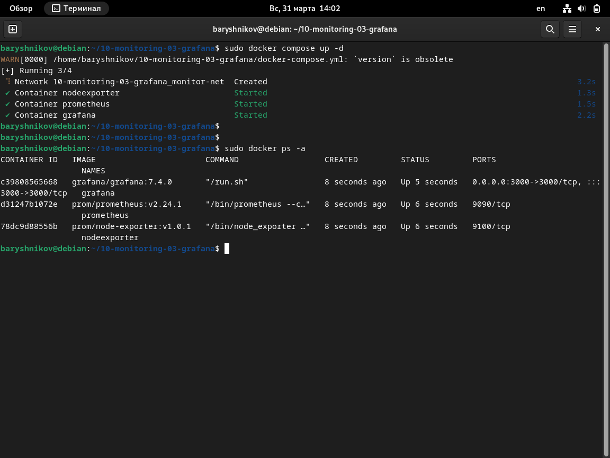
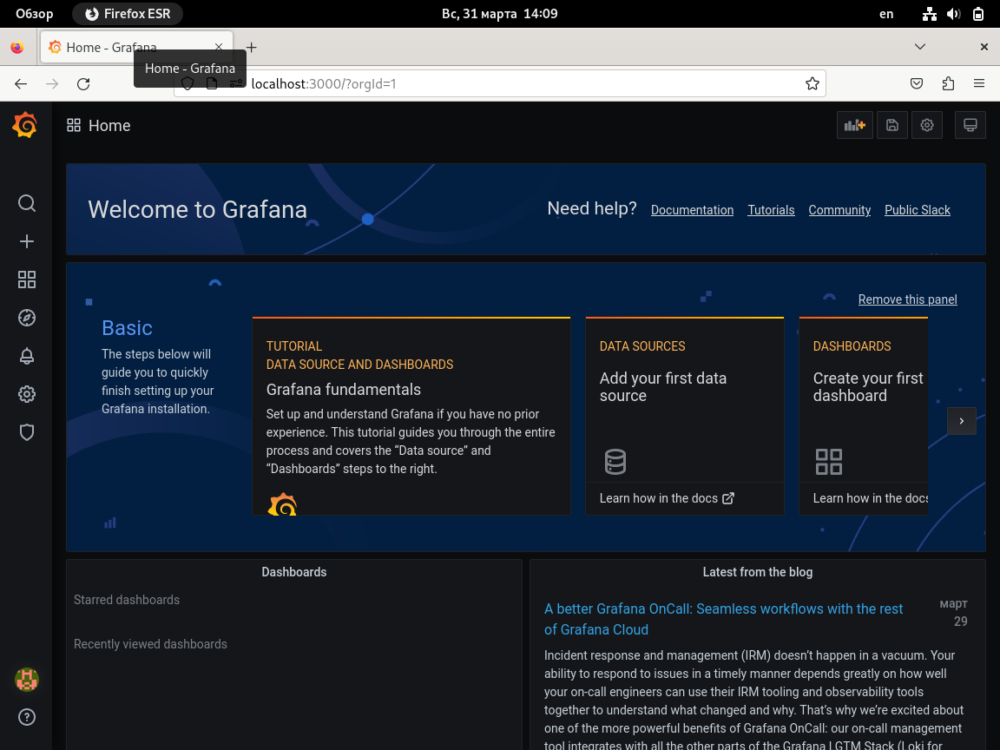
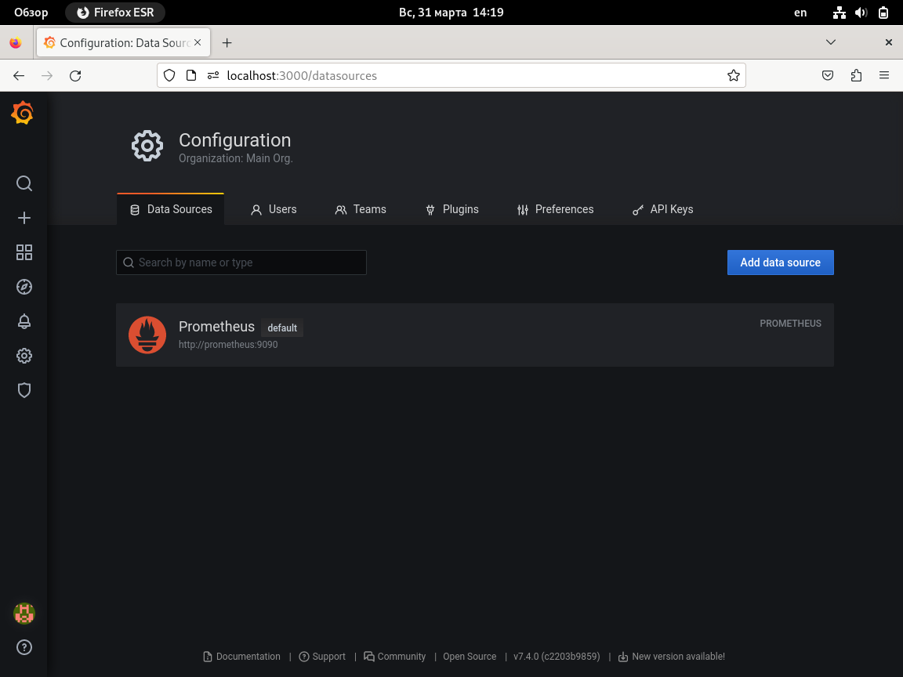
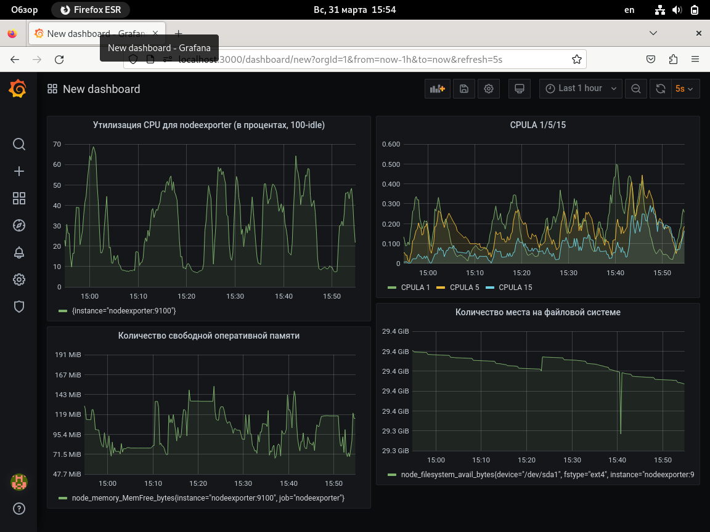
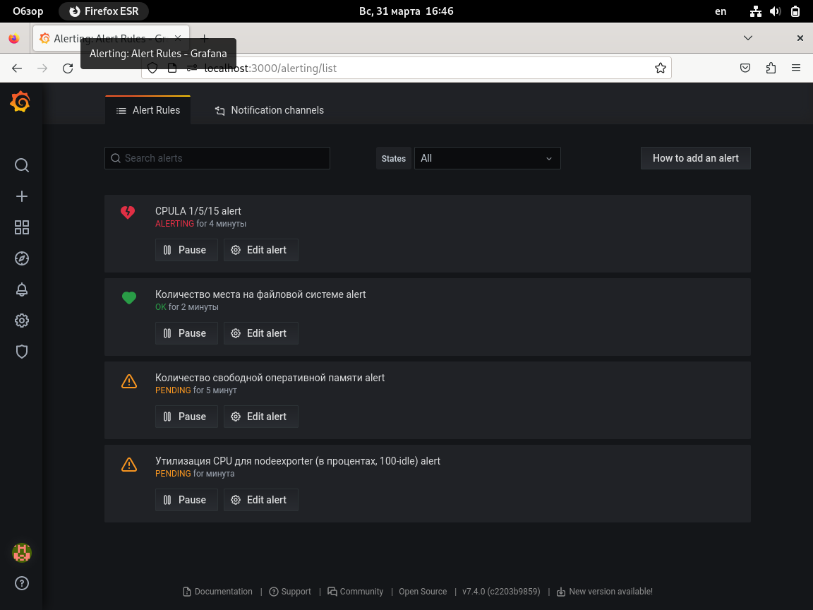
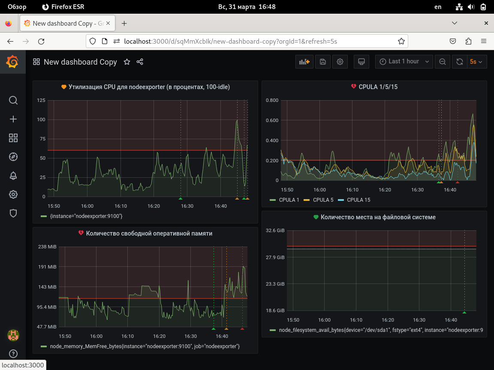

# Домашнее задание к занятию "`Средство визуализации Grafana`" - `Барышников Никита`


## Задание 1.
<details>
	<summary></summary>
      <br>

1. Используя директорию [help](./config/help) внутри этого домашнего задания, запустите связку prometheus-grafana.
2. Зайдите в веб-интерфейс grafana, используя авторизационные данные, указанные в манифесте docker-compose.
3. Подключите поднятый вами prometheus, как источник данных.
4. Решение домашнего задания — скриншот веб-интерфейса grafana со списком подключенных Datasource.

</details>

### Решение:

1. Используя директорию [help](./config/help) запустим связку prometheus-grafana.

Скриншот 1 - Запуск связки prometheus-grafana.


2. Зайдем в веб-интерфейс grafana.

Скриншот 2 - Веб-интерфейс grafana.


3. Подключим поднятый prometheus, как источник данных.
4. Решение домашнего задания — скриншот веб-интерфейса grafana со списком подключенных Datasource.

Скриншот 3 - Веб-интерфейс grafana со списком подключенных Datasource.


---

## Задание 2.
<details>
	<summary></summary>
      <br>

Изучите самостоятельно ресурсы:

1. [PromQL tutorial for beginners and humans](https://valyala.medium.com/promql-tutorial-for-beginners-9ab455142085).
2. [Understanding Machine CPU usage](https://www.robustperception.io/understanding-machine-cpu-usage).
3. [Introduction to PromQL, the Prometheus query language](https://grafana.com/blog/2020/02/04/introduction-to-promql-the-prometheus-query-language/).

Создайте Dashboard и в ней создайте Panels:

- утилизация CPU для nodeexporter (в процентах, 100-idle);
- CPULA 1/5/15;
- количество свободной оперативной памяти;
- количество места на файловой системе.

Для решения этого задания приведите promql-запросы для выдачи этих метрик, а также скриншот получившейся Dashboard.

</details>

### Решение:

Создадим Dashboard и в ней создадим Panels:

- утилизация CPU для nodeexporter (в процентах, 100-idle)

```promql
100 - (avg by (instance) (rate(node_cpu_seconds_total{job="nodeexporter",mode="idle"}[1m])) * 100)
```

- CPULA 1/5/15

```promql
avg by (instance)(rate(node_load1{}[1m]))
avg by (instance)(rate(node_load5{}[1m]))
avg by (instance)(rate(node_load15{}[1m]))
```

- количество свободной оперативной памяти

```promql
node_memory_MemFree_bytes{instance="nodeexporter:9100",job="nodeexporter"}
```

- количество места на файловой системе

```promql
node_filesystem_avail_bytes{mountpoint="/"}
```

Скриншот 4 - Получившийся Dashboard.


---

## Задание 3.
<details>
	<summary></summary>
      <br>

1. Создайте для каждой Dashboard подходящее правило alert — можно обратиться к первой лекции в блоке «Мониторинг».
2. В качестве решения задания приведите скриншот вашей итоговой Dashboard.

</details>

### Решение:

1. Создадим правила alert.

Скриншот 5 - Создание правил alert.


2. В качестве решения задания приведем скриншот итоговой Dashboard.

Скриншот 6 - Итоговая Dashboard.


---

## Задание 4.
<details>
	<summary></summary>
      <br>

1. Сохраните ваш Dashboard.Для этого перейдите в настройки Dashboard, выберите в боковом меню «JSON MODEL». Далее скопируйте отображаемое json-содержимое в отдельный файл и сохраните его.
2. В качестве решения задания приведите листинг этого файла.

</details>

### Решение:

1. Сохраните Dashboard. Для этого перейдем в настройки Dashboard, выберем в боковом меню «JSON MODEL». Далее скопируем отображаемое json-содержимое в отдельный файл и сохраним его.
2. В качестве решения задания приведем листинг этого [файла](./config/Dashboard_JSON_MODEL.json).

---