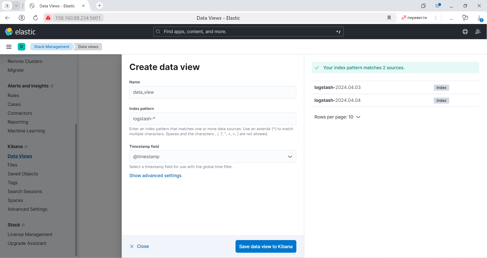
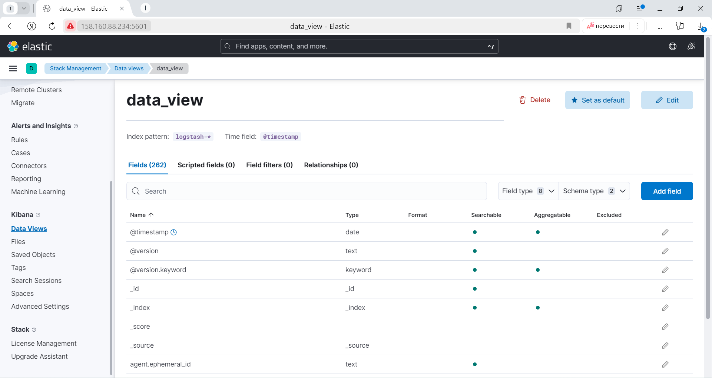

# Домашнее задание к занятию "`Система сбора логов Elastic Stack`" - `Барышников Никита`

## Задание 1.

	

       

Вам необходимо поднять в докере и связать между собой:

- elasticsearch (hot и warm ноды);
- logstash;
- kibana;
- filebeat.

Logstash следует сконфигурировать для приёма по tcp json-сообщений.

Filebeat следует сконфигурировать для отправки логов docker вашей системы в logstash.

В директории [help](./help) находится манифест docker-compose и конфигурации filebeat/logstash для быстрого 
выполнения этого задания.

Результатом выполнения задания должны быть:

- скриншот `docker ps` через 5 минут после старта всех контейнеров (их должно быть 5);
- скриншот интерфейса kibana;
- docker-compose манифест (если вы не использовали директорию help);
- ваши yml-конфигурации для стека (если вы не использовали директорию help).

### Решение:

С помощью манифеста docker-compose и конфигурации filebeat/logstash находящихся в директории [help](./config/help) поднимем докере:

- elasticsearch (hot и warm ноды);
- logstash;
- kibana;
- filebeat.

В результате выполнения задания получим:

- скриншот `docker ps` через 5 минут после старта всех контейнеров (их должно быть 5);

Скриншот 1 - Docker ps через 5 минут после старта всех контейнеров.

- скриншот интерфейса kibana.

Скриншот 2 - Интерфейс kibana.

---

## Задание 2.

	

       

Перейдите в меню [создания index-patterns  в kibana](http://localhost:5601/app/management/kibana/indexPatterns/create) и создайте несколько index-patterns из имеющихся.

Перейдите в меню просмотра логов в kibana (Discover) и самостоятельно изучите, как отображаются логи и как производить поиск по логам.

В манифесте директории help также приведенно dummy-приложение, которое генерирует рандомные события в stdout-контейнера.
Эти логи должны порождать индекс logstash-* в elasticsearch. Если этого индекса нет — воспользуйтесь советами и источниками из раздела «Дополнительные ссылки» этого задания.

### Решение:

Перейдем в меню [создания index-patterns в kibana](http://localhost:5601/app/management/kibana/indexPatterns/create) и создадим index-patterns.

Скриншот 3 - Cоздание index-patterns.

Скриншот 4 - index-patterns.

Перейдем в меню просмотра логов в kibana (Discover) и изучим, как отображаются логи и как производить поиск по логам.

Скриншот 5 - Меню просмотра логов в kibana (Discover).
.png)

---