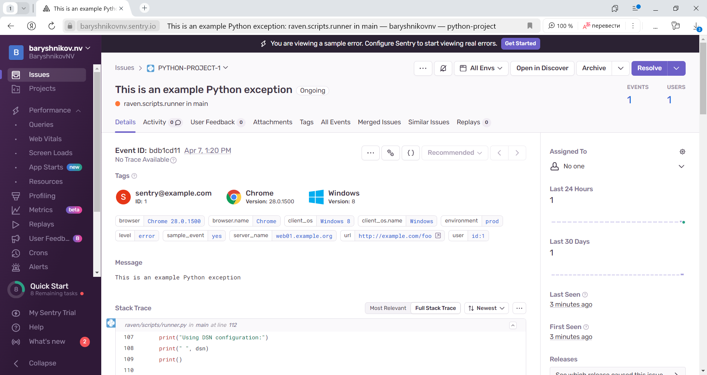

# Домашнее задание к занятию "`Платформа мониторинга Sentry`" - `Барышников Никита`

## Задание 1.

	

       

Так как Self-Hosted Sentry довольно требовательная к ресурсам система, мы будем использовать Free Сloud account.

Free Cloud account имеет ограничения:

- 5 000 errors;
- 10 000 transactions;
- 1 GB attachments.

Для подключения Free Cloud account:

- зайдите на sentry.io;
- нажмите «Try for free»;
- используйте авторизацию через ваш GitHub-аккаунт;
- далее следуйте инструкциям.

В качестве решения задания пришлите скриншот меню Projects.

### Решение:

Зайдем на sentry.io и авторизуемся используя GitHub-аккаунт.

Скриншот 1 - Меню Projects.

---

## Задание 2.

	

       

1. Создайте python-проект и нажмите `Generate sample event` для генерации тестового события.
2. Изучите информацию, представленную в событии.
3. Перейдите в список событий проекта, выберите созданное вами и нажмите `Resolved`.
4. В качестве решения задание предоставьте скриншот `Stack trace` из этого события и список событий проекта после нажатия `Resolved`.

### Решение:

1. Создадим python-проект и нажмем `Generate sample event` для генерации тестового события.

Скриншот 2 - Создание python проекта.

2. Изучим информацию, представленную в событии.

Скриншот 3 - Информация представленная в событии.

3. Перейдем в список событий проекта, выберем созданное и нажмем `Resolved`.

Скриншот 4 - Выполнение Resolved.

4. В качестве решения задания представим скриншот `Stack trace` из этого события и список событий проекта после нажатия `Resolved`.

Скриншот 5 - Stack trace.

Скриншот 6 - Список событий проекта после нажатия `Resolved`.

---